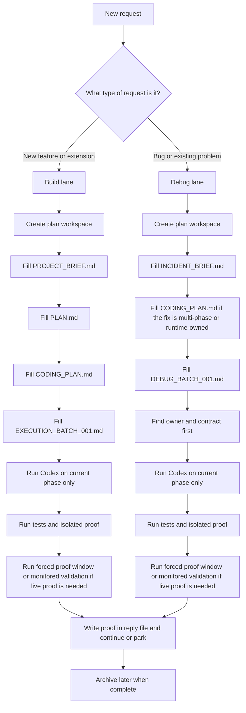

# AI Process User Guide

## Purpose

This is the one guide you should follow day to day.

If you are working on this repo, use this file.

You do not need to remember the full system.
You only need to:
- choose the right lane
- use the right prompt
- follow the flow

## The Simple Flow Chart



## The Only 2 Lanes

### Build lane

Use for:
- new feature
- new output
- new extension
- new workflow step

Main files:
- `PROJECT_BRIEF.md`
- `PLAN.md`
- `CODING_PLAN.md`
- `EXECUTION_BATCH_001.md`

### Debug lane

Use for:
- bug
- stale data
- missing update
- broken join
- wrong output
- runtime issue

Main files:
- `INCIDENT_BRIEF.md`
- `DEBUG_BATCH_001.md`

Main rule:
- do not start by fixing code
- first identify the owner and the broken contract

## Which Tool To Use

### GPT

Use for:
- planning
- thinking
- reviewing
- debugging the problem before fixing

Suggested mode:
- high reasoning

### Deep Research

Use only when:
- the answer is outside the repo
- the domain is unclear
- you need source-backed research

Suggested mode:
- high effort

### Codex in VS Code

Use for:
- editing files
- running tests
- executing the batch
- writing proof into repo files

Suggested mode:
- medium to high reasoning
- high reasoning for execution batches
- high reasoning for coding-plan phases with live monitoring

## The Golden Rule For Codex

Before any real task, always start like this:

```text
Read:
- AGENTS.md
- CODEX.md
- the active plan folder
- the current batch

Summarise:
- what you are about to do
- what you are not allowed to do
- what tests and proof are required

Then proceed.
```

If you skip this step, Codex is much more likely to drift.

## The 3 Roles

Keep these roles separate:

### Architect
- Tool: GPT
- Job: think, plan, spot risks

### Builder
- Tool: Codex
- Job: edit files, run tests, execute the batch

### Inspector
- Tool: GPT
- Job: review logic, challenge assumptions, spot hidden gaps

## The Workflow You Should Actually Follow

Monitoring rule:
- once you have approved a monitored validation block, Codex should keep checking silently
- Codex should not message you at every interval
- Codex should only interrupt when:
  - a phase completes
  - a new alert appears or worsens
  - the plan needs approval or a scope decision
  - the monitoring window expires and work cannot continue automatically

Routine alert rule:
- routine FAIL and WARN review belongs in the morning MOT
- outside the morning MOT, Codex should keep replies task-scoped unless an alert is new, worse, blocking, or needs approval

Morning MOT fix rule:
- if you ask for morning MOT fix execution, Codex should sort the findings, fix clear blockers, test them, and prove them quietly
- Codex should not stop between each clear blocker for routine permission
- Codex should only interrupt when a real decision or safety boundary appears

Forced proof rule:
- if the task needs proof for a single run or a narrow sign-off, Codex should try to make that proof happen safely instead of waiting for the next scheduled cycle
- use a flow-owned boundary:
  - A -> owned A cycle
  - B -> maintenance boundary plus `B_RUN_ONCE=1`
  - E -> one owned E cycle
  - H -> pause, controlled one-shot, scoped health, resume
- never read health mid-cycle when that can create false red flags
- if forced proof is blocked, record the exact blocker and the exact boundary needed

### 1. If it is a new feature

Use this prompt:

```text
I want to create a new feature to add <feature> to <system>.

Create the plan workspace first.
Use the build lane.
Read AGENTS.md and CODEX.md.
Then create:
- PROJECT_BRIEF.md
- PLAN.md
- CODING_PLAN.md
- EXECUTION_BATCH_001.md

Do not start coding yet.
First summarise:
- goal
- scope
- files likely involved
- risks
- proof required
```

### 2. If it is a bug or existing problem

Use this prompt:

```text
Could we investigate why <problem>?

Create the plan workspace first.
Use the debug lane.
Read AGENTS.md and CODEX.md.
Then create:
- INCIDENT_BRIEF.md
- CODING_PLAN.md if this is likely to need more than one phase or live monitoring
- DEBUG_BATCH_001.md

Do not change code yet.
First summarise:
- classification
- likely owner
- expected contract
- actual symptom
- likely blast radius
```

### 3. When you are ready for Codex to execute

Use this prompt:

```text
Read:
- AGENTS.md
- CODEX.md
- the active plan folder
- CODING_PLAN.md
- the current batch

Summarise:
- what you are about to do
- what you are not allowed to do
- what tests and proof are required

Then execute only the current phase in the coding plan and the current batch.
Do not widen scope.
Write factual proof into the reply file.
If monitored validation is part of the phase, keep it passive unless an interruption threshold is hit.
If live proof is needed, prefer a safe forced proof window over waiting for the next scheduled cycle.
```

### 3A. When you want a quiet morning MOT autofix

Use this prompt:

```text
Run the morning MOT in quiet fix mode.

Use the morning MOT checklist as the operating pattern.
Sort findings into:
- fix now
- monitor in MOT only
- stale evidence only
- needs user decision

Fix the clear blockers, test each fix, prove each fix, and keep the user channel quiet unless:
- approval is required
- the evidence turns contradictory
- the package is complete
```

### 4. When you want GPT to review the result

Use this prompt:

```text
Act as a senior engineer reviewing this result.

Find:
- logical gaps
- hidden risks
- incorrect assumptions
- missing tests
- weak proof
- likely regressions
```

## The Correct Order For Bugs

When something breaks, follow this order:

1. classify the error
- data
- logic
- integration
- contract

2. find the owner
- which flow owns the output
- which script owns the output

3. check the contract
- path
- schema
- freshness
- expected row or state rule

4. compare actual vs expected

5. fix the earliest broken stage

6. add or update a test

7. rerun proof

8. check health

If you skip steps 2 to 4, you usually get a local fix that does not solve the real system problem.

## The 3 Rules That Will Keep This Stable

### 1. Never let Codex figure things out from memory alone

Always give it:
- repo rules
- plan folder
- current batch

### 2. Always think before fixing

Use GPT first when the problem is not yet understood.

### 3. Keep roles separate

- Architect = GPT
- Builder = Codex
- Inspector = GPT

## What Good Looks Like

A good ticket looks like this:
- the request is clearly build or debug
- the plan folder exists
- the correct brief exists
- the correct batch exists
- the coding plan exists for phase execution
- Codex reads the files before coding
- tests run
- monitored validation is owned by Codex when live proof is required
- monitored validation does not spam the user with interval-by-interval updates
- health is checked
- proof is written down

## What Bad Looks Like

Stop if you catch yourself doing this:
- asking Codex to fix something before classifying it
- storing the only plan in chat history
- storing the only phase sequence in chat history
- mixing feature work and bug fixing in one ticket
- changing code before defining proof
- patching the consumer when the producer is broken
- messaging the user on every monitoring interval when no decision is needed

## Quick Reference

### New feature
`build lane -> brief -> plan -> coding plan -> execution batch -> codex -> monitored validation -> proof`

### Existing bug
`debug lane -> incident brief -> coding plan -> debug batch -> codex -> monitored validation -> proof`

### Unknown topic
`deep research -> plan -> batch -> codex`

### Review
`gpt review -> correction -> codex`

## Final Reminder

You do not need to remember the whole system.

Just do this:
- choose the lane
- create the workspace
- fill the correct files
- run the batch
- check proof
