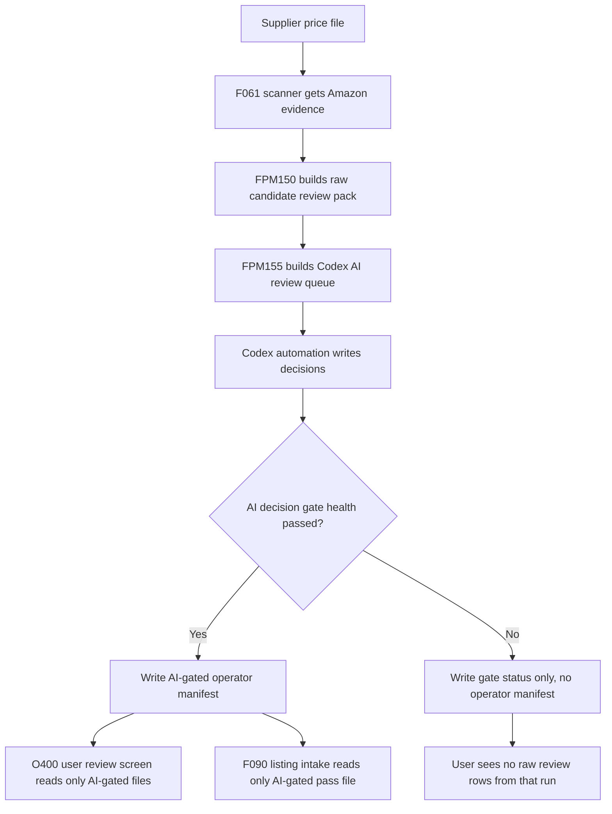

# F032 Real Pipeline Integration Design

Date: 2026-05-20

## Plain English Aim

The product should not appear on the user review checks until the F032 AI review has seen it first.

In simple terms, the scanner currently builds a pile of products and then gives that pile straight to the review screen. F032 currently creates a useful decision file, but it is still standing beside the doorway. The clean integration moves F032 into the doorway.

The new rule is:

- raw scanner result first
- AI review gate second
- user review screen third
- listing intake only after the AI-gated review pack exists

## Current Real Flow Found In The Code

Files checked:

- `scripts/flows/F/price_list_manager/FPM130_run_live_cycle.py`
- `scripts/flows/F/price_list_manager/FPM150_build_completed_review_pack.py`
- `scripts/flows/F/price_list_manager/_schemas.py`
- `scripts/flows/O/O400_operator_ui.py`
- `scripts/flows/F/F090_build_amazon_listing_intake.py`
- `scripts/one_off/F032_build_review_intelligence_cycle.py`

Current handover:

1. F061 finishes scanning a supplier run.
2. FPM130 sees that scanner pending rows are finished.
3. FPM130 calls FPM150.
4. FPM150 builds the review pack.
5. FPM150 writes `manifest.csv` and `live/review_handoff_manifest.csv`.
6. O400 review UI reads `pass_review_path` and `near_miss_review_path` from that manifest.
7. F090 listing intake also reads `pass_review_path` from that manifest.

Important finding:

- F032 is not currently in that handover chain.
- The UI can still read the raw FPM150 output.
- F090 can still read the raw FPM150 pass file.
- Therefore the system is not yet enforcing "AI first".

## The Clean Target Flow

## New Production Step

Add a new F-owned production step:

- name: `FPM155_apply_review_intelligence_gate.py`
- owner: F price list manager
- trigger: immediately after FPM150 builds the raw candidate pack
- purpose: turn raw scanner output into a Codex AI review queue, then publish an AI-gated operator handoff after Codex decisions exist

This should not import the current one-off F032 script directly. Daily production code must not depend on one-off scripts. The F032 logic should be moved into a shared F module, for example:

- `scripts/flows/F/_review_intelligence.py`

Then both of these can use the same logic:

- production gate: `FPM155_apply_review_intelligence_gate.py`
- manual/report wrapper: `scripts/one_off/F032_build_review_intelligence_cycle.py`

## Handover Contract

The clean handover should use two different stages.

### Stage 1 - Raw Candidate Pack

FPM150 should write raw outputs, but they should not be treated as ready for the user.

Recommended files inside the supplier/run handoff folder:

- `candidate_manifest.csv`
- `raw_pass_review.csv`
- `raw_near_miss_review.csv`
- `raw_review_summary.csv`

The raw candidate manifest is for FPM155 only. It is not an operator-ready manifest.

### Stage 2 - AI-Gated Operator Pack

FPM155 reads the raw candidate pack and first writes the queue that Codex must review. After Codex writes decisions, FPM155 writes the only files that the review screen is allowed to use.

Recommended files inside the supplier/run handoff folder:

- `manifest.csv`
- `ai_operator_pass_review.csv`
- `ai_operator_near_miss_review.csv`
- `ai_manual_review.csv`
- `ai_rescan_queue.csv`
- `ai_removed_from_clean_pass_audit.csv`
- `ai_review_queue.csv`
- `codex_ai_review_decision_template.csv`
- `codex_ai_review_decisions.csv`
- `ai_review_intelligence_decisions.csv`
- `ai_review_intelligence_checklist.csv`
- `ai_review_intelligence_health.csv`
- `ai_rule_tightening_suggestions.csv`

Important rule:

- O400 and F090 must read `manifest.csv` only after FPM155 creates it.
- FPM150 should no longer create the operator-ready `manifest.csv`.
- If Codex decisions are missing or FPM155 fails, there should be no operator-ready `manifest.csv` for that run.

That is the clean block. It means the raw pile exists for system use, but it is not visible to the user review screen.

## Manifest Fields Needed

The current manifest has `pass_review_path` and `near_miss_review_path`. Those fields are already used by the review screen, so the safest contract is:

- after F032 gate: `pass_review_path` points to `ai_operator_pass_review.csv`
- after F032 gate: `near_miss_review_path` points to the AI-gated review file
- before F032 gate: no operator `manifest.csv` exists

Add these fields to the manifest:

- `ai_gate_status`
- `ai_gate_observed_utc`
- `ai_gate_version`
- `ai_gate_health_path`
- `ai_gate_decision_path`
- `ai_gate_checklist_path`
- `ai_gate_rule_suggestion_path`
- `ai_gate_rescan_queue_path`
- `ai_gate_removed_audit_path`
- `ai_gate_manual_review_path`
- `raw_candidate_manifest_path`
- `raw_pass_review_path`
- `raw_near_miss_review_path`
- `ai_gate_fail_rows`
- `ai_gate_warn_rows`
- `ai_gate_clear_rows`
- `ai_gate_manual_rows`
- `ai_gate_rescan_rows`
- `ai_gate_removed_rows`
- `operator_ready_flag`

Required values before the review screen can show the run:

- `ai_gate_status` must be `passed`
- `operator_ready_flag` must be `1`
- `pass_review_path` must point to the AI-gated pass file
- every visible row must have `f032_decision_id`
- every visible row must have `f032_action`

## Routing Rules

F032 output action should control where each row goes.

- `allow_if_other_checks_pass` goes to `ai_operator_pass_review.csv`
- `manual_review` goes to `ai_manual_review.csv` and can be included in the user review lane as "needs judgement"
- `rescan_needed` goes to `ai_rescan_queue.csv`, not the normal review checks
- `remove_from_clean_pass` goes to `ai_removed_from_clean_pass_audit.csv`, not the normal review checks

Low confidence rule:

- low confidence should never mean "let it pass"
- low confidence should mean "manual review" or "rescan"

This lets the system run live while still being cautious.

Codex decision rule:

- FPM155 rule checks are evidence preparation and safety triage.
- Codex AI decisions are the final row-routing decision while product volume is low.
- Later, when enough decision history exists, repeated safe patterns can be moved from Codex work into earlier automatic rules.

## Review Screen Guard

O400 must stop trusting raw review files.

Required O400 changes:

- handoff snapshots must load only `manifest.csv` with `ai_gate_status=passed`
- if `ai_gate_status` is missing, pending, or failed, show no product rows from that run
- the old latest fallback to `f_live_price_file_pass_review_latest.csv` must not feed the user review screen as an operator-ready pack
- the review screen should display a plain status if a run is waiting for AI review, but not show the raw product rows

Pass criteria:

- when only `candidate_manifest.csv` exists, O400 shows zero review rows for that run
- when AI-gated `manifest.csv` exists, O400 shows only the AI-gated rows
- no row can appear in O400 without `f032_decision_id` and `f032_action`

## Listing Intake Guard

F090 currently reads the same manifest and can also fall back to raw latest analysis output.

Required F090 changes:

- read only AI-gated manifests
- ignore manifests where `ai_gate_status` is not `passed`
- use the AI-gated `pass_review_path`
- remove or block fallback to raw latest pass review output for listing intake

Pass criteria:

- when only a raw candidate pack exists, F090 creates zero listing intake rows
- when an AI-gated manifest exists, F090 can create intake rows from the AI-gated pass file
- every intake row trace links back to an F032 decision

## FPM130 Trigger

FPM130 already has the correct natural handoff point. It calls review pack build when the scan is finished.

New sequence:

1. F061 finishes.
2. FPM130 calls FPM150.
3. FPM150 writes raw candidate pack only.
4. FPM130 calls FPM155.
5. FPM155 writes the AI-gated operator manifest only if health passes.
6. FPM130 records an `ai_review_gate` event.

The Codex morning automation should not be the main gate. It can help with learning and audits, but the live prevention must happen inside the F price list manager flow.

## Health Gate

FPM155 should refuse to publish an operator manifest if any hard health check fails.

Hard fail checks:

- decision rows do not equal raw candidate rows
- missing supplier SKU
- ASIN exists but Amazon title is missing
- blank F032 action
- invalid F032 action
- blank decision bucket
- failed row has no fail category
- manual review row has no reason
- visible operator row missing `f032_decision_id`
- visible operator row missing `f032_action`
- raw pass path is used as operator pass path

Allowed warnings during low-confidence rollout:

- supplier title missing where the row is routed to manual review
- blind-agent consistency below target but with zero fail-to-clear flips
- small sample set warning

## Learning Loop

Every AI decision must be recorded so the system can learn.

Each F032 decision needs a stable id:

- `f032_decision_id`
- suggested formula: supplier id + run id + candidate id + ASIN + F032 version

The user review event should carry:

- `f032_decision_id`
- `f032_action`
- `f032_decision_bucket`
- `f032_fail_category`
- `f032_confidence`
- `f032_reason`
- user final choice
- user note, if entered

Morning learning job:

- compare F032 decision against user outcome
- flag AI allowed but user failed as a false-clear candidate
- flag AI removed but user later accepted as a false-block candidate
- flag manual review rows as training examples
- turn repeated patterns into rule-tightening suggestions

Important safety rule:

- the learning job can suggest new rules
- it must not silently change production rules without tests and proof

## Implementation Phases

### Phase 1 - Move F032 Logic Into A Production Module

Goal:

- make the AI review logic safe for daily flow use

Changes:

- create `scripts/flows/F/_review_intelligence.py`
- move reusable F032 logic there
- keep the one-off F032 script as a wrapper

Pass criteria:

- existing F032 tests still pass
- one-off F032 output stays identical for the same input
- no daily flow imports from `scripts/one_off`

### Phase 2 - Split Raw Candidate Handoff From Operator Handoff

Goal:

- stop FPM150 from creating an operator-ready manifest before AI review

Changes:

- FPM150 writes `candidate_manifest.csv`
- FPM150 writes raw pack paths into candidate fields
- FPM150 no longer writes live `review_handoff_manifest.csv`

Pass criteria:

- raw candidate pack is still built
- no O400-visible `manifest.csv` exists after FPM150 alone
- FPM150 remains idempotent

### Phase 3 - Add FPM155 AI Gate

Goal:

- create the real AI gate between raw pack and user review

Changes:

- FPM155 reads `candidate_manifest.csv`
- FPM155 runs F032 decision logic
- FPM155 writes AI-gated operator files
- FPM155 writes final `manifest.csv` only when hard health passes
- FPM155 writes live `review_handoff_manifest.csv` only after AI gate passes

Pass criteria:

- raw row count equals pass + manual + rescan + removed audit
- health FAIL rows are 0
- every visible row has `f032_decision_id` and `f032_action`
- no raw pass path is exposed as operator pass path

### Phase 4 - Guard O400 And F090

Goal:

- make bypass impossible from the user screen and listing intake

Changes:

- O400 reads only AI-gated manifests
- F090 reads only AI-gated manifests
- raw latest fallback is blocked for operator-ready use

Pass criteria:

- O400 shows zero rows for raw-only handoffs
- F090 creates zero intake rows for raw-only handoffs
- O400 and F090 work normally after an AI-gated manifest exists

### Phase 5 - Record Learning Outcomes

Goal:

- make the system learn from what the user does

Changes:

- carry F032 decision fields into review events
- build daily learning comparison output
- update sample collection from real user outcomes

Pass criteria:

- every user-reviewed row links back to an F032 decision
- false-clear and false-block candidates are recorded
- rule-tightening suggestions are written with example SKUs

### Phase 6 - Live Proof

Goal:

- prove that the full chain works in the real F flow

Proof path:

- use the F-owned safe proof window
- run a completed supplier handoff through FPM150 and FPM155
- confirm O400 reads AI-gated rows only
- confirm F090 reads AI-gated pass rows only

Pass criteria:

- FPM150 raw candidate pack exists
- FPM155 AI-gated manifest exists
- FPM155 health FAIL rows are 0
- O400 visible rows all have F032 decision fields
- F090 intake rows all trace to F032 decisions
- live owner is restored after proof

## Definition Of Working

This is working only when all of these are true:

- F032 runs automatically after each completed scan
- the user review screen cannot see raw FPM150 files
- listing intake cannot see raw FPM150 pass files
- every visible row has an F032 decision record
- every decision is saved for future learning
- uncertain rows are held for manual review or rescan instead of clean pass
- health proves the row counts reconcile

## Current Status

As of 2026-05-20:

- F032 decision building works manually.
- F032 records decisions, checklist results, fail categories, and rule suggestions.
- F032 reusable logic has been moved into production-safe F code.
- FPM150 now writes raw candidate handoff output.
- FPM155 now writes the Codex AI review queue and waits for `codex_ai_review_decisions.csv`.
- FPM155 now writes the AI-gated operator manifest when Codex decisions and health checks pass.
- FPM130 now triggers FPM155 after raw review-pack build.
- O400 blocks raw candidate handoffs while the AI gate is pending.
- F090 requires an AI-gated manifest before listing intake.
- daily Codex automation `f032-codex-ai-review-gate` has been created for `07:30` UK time.
- isolated verification has passed.
- live F-flow verification is not yet proven.
