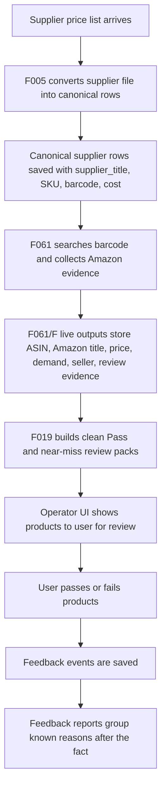
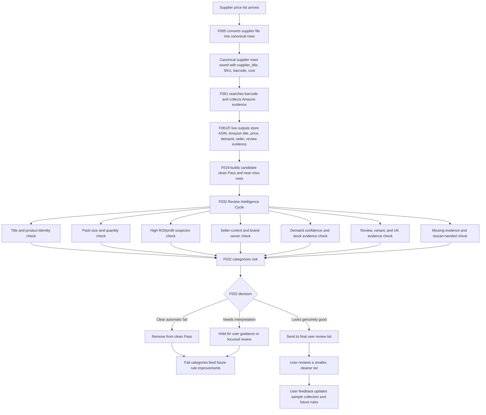

# F032 Review Intelligence Cycle

Cycle name:
- `F032 Review Intelligence Cycle`

Short name:
- `F032 RIC`

Purpose:
- Put an AI-style review gate between the automated price-list checks and the user review screen.
- Make the system do the interpretive checks that currently rely on the user.
- Categorise every fail reason so future data can tighten upstream rules and stop bad SKUs reaching this stage.

## Simple Explanation

The current scanner is good at yes/no checks:
- barcode found
- ASIN found
- rank under limit
- profit above limit
- demand evidence present
- seller history captured

The weak spot is interpretation:
- are the supplier title and Amazon title really the same product?
- is this a single item vs a multipack?
- is this a filter/refill/accessory being matched to the full device?
- is the profit suspiciously high because the matched item is wrong?
- does the seller situation look risky even if the basic numbers pass?
- does review/variant evidence make the listing too risky?

F032 RIC is the checkpoint where an agent goes through those judgment checks before the final user review list is shown.

## Current Flow

Current weakness:
- The user is still doing too much of the interpretation at step `G`.
- Feedback is useful, but a lot of it arrives after the bad product already reached the user.

## Target Flow With F032 RIC

## Where This Comes In

F032 RIC sits after F019 has enough evidence to build a review list, but before the user sees the list.

Plain English:
- F019 says, "this product might be ready for review."
- F032 says, "before Luke sees it, let me check the human-judgment stuff."
- Only the cleaner final list reaches the user.

## F032 Agent Checklist

The agent must check one product at a time.

Checklist:
- Supplier title vs Amazon title
- Same product, not just same barcode
- Same brand where brand matters
- Same size, capacity, model, colour, or variant where relevant
- Pack-size and quantity wording
- Single item vs multipack or case
- Accessory/refill/filter/cartridge vs full device
- High ROI or very high profit warning
- Seller-control risk
- Amazon-only or brand-only risk
- Demand evidence quality
- Seller stock and seller count evidence
- UK review count and variant review quality
- Missing evidence that needs rescan

## Decision Buckets

Every reviewed row must end in one of these buckets:

- `clear_breach_remove_from_clean_pass`
  - Product is clearly wrong.

- `high_roi_identity_suspicion`
  - Product title is suspicious and ROI/profit is unusually high.

- `pack_size_or_quantity_breach`
  - Pack-size mismatch is clear enough to fail.

- `pack_size_or_quantity_needs_user_guidance`
  - Pack-size wording needs interpretation.

- `seller_control_or_brand_owner_risk`
  - The listing looks controlled by Amazon, the brand, or one dominant seller.

- `demand_or_stock_evidence_conflict`
  - Demand or seller-stock evidence does not support the apparent opportunity.

- `review_or_variant_risk`
  - UK review or variant evidence makes the listing risky.

- `missing_evidence_rescan_needed`
  - The agent cannot decide because the evidence is incomplete.

- `needs_user_guidance`
  - The agent cannot safely make a decision.

- `ai_review_clear`
  - The item is clear enough to pass this AI review layer.

## Rule-Tightening Feedback Loop

F032 does not only classify products. It also creates future improvement ideas.

For each fail category, the cycle should ask:
- Could this have been caught earlier?
- Which field exposed the problem?
- Was it title wording, pack size, seller history, ROI, demand, or reviews?
- Can a simple upstream rule catch the same issue next time?
- Would that rule create false fails?
- Does it need more examples before becoming automatic?

The output should feed:
- the sample collection
- future rule candidates
- manual-review reason categories
- supplier-specific exception notes
- CLF pack-size training examples when CLF runs

## Current Implementation State

Built now:
- title-match checker
- title-match sample collection
- F019 clean-Pass routing for title-match decisions
- high ROI plus suspicious title automatic fail
- supplier title and Amazon title preserved separately in F019 outputs
- F032 evidence pack
- F032 decision output
- F032 fail-category summary
- F032 checklist output
- F032 health output
- F032 rule-tightening suggestion output
- F032 input-only blind validation file
- F032 hidden expected-answer file
- three-run blind-agent scoring output

Not built yet:
- morning automation schedule
- CLF pack-size example expansion

## Current Proof

Latest title-checker proof:
- rows checked: `1603`
- remove from clean Pass decisions: `7`
- manual review decisions: `259`
- title-clear decisions: `1337`
- seed examples: `9`
- seed mismatches: `0`

Focused tests:
- F031/F032/F033/F034 plus F019 review pack routing: `58 passed`
- F021/F030 downstream review reports: `20 passed`
- O review UI focused tests: `17 passed`

F032 Phase 1 and Phase 2 proof - 2026-05-20:
- script: `scripts/one_off/F032_build_review_intelligence_cycle.py`
- focused tests: `tests/test_f032_build_review_intelligence_cycle.py`
- focused pytest: `3 passed`
- current evidence rows: `1603`
- current decision rows: `1603`
- current checklist rows: `1603`
- current rule suggestion rows: `10`
- remove from clean Pass decisions: `1353`
- rescan needed decisions: `246`
- manual review decisions: `1`
- allow if other checks pass decisions: `3`
- F032 health FAIL rows: `0`
- F032 health WARN rows: `0`
- output: `out/analysis_reports/f032_review_intelligence_evidence_pack_latest.csv`
- output: `out/analysis_reports/f032_review_intelligence_decisions_latest.csv`
- output: `out/analysis_reports/f032_review_intelligence_fail_categories_latest.csv`
- output: `out/analysis_reports/f032_review_intelligence_checklist_latest.csv`
- output: `out/analysis_reports/f032_rule_tightening_suggestions_latest.csv`
- output: `out/analysis_reports/f032_review_intelligence_health_latest.csv`

Blind validation seed proof - 2026-05-20:
- blind split script: `scripts/one_off/F033_build_f032_blind_validation_pack.py`
- score script: `scripts/one_off/F034_score_f032_blind_agent_runs.py`
- blind split tests: `2 passed`
- blind score tests: `2 passed`
- blind input rows: `9`
- hidden answer rows: `9`
- leaked answer columns: `0`
- three blind-agent run files: `3`
- agent decision rows scored: `27`
- acceptable action agreement: `100.0%`
- exact action agreement: `96.3%`
- exact bucket agreement: `96.3%`
- action consistency: `88.89%`
- bucket consistency: `88.89%`
- fail-to-clear flip cases: `0`
- acceptance status: not accepted yet
- reason: seed set is too small; remaining consistency warning is TePe missing-supplier-title routing as manual review vs rescan needed

## Morning Automation Design

The morning automation should:
- read the latest review backlog
- run F032 RIC
- classify each row
- write a decision file
- write a fail-category summary
- write a rule-tightening suggestion file
- pass only the final user-ready rows to the review UI

It must not:
- write to Google Sheets
- change the local product database
- silently promote a product into Pass
- hide uncertain rows

## Required Outputs

F032 should eventually write:
- `out/analysis_reports/f032_review_intelligence_decisions_latest.csv`
- `out/analysis_reports/f032_review_intelligence_fail_categories_latest.csv`
- `out/analysis_reports/f032_rule_tightening_suggestions_latest.csv`
- `out/analysis_reports/f032_review_intelligence_health_latest.csv`
- `out/analysis_reports/f032_review_intelligence_summary_latest.md`

## Open Improvement Space

Leave room for:
- CLF food and drink pack-size examples
- supplier-specific title wording patterns
- category-specific rules
- better pack-size parsing
- seller ownership intelligence
- review/variant sentiment checks
- ROI anomaly thresholds by category
- user feedback corrections when the agent is too strict or too loose

## Acceptance Rule

F032 RIC is not accepted until:
- it checks the full checklist
- it writes categorized fail outputs
- it produces rule-tightening suggestions
- it reduces the number of weak products reaching the user
- user feedback after the cycle is categorized and fed back into the sample collection

## Implementation And Blind Validation Plan

Detailed phase plan:
- `plans/active/f-new-product-review-fail-automation-v1/F032_IMPLEMENTATION_AND_BLIND_VALIDATION_PLAN.md`

Key acceptance requirement:
- F032 must pass blind validation before it is trusted as the user's pre-review agent.
