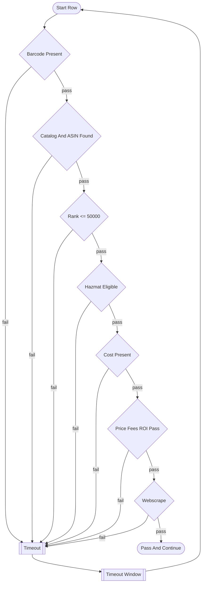

# F Screening Pipeline Simplification Blueprint

## 1. Purpose

Define a concrete coding plan to simplify F screening into one row pipeline:

- pass -> next step
- fail -> timeout queue
- timeout expiry -> restart from start

This blueprint is implementation-focused and scoped to feeder screening flow behavior.

## 2. User-Defined Operating Model

Target behavior per row:

1. Search barcode
2. Find ASIN and rank
3. Run gates (hazmat, cost, price, fees, ROI)
4. If gates pass, run webscrape
5. If webscrape pass, mark row pass and continue
6. Any fail routes to timeout, then returns to start

Data collection mode must keep collecting scrape data without killing rows for scrape-side failures.

## 3. Current Complexity (Root Cause Summary)

The current F flow has multiple layers acting like decision engines:

- `F005_build_supplier_price_list_universal.py` resets downstream legacy files during conversion.
- `F030_build_shared_feeder_pass_logic.py` makes early pass/review/hold decisions.
- `F040_build_feeder_candidate_approval_queue.py` synthesizes ROI and demand heuristics instead of consuming real screening truth.
- `F060_build_legacy_sheet_review_pack.py` rebuilds first-check style views from recommendation rows.
- `F061_run_legacy_first_checks_local.py` runs the actual gate pipeline.

Result: one row can show conflicting states across artifacts.

## 4. Target Architecture (Single Truth)

One owner for row screening truth:

- Keep `F005` as conversion-only.
- Make `F061` the only screening decision engine.
- Convert `F030`, `F040`, `F060` into derived readers (or retire parts that duplicate decision logic).

Single row state contract:

- `row_status`: `pending|processing|pass|timeout`
- `last_stage`
- `fail_code`
- `attempt_count`
- `timeout_until_utc`
- `mode`: `screening|data_collection`
- `updated_at_utc`

Everything else is a projection from this contract.

## 5. Gate Flow (Canonical)

## 6. Fail Code Policy

All non-pass outcomes route to timeout queue.

Existing codes to preserve:

- `NOASIN`
- `OVER50K`
- `HAZMATFAIL`
- `NOCOST`
- `ROIFAIL`
- `LOWROI`
- `BRANDFAIL`
- `NODATE`
- `REVIEWFAIL`
- `SCRAPEFAIL`
- `RESCAN`
- `FAIL`

Timeout duration must be configurable per code through one mapping table in `F061` (single source).

## 7. Data Collection Mode Contract

Add runtime mode switch:

- `F061_MODE=screening`
- `F061_MODE=data_collection`

Behavior:

- `screening`: scrape failures go to timeout
- `data_collection`: scrape failures are recorded as non-blocking collection failures; row remains rerunnable without terminal fail semantics

## 8. File Ownership Simplification

Canonical writable screening files (owned by `F061`):

- `out/systems/F/inbox/supplier_price_list_active_run.csv`
- `out/systems/F/inbox/supplier_price_list_run_state.csv`
- `out/systems/F/live/feeder_legacy_first_checks_live.csv`
- `out/systems/F/live/feeder_legacy_scrape_evidence_live.csv`
- `out/systems/F/live/feeder_legacy_chart_daily_raw_live.csv`
- new: `out/systems/F/live/f_screening_row_state_live.csv` (canonical row state)

Derived/read-only files:

- `feeder_shared_pass_logic_live.csv`
- `feeder_candidate_recommendations_live.csv`
- `feeder_approval_queue_live.csv`
- `feeder_legacy_second_checks_live.csv`
- `feeder_legacy_bot_status_live.csv`

Rule: derived files cannot invent pass/fail outcomes.

## 9. Script Responsibility Changes

### F005

- Keep supplier conversion and queue setup.
- Remove resets of downstream screening outputs unrelated to conversion transaction.

### F061

- Own all row gate decisions.
- Write canonical row state.
- Own timeout enqueue/dequeue logic.
- Implement mode-aware scrape behavior.

### F030

- Convert to optional precheck projection only.
- Must not override `F061` row decision outcomes.

### F040

- Remove heuristic ROI-demand decision engine for screening ownership.
- Rebuild queue from `F061` pass outputs plus explicit human decision states.

### F060

- Render legacy views from canonical `F061` screening outputs.
- Stop reconstructing first-check rows from recommendation rows.

## 10. Implementation Phases

### Phase 0 - Contract Freeze

- Add `f_screening_row_state_live` schema contract.
- Add feature flags for simplified path.
- Keep old behavior default until cutover.

### Phase 1 - Canonical Decision Writer

- Update `F061` to emit canonical row state and one final row decision per candidate per cycle.
- Keep existing outputs for backward compatibility.

### Phase 2 - Timeout Engine

- Add timeout queue fields and scheduler logic in `F061`.
- Route all non-pass codes to timeout mapping.

### Phase 3 - Derived Pipeline Rewire

- Rewire `F040` and `F060` to read canonical screening outcomes only.
- Remove heuristic recommendation ownership in `F040`.

### Phase 4 - Reset And Drift Cleanup

- Remove non-transactional output resets from `F005`.
- Ensure no script except `F061` writes screening decision fields.

### Phase 5 - Final Cutover

- Enable simplified mode by default.
- Keep rollback flag for one cycle window.

## 11. Test And Proof Plan

Required tests (isolated):

- gate-by-gate unit tests for barcode, ASIN, rank, hazmat, cost, ROI, scrape result mapping
- timeout mapping tests per fail code
- data collection mode tests for non-blocking scrape failure behavior
- idempotency tests: rerun with same input does not duplicate decision state
- ownership tests: only `F061` mutates screening decision fields

Runtime proof requirements:

- show one pass row reaches next step
- show one fail row enters timeout with fail code and timeout time
- show timeout expiry returns row to start
- show data collection mode records scrape failure without terminal pipeline corruption

## 12. Rollback Plan

- Keep legacy behavior behind feature flag during rollout.
- Snapshot current F live outputs before each phase cutover.
- On rollback, disable simplified mode and restore latest snapshot set.

## 13. Definition Of Done For This Simplification

- One row has one decision truth at a time.
- pass always advances.
- fail always enters timeout and returns to start later.
- `F061` is the only screening decision writer.
- derived files do not invent screening outcomes.
- data collection mode behaves as non-blocking for scrape-side failures.
