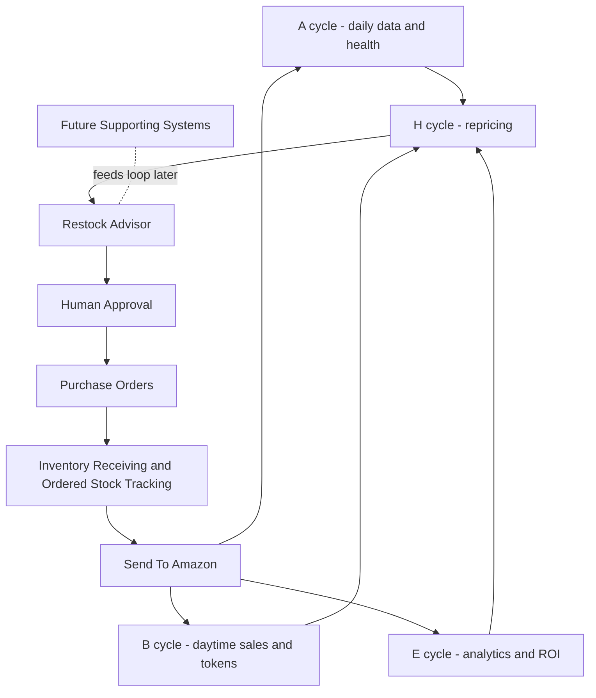

# SellerOne System Map And Roadmap

## A. Title And Purpose
This document is the permanent, at-a-glance roadmap for SellerOne.

It shows:
- what already exists
- what is working
- what is fragile
- what comes next
- how far each system is toward basic replacement

SellerOne's goal is to replace 5-7 separate operational tools with one connected automation system where data and decisions flow with minimal human bridging.

## B. How To Read This Roadmap
- Use the one-page snapshot table first.
- For zone-first navigation, use `project_control/ZONE_INDEX.md`.
- For cross-zone progress at a glance, use `project_control/SYSTEM_PROGRESS_CHART.md`.
- For canonical generated scores and counts, use `project_control/SYSTEM_PROGRESS.json`.
- Check two scores for each system:
- Completion Score = how much of the system exists for basic replacement.
- Reliability Score = how stable it is across recent runs.
- Use status bands to avoid false confidence.
- "Needs Stabilising" means "it runs, but is not finished."
- Read the Mermaid map for system flow.
- Read milestone sections for next actions.

## C. Status Legend
- Done: Basic replacement target is delivered and stable.
- In Progress: Significant parts exist, but not replacement-complete.
- Planned: Planned only.
- Blocked: Cannot progress due to dependency or decision.
- Needs Stabilising: Function exists, but runtime stability is not acceptable yet.

## D. Scoring Model
### Completion Score
Completion Score measures build progress toward basic functional replacement.

Use weighted milestones (0-100 total):
- M1 Structure Exists - 10
- M2 Produces Core Outputs - 20
- M3 Runs On Intended Cadence - 15
- M4 Handles Failures Safely - 20
- M5 Basic Replacement Achieved - 25
- M6 Ready For Optimisation - 10

Milestone scoring:
- Planned = 0 percent of milestone weight
- In Progress = 50 percent of milestone weight
- Done = 100 percent of milestone weight

### Reliability Score
Reliability Score measures operational trustworthiness from recent run evidence.

Roadmap rule (until automated scoring is coded):
- Window: last 10 completed runs for that system.
- Start at 100.
- Subtract 20 if any FAIL appears in the window.
- Subtract 10 for each run with WARN, up to 30 total.
- Subtract 15 if run ownership/finalization safety is broken.
- Subtract 15 if required health evidence is stale or missing.
- Minimum score is 0.

If a system does not yet have enough clean comparable run evidence, set Reliability Score to: `To Baseline`.

## E. Executive Summary
SellerOne has live core systems for A, B, E, and H.

A, B, and E are broadly functional foundations. H is actively running repricing and is functionally present, but it is still stability-gated and not yet replacement-complete.

After H stabilisation, the next major phase is one single operations loop:
Restock Advisor -> Purchase Orders -> Inventory Receiving/Ordered Stock Tracking -> Send To Amazon.

This loop is intended to remove human handoff between separate tools. The human should mainly approve important decisions, especially restock recommendations.

Detailed completion and reliability definitions are maintained in `project_control/EXPECTATIONS/`.

## F. One-Page System Snapshot Table
| System | Role | Status | Completion Score | Reliability Score | Notes / Next Focus |
|---|---|---|---:|---|---|
| A | Daily product/inventory orchestration and health gate | In Progress | 50 | To Baseline | Operational and in progress. Next focus: maintain cadence and strengthen reliability baseline. |
| B | Daytime orders/tokens/sales loop | In Progress | 50 | To Baseline | Operational and in progress. Next focus: maintain boundary-safe loop behavior and reduce warnings. |
| E | ROI/velocity/performance analytics | In Progress | 50 | To Baseline | Operational and in progress. Next focus: keep output freshness and reliability evidence consistent. |
| H | Repricing runtime | Needs Stabilising | 46 | Provisional (45) | Active but not stable. Next focus: resolve stability gates and finalization/runtime boundary issues. |
| Restock Advisor | Reorder recommendation engine | Planned | 0 | To Baseline | Planned as first step in single operations loop. |
| Purchase Orders | PO creation and management | Planned | 0 | To Baseline | Planned with human approval before commitment. |
| Inventory Receiving / Ordered Stock Tracking | Track ordered and received stock | Planned | 0 | To Baseline | Planned to remove manual handoff tracking. |
| Send To Amazon | Create and manage send-to-Amazon flow | Planned | 0 | To Baseline | Planned final step in loop with stock feedback to core systems. |

## G. Mermaid System Map

## H. Current Core Systems
### A
- Purpose: Daily orchestrator for listings, catalog, inventory, fees, daily intel, and health evidence.
- Current state: Operational and in progress.
- Replacement position: High completion, still needs reliability baseline tracking in this roadmap model.
- Next focus: keep full-cycle consistency and low warning drift.

### B
- Purpose: Daytime loop for orders, tokens, order master, and sales-side outputs.
- Current state: Operational and in progress.
- Replacement position: High completion, still needs stronger reliability confidence trend.
- Next focus: continue fail-safe loop quality and warning reduction.

### E
- Purpose: Sales velocity, ROI, restock signals, performance summaries.
- Current state: Operational and in progress.
- Replacement position: Partial-to-strong completion but not yet replacement-complete.
- Next focus: tighten reliability baseline and downstream confidence for decision support.

### H
- Purpose: Live repricing runtime.
- Current state: Functional but marked `Needs Stabilising`.
- Replacement position: Not yet replacement-complete due to live stability risk.
- Next focus: stabilise runtime ownership/finalization behavior and prove consistent clean runs.

## I. Next Major Operations Loop
This is one connected operational loop, not separate disconnected tools.

### Restock Advisor
- Status: Planned
- Objective: produce clear reorder recommendations.

### Purchase Orders
- Status: Planned
- Objective: convert approved recommendations into managed purchase orders.

### Ordered Stock Tracking / Inventory Receiving
- Status: Planned
- Objective: track ordered stock through receiving with clear state visibility.

### Send To Amazon
- Status: Planned
- Objective: move received stock into Amazon workflow and feed updated stock state back into A/B/E.

## J. Human Role
- Human approves important decisions, especially restock recommendations.
- Human should not have to manually move data between disconnected tools.
- Human remains decision owner, while SellerOne becomes the connected execution and evidence layer.

## K. Future Systems Feeding The Loop
Future tools can be added later as supporting feeders into the main loop.

They should be represented as:
- external support systems
- feeding recommendations or constraints into the loop
- not replacing the loop structure itself

Potential examples (deferred):
- demand-learning extensions
- portfolio policy layers
- notification helpers

Feeder planning reference:
- `project_control/FEEDER_CYCLE_PLAN.md`
- `project_control/EXPECTATIONS/feeder_cycle_expectations.md`

Supplier Discovery planning reference:
- Flow: Supplier Discovery -> Product Sourcing / Feeder -> Operations Loop
- `project_control/SUPPLIER_DISCOVERY_PLAN.md`
- `project_control/EXPECTATIONS/supplier_discovery_expectations.md`

## L. Review/Update Rules
- Review this roadmap at least once per week.
- Also review after any major cycle behavior change.
- Update order:
- refresh run evidence
- update status band first
- update Completion Score second
- update Reliability Score third
- write next focus note last
- Do not mark H as Done while stability-gated behavior is still present.
- Keep this document plain-English and non-technical where possible.

## M. Change Log Header
- Last Reviewed UTC: 2026-03-13T00:00:00Z
- Reviewed By: Codex (implementation from PROMPT 003)
- Evidence Window UTC: up to 2026-03-13
- Version: v1
- Notes: Initial permanent roadmap created.
