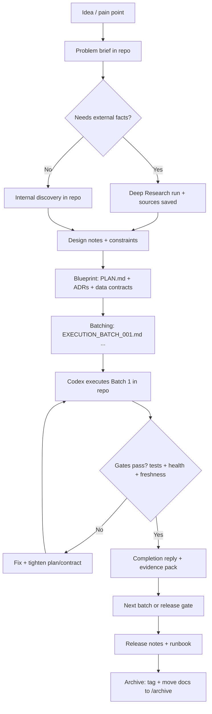

# A Repeatable AI-Assisted Development Workflow for Complex Business Scripts

## What’s working already and what’s still breaking

You’re not “winging it” as much as it feels. The approach you used in your backtest work is actually close to a mature engineering pattern: you wrote an explicit build plan with locked contracts/outputs, then executed in bounded “batches” with acceptance criteria, tests, and a proof/evidence pack. fileciteturn0file2 fileciteturn0file3 fileciteturn0file4

Where your process is still leaking time (and trust) is the hand-off between **thinking** and **execution**:

- You do careful planning in chat, then you switch into an execution window where the agent behaves like it’s solving isolated tickets rather than delivering a coherent project. That happens when the plan is not a first-class artifact inside the repo and the coding agent isn’t forced to read/obey it every time. OpenAI explicitly recommends using persistent repo instructions for Codex (via `AGENTS.md`) so the agent starts each task with consistent expectations and project context. citeturn6view0turn3search22
- You’re also missing a **consistent set of gates** that prevent “looks good” code from quietly desynchronising with data and other scripts. Your own examples (data exporting to a different sheet, data becoming stale) are classic “no contract + no freshness checks + no health gate” failures, and they do not fix themselves by prompting better. They fix by putting “truth tests” into the system (contracts, freshness SLAs, health checks). citeturn2search0turn2search1turn2search6

Finally, the tool split you described is real and appropriate, but only if the boundary is explicit:

- Deep Research is designed for multi-step research and synthesis across web and controlled sources, producing a structured report with citations/links. citeturn5view2turn0search8  
- Codex (in the IDE/CLI) is designed to read/edit/run code in your workspace and work with approvals, reasoning depth, and diffs—i.e., the “make it real in the repo” part. citeturn5view1turn3search21  
- The ChatGPT “Work with Apps” VS Code extension is specifically for the macOS app’s Work with Apps flow—useful if you want ChatGPT to operate over open files in the IDE, but it is not the same thing as Codex running your build/test loop. citeturn5view0

The rest of this report turns what you already did in your backtest batches into a **general operating system** you can reuse for any complex script: planning, storage, execution, reliability, and archiving—so you don’t have to remember everything.

## Your “project memory” system

The key shift is this: stop treating the conversation thread as “the plan”. Treat the repo as the plan’s home, and treat AI sessions as **temporary compute** that must read the repo’s durable agreements.

A robust system needs a small set of durable artefacts. The goal is not more documentation; it’s **the minimum documentation that prevents silent breakage and context drift**.

### The minimum durable artefacts

**Agent instructions (persistent, repo-local)**  
Use `AGENTS.md` as the canonical “how to work in this repo” file for coding agents. Codex reads `AGENTS.md` before doing work, can layer global + repo + subdirectory overrides, and has a defined precedence/merge order. citeturn6view0turn3search22  
If you strongly prefer a `CODEX.md` name, Codex can be configured to treat alternate filenames as fallbacks via `project_doc_fallback_filenames`, but `AGENTS.md` is the native convention. citeturn6view0

**Configuration that won’t rot**  
Don’t hardcode models or behaviour in your scripts. For Codex itself, OpenAI documents a config layering model: personal defaults in `~/.codex/config.toml` and project overrides in `.codex/config.toml` (loaded only when the project is trusted). citeturn3search1turn6view1turn4view2  
For your own code, use the same principle: configuration belongs outside code (environment/config), so switching models or keys doesn’t require code edits. This separation is a core principle of the Twelve-Factor methodology (“Store config in the environment”). citeturn1search3turn1search11

**Architecture decisions you won’t forget**  
Use Architecture Decision Records (ADRs) for decisions that change structure, dependencies, interfaces, or non-functional behaviour. ADRs are intentionally short and capture context, decision, and consequences. citeturn0search15turn0search9  
This is exactly how you avoid “we changed the data source last month and now nothing matches” becoming tribal knowledge.

**Data contracts and freshness promises**  
Your biggest recurring pain (stale/crossed data sources) is what data contracts are meant to prevent: explicit agreements about schema, semantics, and delivery expectations between producers and consumers. citeturn2search0turn2search8  
And if a dataset can go stale, you need freshness checks (warn/error thresholds) as part of the pipeline, not as a human memory exercise. Tools like Great Expectations and dbt both explicitly support freshness concepts and checks. citeturn2search1turn2search2turn2search6

**Execution batches with proof**  
You already proved this pattern works: each batch defines exact tasks, tests, acceptance criteria, and proof required, and the completion reply records evidence and outcomes. fileciteturn0file3 fileciteturn0file4 fileciteturn0file8  
This is the bridge from “plan notes” to “working system”.

## End-to-end flow chart

Below is a flow that explicitly separates **research**, **design**, and **execution**, and forces outputs into the repo at each step so nothing gets lost in chat history.



image_group{"layout":"carousel","aspect_ratio":"16:9","query":["software development lifecycle flowchart requirements design implementation testing deployment","kanban board workflow in software development","architecture decision record ADR example template diagram","data pipeline freshness monitoring dashboard"],"num_per_query":1}

How to read the chart in practice:

- **Deep Research is for uncertainty**, changing facts, and “holes you don’t know exist yet.” OpenAI explicitly positions Deep Research for multi-step questions with source control and a cited report. citeturn5view2turn0search8  
- **Codex is for execution in the repo**. The IDE extension is explicitly designed to read/edit/run code, adjust reasoning effort, and work with approval modes. citeturn5view1turn6view1  
- The “Gates pass?” decision is where you eliminate the “genius with no common sense” failure mode: correctness is not a vibe, it’s tests + data checks + deterministic outputs.

## Turning plans into code without losing the plot

The mistake you identified—agents generating “singular tasks” instead of an integrated project—usually comes from one of these causes:

- The plan exists only in chat, so the execution agent has no durable spec to obey.
- The agent is not constrained by contracts (schemas, output paths, invariants).
- There is no acceptance test pack that defines “done”.

Your backtest batches already demonstrate the correct cure: **bounded execution batches with locked outputs, tests, and proof**. fileciteturn0file3 fileciteturn0file8

### The batch contract that makes agents behave

A batch should always include:

- **Scope guardrails** (“do not reopen architecture; do not add new features”)  
- **Exact files to create/modify** (paths)  
- **Acceptance criteria** (objective outcomes, not “seems right”)  
- **Test commands** (one tight pack, plus full pack when appropriate)  
- **Proof required** (row counts, health checks, screenshots/log tail, etc.)  

This is what you did in your Execution Batch docs, and it is one of the most effective ways to stop an agent from wandering. fileciteturn0file3 fileciteturn0file7

### How to make Codex follow the plan every time

Codex’s official mechanism for persistent repo guidance is `AGENTS.md`, with defined discovery and precedence rules. citeturn6view0turn3search22  
That means your “invented system” should not rely on you re-explaining the project each session.

Practical pattern:

1. Put the non-negotiables in `AGENTS.md` (commands, conventions, how to run tests, how outputs are owned). citeturn6view0  
2. Put the current work in `plans/<project_id>/PLAN.md` and `EXECUTION_BATCH_###.md`.  
3. In Codex, always start with a “read and summarise the plan + current batch” instruction before writing any code (Codex best-practice guidance explicitly emphasises prompting/planning/validation loops). citeturn3search2turn3search20  
4. Make it produce a diff + test output, not just prose.

### Reviews as a tool, not a ceremony

Even solo, treat every batch like a mini pull request:

- “Make changes easy to review” is a documented best practice in GitHub’s own PR guidance: reviewers need context on what changed and why. citeturn2search3turn2search7  
- Codex/agents can generate a change summary, but your “truth gate” should still be: diffs + tests + health checks.

## Reliability guardrails for data and APIs

This is where you get the “never go wrong” feeling—not because the agent becomes perfect, but because mistakes become harder to ship silently.

### Preventing stale or crossed data sources

Your recurring failure mode (“data exports somewhere else, scripts keep pointing at the old sheet”) is fundamentally a missing-contract problem.

A robust fix is:

1. **Single writer per dataset**  
   Every dataset has one owning producer script. Consumers don’t “pick a file”; they consume the contracted output of the producer. This is exactly the mental model implied by data contracts (“APIs for data”, stable transfer expectations). citeturn2search0turn2search8  

2. **Data contract files that include freshness**  
   Add `freshness` expectations (warn/error) to the contract. dbt formalises freshness as “acceptable time between the most recent record and now,” with warn/error thresholds. citeturn2search6turn2search2  
   Great Expectations also explicitly frames freshness as a first-class data quality use case. citeturn2search1turn2search5  

3. **Health checks. Always.**  
   Your backtest pipeline includes an explicit health output and uses that as a readiness signal; that pattern generalises extremely well to any data pipeline. fileciteturn0file3 fileciteturn0file8  

The “brutal truth” here: without freshness/health gates, you will keep rediscovering stale-data failures because they are silent by nature. Tools don’t complain when you read yesterday’s CSV unless you force them to.

### Avoiding API timing clashes and reliability failures

When scripts interact with APIs, failure is normal: rate limits, transient errors, network flaps. Reliability comes from defensive patterns that are well-documented:

- **Retries must be controlled**: use exponential backoff, add jitter, and cap retries. AWS Well-Architected explicitly recommends exponential backoff + jitter + retry limits. citeturn1search0turn1search4turn1search12  
- **Side-effecting requests must be idempotent**: Stripe recommends adding an idempotency key to POST requests, and documents how idempotency keys behave and how to generate them safely. citeturn1search1turn1search5turn1search9  
- **Set an SLO for your pipeline**: if your system depends on data freshness and API calls, define an SLO (e.g., “dataset X is < 6 hours old 99% of the time”) and use an error-budget mindset to decide when to pause feature work to fix reliability. Google’s SRE guidance treats SLOs and error budgets as the mechanism for balancing reliability with change velocity. citeturn1search2turn1search10turn1search6  

This matters directly to your workflow because it turns “random breakages” into **explicit gates** that block bad merges and force investigation before rot spreads.

## Templates you can adopt immediately

This section gives you a practical “user guide” for the system—what to create, where to store it, how to execute, and how to archive—using patterns that match how Codex is designed to be configured and guided.

### Folder structure

This structure is intentionally simple and mirrors the way you already work with plans and execution batches:

```text
project_control/
  AI_DEV_PLAYBOOK.md
  adr/
    0001-record-architecture-decisions.md
    0002-data-contracts-as-source-of-truth.md

agents/
  (optional) reusable agent skills, if you adopt them later

plans/
  active/
    2026-04-f-cycle-backtest-v1/
      PROJECT_BRIEF.md
      RESEARCH_PACK.md
      PLAN.md
      EXECUTION_BATCH_001.md
      EXECUTION_BATCH_001_REPLY.md
      EXECUTION_BATCH_002.md
      EXECUTION_BATCH_002_REPLY.md
      RUNBOOK.md
  archive/
    2026/
      2026-04-f-cycle-backtest-v1/  (copied or moved when complete)

data_contracts/
  datasets/
    feeder_backtest_summary.md
    sku_sales_velocity.md
  freshness_slas.md
  lineage.md

AGENTS.md             (Codex primary instructions)

.codex/
  config.toml         (project-level Codex config overrides)
```

This is deliberately “docs-as-code”: it works because everything is versioned, diffable, and reviewable.

### `AGENTS.md` template

Codex’s official guidance is that `AGENTS.md` should tell it how to navigate the repo, run tests, and follow conventions. citeturn6view0turn3search22  
Use this as a starting point:

```markdown
# AGENTS.md

## Mission
You are a coding agent working inside this repo. Optimise for correctness, determinism, and maintainability.

## Non-negotiables
- Do not change architectures or add new features unless the current batch explicitly asks.
- Do not modify output schemas/paths unless the current batch explicitly asks and updates tests/contracts.
- Prefer small diffs that pass the batch test pack.
- No silent behaviour changes: update docs/contracts when behaviour changes.

## How to run the project locally
- Run unit tests: `pytest`
- Run targeted tests (batch will specify exact pack): see `plans/active/**/EXECUTION_BATCH_*.md`
- Run lint/type checks (if present): (document your commands here)

## Output ownership rules
- Each dataset/output has one owner script (producer). Consumers must not write to producer-owned outputs.
- All outputs must have:
  - a schema/contract in `data_contracts/`
  - a health check signal (pass/warn/fail) where applicable

## Working style
- Before coding: summarise the current batch scope, acceptance criteria, and tests.
- While coding: keep a running checklist of which acceptance criteria are satisfied.
- After coding:
  - show a concise summary of changes
  - show test outputs (or the exact command + result)
  - show any new/updated files and why
```

If you really want the filename `CODEX.md`, Codex supports fallback instruction filenames via configuration. citeturn6view0turn6view1

### `PLAN.md` template

This is the bridge from “notes” to a blueprint an agent can execute.

```markdown
# Plan

## Goal
What outcome must exist when this work is finished?

## Non-goals
Explicitly list what is out of scope.

## Current state
- What exists already?
- Known pain points / failures.

## Target design
- Modules/flows involved
- Key invariants (must never break)
- Inputs/outputs (paths + grains)

## Contracts
List every output dataset/file and its owner script.
For each: schema, freshness SLA, health check expectation.

## Integration points
- APIs used (rate limits, retry strategy, idempotency strategy)
- Shared resources (files, DB tables, queues)

## Risks & mitigations
- Data staleness risk → freshness checks + health gate
- API timing clashes → throttling + retry/backoff + idempotency

## Batches
- Batch 1: (scope + acceptance)
- Batch 2: ...
```

Your existing v1 plan style already contains many of these elements (locked contracts, join keys, file paths); the goal is to standardise it across every project so you don’t have to reinvent the format. fileciteturn0file2

### Execution batch template

This is the “Codex work order”. It’s what stops the agent producing disconnected micro-tasks.

```markdown
# Execution Batch 001

## Purpose
One sentence: what does this batch accomplish?

## Scope guardrails
- Do not change: (list)
- Do not add: (list)
- Only do: (list)

## Tasks
### Task 1 - ...
**Goal:**  
**Files:**  
**Implementation notes:**  
**Tests:**  
**Acceptance criteria:**  
**Proof required:**  

## Run order
List the exact command sequence (build scripts, migrations, etc.)

## Batch test pack
Provide the exact command(s) that must pass.

## Completion checklist
- [ ] All tasks done
- [ ] Tests pass
- [ ] Health checks pass
- [ ] Evidence captured in reply file
```

This is structurally the same as the batch approach in your attachments, including proof requirements and explicit tests. fileciteturn0file3 fileciteturn0file7

### Completion reply template

This template makes the “tidy it away without remembering everything” part automatic:

```markdown
# Execution Batch 001 - Completion Reply

## Completion decision
- Status: COMPLETE / PARTIAL / FAILED
- Checked against: plans/active/<project>/EXECUTION_BATCH_001.md

## Summary of changes
- Files added:
- Files modified:
- Behavioural changes:

## Evidence
- Test results: (paste summary)
- Output row counts: (if applicable)
- Health checks: (paste key lines)
- Known residual warnings:

## Notes for next batch
- What remains
- New risks discovered
- Any ADR needed
```

Your existing completion replies already do this—statuses, proofs, counts, test packs. Standardising it means you can archive with confidence and re-enter later without reconstructing history from memory. fileciteturn0file4turn0file6turn0file8

### Data contract template

This is the concrete antidote to “wrong sheet” and “stale export.”

```markdown
# Dataset contract: <dataset_name>

## Owner
- Producer script: <path>
- Owning module/flow: <name>
- Downstream consumers: <list>

## Purpose
What business question/process relies on this dataset?

## Location
- Path: <path>
- Grain: (e.g., one row per sku/day)

## Schema
| column | type | meaning | required |
|--------|------|---------|----------|
| ...    | ...  | ...     | yes/no   |

## Freshness SLA
- Loaded-at field: <field>
- Warn if older than: <time>
- Error if older than: <time>

## Quality checks
- Uniqueness constraints
- Null rules
- Accepted values

## Change management
- Backwards compatible change rules
- Versioning strategy
```

This is directly aligned with the “data contracts are APIs for data” framing and with formal freshness concepts (warn/error thresholds) used in common data tooling. citeturn2search0turn2search6turn2search2

### Settings guide: models and agent behaviour without hardcoding

Your goal—“don’t hardcode a model because AI evolves”—is correct. The best pattern is:

- **Agent settings live in Codex config**, not in your application code.
- **Application settings live in environment/config**, not in your Python scripts.

Codex configuration (official):

- Personal defaults: `~/.codex/config.toml`  
- Project overrides: `.codex/config.toml` (loaded only when the project is trusted) citeturn3search1turn6view1turn4view2  
- The sample config shows `model = "gpt-5.4"` as an example and includes keys for reasoning effort, verbosity, etc. citeturn4view0turn6view1  

A minimal `.codex/config.toml` you can use as a project baseline (example structure, edit to taste):

```toml
# .codex/config.toml

# Aim: stable defaults for this repo. Change here, not in scripts.
model = "gpt-5.4"

# Make risky commands require approval by default.
approval_policy = "on-request"

# Encourage deeper planning for complex edits.
plan_mode_reasoning_effort = "high"
```

For your own scripts, follow the same split: model names, API keys, and endpoints should be passed in via environment or config (not hardcoded), which aligns with the Twelve-Factor guidance on separating config from code. citeturn1search3turn1search11

### Archiving rules that prevent “I forgot how this works”

At project close, you do three things:

1. **Tag the state** (git tag or at least a final commit message referencing the project ID).  
2. **Freeze the docs**: copy/move `plans/active/<project>` to `plans/archive/<year>/<project>`.  
3. **Write a one-page RUNBOOK** explaining how to run and validate the system (commands, expected outputs, health checks).  

This is how you turn a working system into something you can return to months later without relying on memory.

---

**Bottom line (brutally honest):** you can’t make AI development “fool proof” in the literal sense, because the failure modes include misunderstood requirements, missing data, and false assumptions. But you *can* make it **hard to ship silent breakage** by pushing “memory” into `AGENTS.md` + plans + ADRs + data contracts, and by making execution pass through batches with tests/health/freshness gates—the exact style you already proved works in your backtest work. fileciteturn0file3turn0file8 citeturn6view0turn2search6turn1search0