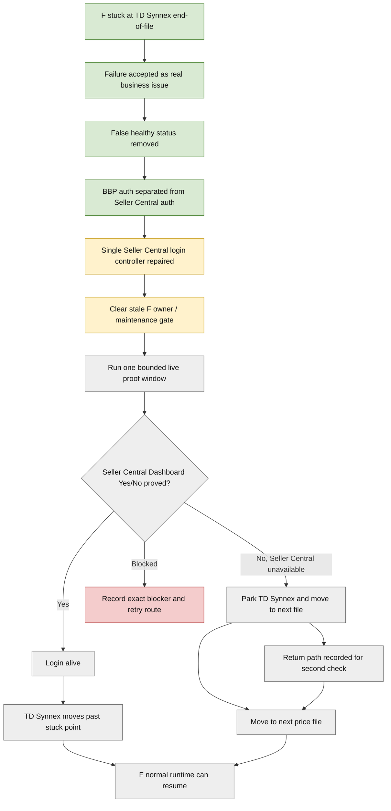

# F Live Login Milestone Log

Updated: 2026-06-09 16:25 UK
Owner: Rep
Goal: F cycle logs into Seller Central safely and stays usable without blocking price-file progress.

## Plain-English Goal

F is not complete until Seller Central login is alive and proved.

Success means:

- Seller Central Dashboard Yes/No is proved through the single controller
- no false `LOGGED_IN` wording
- no old UI login, old scanner login, or auto-login competing
- TD Synnex is no longer stuck at the same end-of-file point
- if Seller Central is unavailable, TD Synnex is parked cleanly and F moves to the next file

## Current Status

Overall: in progress, not proved.

Latest plain-English position:

- 2026-06-10 00:00 UK midnight escalation: F is not finished and not parked-and-moving. Exact blocker is recorded in `CONTROL/F_MIDNIGHT_BLOCKER_20260610T0000.md`: PID `25928` owns `live_cycle.lock`, no `F_restart_drain.ready` exists, no F061 child is active, live-cycle status remains blocked at `apply_next_batch`, and the controller remains stale at `normal_scan_only` / `attempt_mode_not_enabled`.
- Single-login/status repair has been applied offline.
- Focused tests passed.
- Old misleading `LOGGED_IN` wording has been corrected in code.
- Live proof has not passed yet.
- F must not be called healthy until Seller Central proof passes or logged-out parking is proved.
- Login failure is not allowed to freeze the scanner. If SMS is unavailable or Seller Central cannot be reached, F must use the logged-out continuation path.
- TD Synnex must be parked for second checks after login, not left stuck and not pushed to user review just because login is unavailable.
- Luke has placed a Tropicana Wholesale June price file into the price-list folder and wants it loaded as the next file after TD Synnex. The worker must confirm the exact file path and add it to the next-file route safely.
- F may not appear as an actively working thread while it is blocked on maintenance ownership. That does not mean it is complete.
- Current visible worker activity may show B or SO21 lanes because safe parallel work is continuing while F waits for its proof gate.
- Fresh check at 16:12 UK showed A is actively running under the global maintenance gate, not merely stale. F is waiting for A to finish, not waiting for more Luke input.
- Current A gate evidence: `requested_by=A`, `active_by=A`, PID `29688`, reason `A_cycle_run`, request id `A_20260609T145204Z_29688_df58d7bf`.
- Process evidence: PID `29688` is Python running `scripts\\cycles\\run_A_all.py`.
- 16:20 UK correction: stop describing F as simply waiting for normal A. The active F blocker is the `AMZ Pricing Summary Hourly` scheduler conflict.
- Read-only scheduler evidence says `AMZ Pricing Summary Hourly` is currently Running, last ran at 2026-06-09 15:52 UK, next run is 16:52 UK, and it launches `run_A_all.bat` hourly.
- The expected daily A task is `AMZ Pricing Summary`, last run 2026-06-09 06:00 UK, next run 2026-06-10 06:00 UK.

## Milestone Table

| Step | Milestone | Status | Evidence To Check | Notes |
|---|---|---|---|---|
| 1 | Confirm F failure symptom | complete | Luke report and Operations notes | TD Synnex stuck at end of file for days. |
| 2 | Stop treating F as healthy | complete | Operations status and Rep directive | `LOGGED_IN` and `Catching Up` no longer count as success. |
| 3 | Separate BBP login from Seller Central login | complete offline | Worker result and focused tests | BBP auth must not mean Seller Central proved. |
| 4 | Single controller owns Seller Central login | partly complete | F rebuild review and worker result | Designed and repaired, but live proof still pending. |
| 5 | Clear stale/old F owner risk | partly complete | F maintenance blocker and latest process evidence | Stale PID was later reported gone, but proof still needs fresh check before restart. |
| 6 | Confirm maintenance gate is safe | blocked by hourly scheduler conflict | A/global maintenance evidence and Task Scheduler read-only check | `AMZ Pricing Summary Hourly` is launching `run_A_all.bat` hourly. This is the active F blocker and can keep blocking F proof windows. |
| 7 | Launch one bounded F proof window | pending | F proof window result | Must use one owner, one controller, scanner-owned path only. |
| 8 | Prove Seller Central Dashboard Yes/No | pending | Controlled live login proof result | This is the main login-alive proof. |
| 9 | Prove TD Synnex moves or parks cleanly | pending | F run/proof result | If SMS/login is unavailable, TD Synnex must be held for login second-checks and F must continue to the next price file. |
| 9a | Prove next price file starts | pending | F run/proof result and price-list queue evidence | Tropicana Wholesale June should be loaded next after TD Synnex if the worker confirms the exact file in the price-list folder. |
| 10 | Resume normal F runtime safely | pending | Post-proof health evidence | Only after proof and restart/health evidence. |

## Progress Diagram

## Update Rule

When Luke asks for an F progress check, Rep should:

1. Read the latest F worker, Operations, and proof evidence.
2. Update the milestone table status.
3. Update the diagram classes if progress changed.
4. Explain the result in plain English.

Do not treat live F as fixed unless the proof says it is fixed.

## Current Trigger Rule

No more Luke input is needed for the current F proof route.

Operations should:

1. Check A/global maintenance clearance every 2-minute pass.
2. Treat `AMZ Pricing Summary Hourly` as the active F blocker, not as a normal morning A wait.
3. Do not interrupt A and do not change Task Scheduler until Luke explicitly approves the scheduler route.
4. Prepare the two safe decision routes for Rep:
   - temporary hold/pause of `AMZ Pricing Summary Hourly` only for one bounded F proof window, then restore and prove scheduler state
   - classify the hourly task as business-critical runtime and schedule F around verified clear gaps
5. When A clears and the scheduler decision allows a proof window, confirm no stale F owner or child remains.
6. Confirm the repaired F code is the loaded route.
7. Start one bounded F proof window through the single controller.
8. If SMS/login is unavailable, prove the logged-out continuation path: TD Synnex held for second checks, next price file starts, and return path is recorded.
9. Confirm the exact Tropicana Wholesale June file path in the price-list folder and use it as the next-file candidate after TD Synnex where safe.
10. If the hourly A task is about to relaunch before F proof can run, Operations must use the already approved bounded hold/pause route for `AMZ Pricing Summary Hourly`, then restore/prove scheduler state.

Do not stop A blindly. A is business/runtime evidence and must not be interrupted without explicit cross-flow approval.

## Operations Update - 2026-06-09 16:42 UK

Current result: exact blocker.

- One bounded F proof window ran after Luke approved the temporary `AMZ Pricing Summary Hourly` hold.
- `CONTROL/F_SELLER_CENTRAL_CONTROLLED_LIVE_LOGIN_PROOF_RESULT.md` records the result as safely blocked.
- Seller Central Dashboard Yes/No was not proved.
- Logged-out continuation was not proved.
- TD Synnex stayed first in the active queue with 67 rows.
- Tropicana Wholesale route exists, but the June price-list file was not found in the searched locations.
- No SMS, phone, code request, Amazon challenge, bypass, separate Chrome, cookie/profile change, secret handling, price change, Sheet write, DB alignment, purchase, receiving, send-to-Amazon, output deletion, or destructive action occurred.
- `AMZ Pricing Summary Hourly` was restored and proved `Ready` after the proof window blocked.
- Daily `AMZ Pricing Summary` remains `Ready` and untouched.
- F remains not trusted live because read-only process evidence still showed FPM130 owner PID `14368` and F061 child PID `32872`, while the controller remains blocked by `normal_scan_only`.

Next required F action:

- contain or repair the F owner/controller handoff before any new proof
- prove either Dashboard Yes/No through the single controller, or prove logged-out continuation by holding TD Synnex for second-check-after-login and moving to the next safe file

## Operations Update - 2026-06-09 16:45 UK

Current result: exact blocker, no active worker.

- F proof worker has signed out blocked.
- Generated worker utilisation now shows `active_count=0`, `working_count=0`, `quiet_count=0`.
- This is not a quiet-worker problem; it is a blocked-lane problem.
- Fresh read-only evidence still shows FPM130 owner PID `14368` and F061 child PID `32872`.
- Controller state remains blocked by `normal_scan_only` with no Dashboard proof and no SMS/code/phone attempt.
- `AMZ Pricing Summary Hourly` and daily `AMZ Pricing Summary` are both `Ready`.

Needed next lane:

- a named F containment/controller-handoff repair lane, or explicit confirmation that the existing F safe-login packet can be reopened for offline repair only
- no new live proof, no second owner, and no normal F restart until containment is clear

## Operations Update - 2026-06-09 16:48 UK

Current result: exact blocker, still live F owner/child state.

- FPM130 owner PID `14368` remains present.
- F061 child PID `32872` remains present.
- Latest F061 child heartbeat: `2026-06-09T15:48:03Z`.
- Latest controller state: `2026-06-09T15:47:45Z`, still blocked by `normal_scan_only`.
- Dashboard Yes/No is not proved.
- Logged-out continuation is not proved.
- `AMZ Pricing Summary Hourly` remains restored and `Ready`.
- Daily `AMZ Pricing Summary` remains `Ready` and untouched.
- No active worker is currently logged because a replacement proof worker would risk a second-owner problem and the repair boundary is not yet named.

Rep-facing next ask:

- approve or create a named F containment/controller-handoff repair lane
- keep proof/restart blocked until containment is clear

## Operations Update - 2026-06-09 16:50 UK

Current result: exact blocker, live child still fresh.

- FPM130 owner PID `14368` remains present.
- F061 child PID `32872` remains present.
- Latest F061 child heartbeat: `2026-06-09T15:49:56Z`.
- Latest controller state: `2026-06-09T15:49:59Z`, still blocked by `normal_scan_only`.
- Dashboard Yes/No is not proved.
- Logged-out continuation is not proved.
- `AMZ Pricing Summary Hourly` remains restored and `Ready`.
- Daily `AMZ Pricing Summary` remains `Ready` and untouched.
- Worker utilisation remains `active_count=0`, `working_count=0`, `quiet_count=0`.

Rep-facing next ask remains:

- named F containment/controller-handoff repair lane, or explicit offline-repair boundary
- no proof, restart, second owner, or normal F runtime until containment is clear

## Operations Update - 2026-06-09 16:52 UK

Current result: exact blocker; restored hourly A task is now running.

- FPM130 owner PID `14368` remains present.
- F061 child PID `32872` remains present.
- Latest F061 child heartbeat: `2026-06-09T15:52:02Z`.
- Latest controller state: `2026-06-09T15:51:59Z`, still blocked by `normal_scan_only`.
- Dashboard Yes/No is not proved.
- Logged-out continuation is not proved.
- `AMZ Pricing Summary Hourly` is now `Running` after being restored.
- Daily `AMZ Pricing Summary` remains `Ready` and untouched.
- Worker utilisation remains `active_count=0`, `working_count=0`, `quiet_count=0`.

Rep-facing interpretation:

- this is not scheduler restore failure
- F remains blocked on live owner/child containment and controller handoff
- proof/restart must remain blocked until containment is clear and a named repair lane exists

## Operations Update - 2026-06-09 16:54 UK

Current result: exact blocker, live child still fresh.

- FPM130 owner PID `14368` remains present.
- F061 child PID `32872` remains present.
- Latest F061 child heartbeat: `2026-06-09T15:54:01Z`.
- Latest controller state: `2026-06-09T15:53:43Z`, still blocked by `normal_scan_only`.
- Dashboard Yes/No is not proved.
- Logged-out continuation is not proved.
- `AMZ Pricing Summary Hourly` remains `Running` after restore.
- Daily `AMZ Pricing Summary` remains `Ready` and untouched.
- Worker utilisation remains `active_count=0`, `working_count=0`, `quiet_count=0`.

Rep-facing interpretation:

- F is still the emergency blocker
- no active worker should be started until there is a named containment/controller-handoff repair lane or explicit offline-repair boundary

## Operations Update - 2026-06-09 16:56 UK

Current result: exact blocker, live child still fresh.

- FPM130 owner PID `14368` remains present.
- F061 child PID `32872` remains present.
- Latest F061 child heartbeat: `2026-06-09T15:56:00Z`.
- Latest controller state: `2026-06-09T15:55:25Z`, still blocked by `normal_scan_only`.
- Dashboard Yes/No is not proved.
- Logged-out continuation is not proved.
- `AMZ Pricing Summary Hourly` remains `Running` after restore.
- Daily `AMZ Pricing Summary` remains `Ready` and untouched.
- Worker utilisation remains `active_count=0`, `working_count=0`, `quiet_count=0`.

Rep-facing interpretation:

- F still needs containment and controller-handoff repair before another proof
- no proof/restart/normal F runtime should start while PID `14368` or child PID `32872` remain unresolved

## Operations Update - 2026-06-09 16:58 UK

Current result: exact blocker, live child still fresh.

- FPM130 owner PID `14368` remains present.
- F061 child PID `32872` remains present.
- Latest F061 child heartbeat: `2026-06-09T15:58:00Z`.
- Latest controller state: `2026-06-09T15:57:12Z`, still blocked by `normal_scan_only`.
- Dashboard Yes/No is not proved.
- Logged-out continuation is not proved.
- `AMZ Pricing Summary Hourly` remains `Running` after restore.
- Daily `AMZ Pricing Summary` remains `Ready` and untouched.
- Worker utilisation remains `active_count=0`, `working_count=0`, `quiet_count=0`.

Rep-facing interpretation:

- F remains live-blocked, not finished
- proof/restart/normal F runtime must wait for explicit containment and controller-handoff repair boundary

## Operations Update - 2026-06-09 17:00 UK

Current result: exact blocker, changed shape.

- FPM130 owner PID `14368` remains present.
- F061 child status file still names PID `32872`.
- Process snapshot did not show PID `32872`.
- Latest F061 child status heartbeat: `2026-06-09T15:59:52Z`.
- Latest controller state: `2026-06-09T15:58:48Z`, still blocked by `normal_scan_only`.
- Dashboard Yes/No is not proved.
- Logged-out continuation is not proved.
- `AMZ Pricing Summary Hourly` remains `Running` after restore.
- Daily `AMZ Pricing Summary` remains `Ready` and untouched.
- Worker utilisation remains `active_count=0`, `working_count=0`, `quiet_count=0`.

Rep-facing interpretation:

- F remains live-blocked, not finished
- this is now a containment/status-consistency blocker because owner PID remains but child process visibility and child status file do not fully agree
- proof/restart/normal F runtime must wait for explicit containment and controller-handoff repair boundary

## Operations Update - 2026-06-09 17:02 UK

Current result: exact blocker, stale child-status under live owner.

- FPM130 owner PID `14368` remains present.
- F061 child status file still names PID `32872`.
- Process snapshot did not show PID `32872`.
- Latest F061 child status heartbeat remains `2026-06-09T15:59:52Z`.
- Latest controller state remains `2026-06-09T15:58:48Z`, still blocked by `normal_scan_only`.
- Dashboard Yes/No is not proved.
- Logged-out continuation is not proved.
- `AMZ Pricing Summary Hourly` remains `Running` after restore.
- Daily `AMZ Pricing Summary` remains `Ready` and untouched.
- Worker utilisation remains `active_count=0`, `working_count=0`, `quiet_count=0`.

Rep-facing interpretation:

- F remains live-blocked, not finished
- this is now a live-owner/stale-child-status blocker
- proof/restart/normal F runtime must wait for explicit containment and controller-handoff repair boundary

## Operations Update - 2026-06-09 17:06 UK

Current result: exact blocker, drain-ready owner handoff needed.

- FPM130 owner PID `14368` remains present.
- F061 manager mode now reports `mode=Idle`, `pid=0`, `auth_state=BBP_AUTHENTICATED`.
- `F_restart_drain.ready` exists and reports `launcher_pid=14368`, `state=drain_wait`.
- Live cycle status reports `state=drain_wait`, `drain_ready=1`, active supplier `td_synnex`, pending rows `65`.
- Supervisor reports `state=alive_no_progress`, `manager_pids=14368`, no child PIDs, scanner progress age over `1600` seconds.
- F061 child status still names old PID `32872`, but process snapshot does not show PID `32872`.
- Latest controller state remains `2026-06-09T15:58:48Z`, still blocked by `normal_scan_only`.
- Dashboard Yes/No is not proved.
- Logged-out continuation is not proved.
- `AMZ Pricing Summary Hourly` is `Running` after restore.
- Daily `AMZ Pricing Summary` is `Ready` and untouched.

Rep-facing interpretation:

- F has reached a safer drain-ready boundary, but it is still not finished
- the immediate blocker is now owner handoff/reload: child drained, owner PID remains, and controller proof has not resumed
- proof/restart/normal F runtime must wait for the named F-only owner handoff/reload route and post-handoff proof

## Operations Update - 2026-06-09 17:08 UK

Current result: exact blocker, drain-ready owner handoff plus packet-state mismatch.

- FPM130 owner PID `14368` remains present.
- No visible process for old F061 child PID `32872`.
- F061 manager mode remains `mode=Idle`, `pid=0`, `auth_state=BBP_AUTHENTICATED`.
- `F_restart_drain.ready` exists and reports `launcher_pid=14368`, `state=drain_wait`.
- Live cycle status reports `state=drain_wait`, `drain_ready=1`, active supplier `td_synnex`, pending rows `65`.
- Supervisor reports `state=alive_no_progress`, `manager_pids=14368`, no child PIDs, scanner progress age over `1700` seconds.
- Latest controller state remains `2026-06-09T15:58:48Z`, still blocked by `normal_scan_only`.
- Dashboard Yes/No is not proved.
- Logged-out continuation is not proved.
- `tasks/approved/MGR_F_SELLER_CENTRAL_SAFE_LOGIN_TODAY.md` still says `status: blocked_needs_luke`, even though later durable approvals record Luke approved the bounded hourly scheduler hold and controlled F owner reload/relaunch for this named task.

Rep-facing interpretation:

- F is not waiting on Luke for the already-approved owner reload permission, but the packet status is stale and should be reconciled before another worker is signed in
- the live blocker remains: owner PID is waiting at drain-ready handoff and controller proof has not resumed
- next safe management action is packet-status reconciliation or a clearly recorded manager-status blocker, then a bounded F-only handoff/reload worker if still inside the approved boundary

## Operations Update - 2026-06-09 17:10 UK

Current result: F packet reconciled; bounded handoff/reload worker reactivated.

- Manager app successfully updated `F-SELLER-CENTRAL-SAFE-LOGIN-TODAY` to `status=in_progress`.
- Packet header now shows `luke_action_required: 0`.
- Operations reused existing one-packet F worker `019eac28-6bb2-7642-9e04-87503c5f2e68` rather than creating another F owner or manager.
- Worker was instructed to handle only the drain-ready owner handoff/reload continuation under the existing approved F packet and maintenance approval.
- Worker was explicitly forbidden from creating a second owner, starting normal F scanning, using a separate Chrome workaround, bypassing Amazon security, repeating SMS/phone/code attempts, or touching prices, Sheets, databases, outputs, purchasing, receiving, or send-to-Amazon.

Rep-facing interpretation:

- F is moving again as an Operations-managed lane, but it is not finished yet
- expected next result is one of: owner handoff/reload proved then bounded F proof, clean logged-out continuation, or exact blocker if the safe route is missing

## Operations Update - 2026-06-09 17:12 UK

Current result: F worker active; A-owned maintenance gate may block handoff.

- Existing one-packet F worker `019eac28-6bb2-7642-9e04-87503c5f2e68` has visible movement.
- Worker is checking the exact F owner handoff/reload route and has not started normal F scanning or a second owner.
- FPM130 owner PID `14368` remains present.
- No visible process for old F061 child PID `32872`.
- `F_restart_drain.ready` remains present.
- Live cycle status remains `drain_wait`, `drain_ready=1`, active supplier `td_synnex`, pending rows `65`.
- F061 manager mode remains `Idle`, `pid=0`, `auth_state=BBP_AUTHENTICATED`.
- Latest controller state remains blocked by `normal_scan_only`.
- Dashboard Yes/No is not proved.
- Logged-out continuation is not proved.
- Shared maintenance gate is A-owned again:
  - `requested_by=A`, PID `30160`, reason `A_cycle_run`
  - `active_by=A`, PID `30160`, reason `A_cycle_run`

Rep-facing interpretation:

- F is actively being worked, not idle
- the likely next blocker is the A-owned shared maintenance gate if the F handoff/reload route cannot proceed safely while A is active
- no Luke input is needed unless the worker confirms cross-flow maintenance ownership is required

## Operations Update - 2026-06-09 17:18 UK

Current result: positive movement, proof still pending.

- Rep escalation applied: Operations used the already-approved bounded hold route again because hourly A recreated the blocker.
- `AMZ Pricing Summary Hourly` was disabled for the minimum F window.
- Daily `AMZ Pricing Summary` remains Ready and untouched.
- `AMZ Pricing Summary Hourly` still reports Status `Running`, but Scheduled Task State is `Disabled` and Next Run Time is `N/A`.
- F live cycle moved from `drain_wait` to `running`.
- F owner PID `14368` remains the single owner.
- F061 child PID `11480` is active on `td_synnex`.
- Live cycle status reports `login_mode=1`, `scanner_running`, pending rows `63`.
- F061 manager mode reports `Seller Central Proof Required`.
- Controller still reports `normal_scan_only` / `attempt_mode_not_enabled`.
- Dashboard Yes/No is not proved yet.
- Logged-out continuation is not proved yet.
- Existing one-packet F worker has been updated to monitor this resumed proof/continuation path.

Rep-facing interpretation:

- positive news: F is no longer sitting at drain wait; the scanner child is running again under the same owner
- not finished yet: controller proof is still blocked by `normal_scan_only`, so the worker must now prove Dashboard Yes/No, prove parked-and-moving, or name the exact remaining controller handoff blocker

## Operations Update - 2026-06-09 18:01 UK

Current result: F worker nudged; positive runtime movement still not a finish.

- Worker-utilisation board flagged the active F worker as quiet.
- Operations sent a focused nudge requiring one plain result:
  - F finished
  - F parked-and-moving
  - exact blocker
- Current positive evidence remains:
  - hourly A is disabled for this bounded F window
  - daily A is untouched
  - F is running under owner PID `14368`
  - F061 child PID `11480` is active on `td_synnex`
  - live cycle reports `login_mode=1`, `scanner_running`, pending rows `63`
- Current unresolved evidence:
  - controller still reports `normal_scan_only` / `attempt_mode_not_enabled`
  - Dashboard Yes/No is not proved
  - logged-out continuation is not proved
  - hourly A restore/proof remains required after the F window

Rep-facing interpretation:

- positive news exists: the scanner is running again under the same owner after the second hourly hold
- not enough yet: the worker must now convert that movement into proof or a final exact blocker

## Operations Update - 2026-06-09 18:03 UK

Current result: exact blocker; scheduler restored/proved.

- Worker wrote `CONTROL/F_CURRENT_OWNER_PROOF_CONTINUATION_RESULT_20260609.md`.
- F is not finished.
- F is not parked-and-moving.
- Exact blocker:
  - F owner PID `14368` and child PID `11480` ran on TD Synnex with `login_mode=1`
  - Seller Central controller still reported `normal_scan_only` / `attempt_mode_not_enabled`
  - Dashboard Yes/No was not proved
  - TD Synnex remained first in active queue, so logged-out continuation was not proved
- No Seller Central attempt occurred.
- No SMS, phone, or code attempt occurred.
- No Amazon security bypass or separate Chrome workaround occurred.
- Operations restored/proved the second hourly hold:
  - `AMZ Pricing Summary Hourly`: Enabled, Running, next run `2026-06-09 18:52 UK`
  - daily `AMZ Pricing Summary`: Enabled, Ready, next run `2026-06-10 06:00 UK`

Rep-facing interpretation:

- positive movement narrowed the issue, but did not finish F
- F is now blocked on a specific internal repair: the FPM130/F061 handoff sets F login mode, but Seller Central recovery still does not receive the bounded attempt-mode gate; logged-out continuation also still needs to hold TD Synnex and move to the next file

## Operations Update - 2026-06-09 18:06 UK

Current result: F repair lane reopened; A hourly finding confirms scheduler design risk.

- Read `CONTROL/A_HOURLY_MAINTENANCE_INVESTIGATION_20260609.md`.
- Finding applied:
  - `AMZ Pricing Summary Hourly` is a full A runner, not a lightweight summary
  - it uses the same `run_A_all.bat` / `run_A_all.py` path as daily A
  - it repeatedly requests A/B maintenance handoff
  - it can block F proof/maintenance windows
- Operations did not start broad A scheduler redesign tonight.
- Later recommended packet:
  - `A-HOURLY-MAINTENANCE-ROLE-REVIEW`
- Same one-packet F worker `019eac28-6bb2-7642-9e04-87503c5f2e68` has been reactivated for repair-only work.
- Repair target:
  - controller handoff: pass bounded Seller Central attempt-mode gate into F061 child when proof window is approved
  - logged-out continuation: hold TD Synnex for second-check and move to next safe file with return path
- Live proof is not approved in this repair step.

Rep-facing interpretation:

- positive news: the F blocker is now narrow and named, and a repair worker is active again
- A hourly is confirmed as a real design problem, but tonight it stays secondary unless it directly blocks F

## Operations Update - 2026-06-09 18:07 UK

Current result: repair work is active; no live proof yet.

- Existing one-packet F worker `019eac28-6bb2-7642-9e04-87503c5f2e68` has visible movement.
- Worker finding so far:
  - FPM130/F061 child login mode was being set
  - the Seller Central controller did not receive the separate bounded attempt-mode flag
  - this explains why live evidence showed `login_mode=1` while controller still said `normal_scan_only` / `attempt_mode_not_enabled`
- Worker is patching:
  - controller handoff into the scanner-owned F061 child
  - logged-out continuation so TD Synnex can be held for second-check and F can move to the next safe file with a return path
- Live proof is not running in this repair step.
- No Amazon security action, SMS/phone/code attempt, separate Chrome path, price change, Sheet write, DB alignment, output deletion, order, receiving, send-to-Amazon, second owner, or scheduler change occurred.

Rep-facing interpretation:

- positive news: F is no longer vague or waiting on Luke; the exact internal gate mismatch is being repaired now
- not finished yet: F still needs repair-ready evidence, then a bounded proof window to show Dashboard Yes/No or clean parked-and-moving continuation

## Operations Update - 2026-06-09 18:09 UK

Current result: repair code movement; proof still pending.

- Existing one-packet F worker `019eac28-6bb2-7642-9e04-87503c5f2e68` has fresh movement.
- Worker patched `scripts/flows/F/price_list_manager/FPM130_run_live_cycle.py`.
- Repair progress:
  - missing Seller Central attempt-mode handoff patched
  - logged-out continuation is being wired into F061 scan-return paths
- This is repair-only movement, not a live proof.
- F is still not finished until one of these is proved:
  - Seller Central Dashboard Yes/No through the single controller, or
  - TD Synnex held for second-check and F moved to the next safe price file with return path
- No live proof, normal F runtime, second owner, scheduler change, Amazon security action, SMS/phone/code attempt, separate Chrome path, price change, Sheet write, DB alignment, output deletion, order, receiving, or send-to-Amazon occurred.

Rep-facing interpretation:

- positive news: actual repair code is now being changed in the narrow place that caused the failed proof
- next useful result is worker test evidence: repair-ready for bounded proof, or an exact code/test blocker

## Operations Update - 2026-06-09 18:11 UK

Current result: focused repair tests moving; no live proof yet.

- Existing one-packet F worker `019eac28-6bb2-7642-9e04-87503c5f2e68` has fresh movement.
- Worker added focused tests in `tests/test_fpm130_live_cycle.py`.
- Current test evidence from the worker thread:
  - new focused checks passed
  - existing Seller Central controller guardrail tests are running
- This is still repair-only work.
- F is not finished until Dashboard Yes/No is proved through the single controller, or TD Synnex is held for second-check and F moves to the next safe price file with a return path.
- No live proof, normal F runtime, second owner, scheduler change, Amazon security action, SMS/phone/code attempt, separate Chrome path, price change, Sheet write, DB alignment, output deletion, order, receiving, or send-to-Amazon occurred.

Rep-facing interpretation:

- positive news: the narrow F repair has progressed from code patching into focused tests
- next useful result remains: repair-ready for a bounded proof window, or exact code/test blocker

## Operations Update - 2026-06-09 18:13 UK

Current result: repair-ready; bounded proof routed.

- F repair-only worker completed and wrote:
  - `CONTROL/F_REPAIR_READY_FOR_BOUNDED_PROOF_RESULT_20260609.md`
- Repair-ready result:
  - Seller Central attempt-mode handoff patched
  - TD Synnex logged-out continuation parking patched
  - local tests passed:
    - FPM130 compile
    - 4 focused FPM130 login/parking tests
    - 16 Seller Central controller/recovery tests
- Operations opened the next bounded F proof route using the same one-packet worker.
- Operations applied the already-approved bounded hourly hold:
  - `AMZ Pricing Summary Hourly`: Disabled, Status `Running`, Next Run Time `N/A`
  - daily `AMZ Pricing Summary`: Enabled, Ready, Next Run Time `2026-06-10 06:00`
- Current pre-proof caveat:
  - A maintenance markers still show `requested_by=A`, `active_by=A`, PID `35868`
  - worker must stop with exact blocker if that prevents safe F handoff/proof
- No Amazon security action, SMS/phone/code attempt, separate Chrome path, price change, Sheet write, DB alignment, output deletion, order, receiving, send-to-Amazon, second owner, or permanent scheduler change occurred.

Rep-facing interpretation:

- positive news: F has a tested repair and the next bounded proof lane is now active
- next result must be one of: F finished, F parked-and-moving, or exact blocker

## Operations Update - 2026-06-09 18:16 UK

Current result: proof worker found A-owned maintenance conflict.

- Existing one-packet F proof worker `019eac28-6bb2-7642-9e04-87503c5f2e68` has fresh movement.
- Worker found:
  - F is drain-ready under owner PID `14368`
  - shared maintenance remains A-owned with live A PID `35868`
  - safe F handoff/proof cannot proceed while the shared marker is A-owned
- Worker is writing exact blocker rather than clearing shared maintenance, starting a second F owner, or forcing proof.
- `AMZ Pricing Summary Hourly` remains intentionally disabled during this bounded F window.
- Daily `AMZ Pricing Summary` remains untouched.
- No Amazon security action, SMS/phone/code attempt, separate Chrome path, price change, Sheet write, DB alignment, output deletion, order, receiving, send-to-Amazon, second owner, or permanent scheduler change occurred.

Rep-facing interpretation:

- positive news: F repair is tested, but proof is currently blocked by live A ownership of the shared maintenance gate
- next result should be the worker's durable blocker note, followed by scheduler restore/proof unless the next approved F step keeps the hold open

## Operations Update - 2026-06-09 18:18 UK

Current result: exact blocker recorded; hourly scheduler restored/proved.

- F proof worker wrote:
  - `CONTROL/F_BOUNDED_PROOF_ROUTE_BLOCKER_20260609T1816.md`
- F is not finished.
- F is not parked-and-moving.
- Bounded proof was not started.
- Exact blocker:
  - F owner PID `14368` is drain-ready
  - shared maintenance remains A-owned
  - live A PID `35868` is still present
  - maintenance files still show `requested_by=A`, `active_by=A`, reason `A_cycle_run`
- Scheduler restore/proof completed:
  - `AMZ Pricing Summary Hourly`: Enabled, Status `Running`, Next Run Time `2026-06-09 18:52`
  - daily `AMZ Pricing Summary`: Enabled, Ready, Next Run Time `2026-06-10 06:00`
- No live F proof run, normal F restart, second F owner, A marker change, Amazon action, SMS/phone/code attempt, Chrome workaround, secret handling, price change, Sheet write, DB alignment, output deletion, purchase, receiving, or send-to-Amazon occurred.

Rep-facing interpretation:

- positive news: F has a tested repair and the blocker is now specific to active A ownership, not missing F code
- next Operations trigger: when A PID `35868` and A-owned maintenance clear, immediately reroute one bounded F proof window

## Operations Update - 2026-06-09 18:21 UK

Current result: A cleared; bounded F proof active again.

- A gate cleared:
  - PID `35868` no longer visible
  - shared maintenance marker reads returned no content
- F moved without a new owner:
  - FPM130 owner PID `14368` remains present
  - F061 child PID `29196`
  - mode `Login Window Open`
  - supplier `td_synnex`
  - `auth_state=LOGIN_REQUIRED`
  - browser visible
  - last output UTC `2026-06-09T17:21:35Z`
- Operations disabled only `AMZ Pricing Summary Hourly` for the renewed bounded proof window.
- Daily `AMZ Pricing Summary` remains untouched.
- Same one-packet F worker was routed to monitor the current owner/child and report:
  - F finished, or
  - F parked-and-moving, or
  - exact blocker
- No second F owner, normal F restart, Amazon security action, SMS/phone/code repeat, Chrome workaround, secret handling, price change, Sheet write, DB alignment, output deletion, purchase, receiving, send-to-Amazon, or permanent scheduler change occurred.

Rep-facing interpretation:

- positive news: the A blocker cleared and F has reached the login window on the repaired path
- next result must be Dashboard Yes/No, parked-and-moving, or exact redacted blocker

## Operations Update - 2026-06-09 18:23 UK

Current result: fresh proof still blocked by controller mode.

- Existing one-packet F proof worker has fresh movement.
- Worker found:
  - current proof child wrote a fresh controller row at `2026-06-09T17:22:28Z`
  - controller still reports `normal_scan_only` / `attempt_mode_not_enabled`
  - active queue still has TD Synnex first with login-backtrack rows
- F is not finished.
- F is not parked-and-moving.
- Dashboard Yes/No is not proved.
- Worker wrote:
  - `CONTROL/F_CURRENT_BOUNDED_PROOF_BLOCKER_20260609T1823.md`
- Worker is linking the blocker from the main proof result.
- `AMZ Pricing Summary Hourly` remains intentionally disabled until proof lane closure and scheduler restore/proof.
- No second F owner, normal F restart, Amazon security action, SMS/phone/code repeat, Chrome workaround, secret handling, price change, Sheet write, DB alignment, output deletion, purchase, receiving, send-to-Amazon, or permanent scheduler change occurred.

Rep-facing interpretation:

- exact blocker: repaired code is present locally, but the currently loaded proof child still did not receive the bounded Seller Central attempt-mode gate
- next Operations step after worker final: sign out blocked and restore/prove hourly A, unless a new approved F step keeps the hold open

## Operations Update - 2026-06-09 18:26 UK

Current result: exact blocker; hourly scheduler restored/proved.

- F proof worker completed.
- Durable blocker:
  - `CONTROL/F_CURRENT_BOUNDED_PROOF_BLOCKER_20260609T1823.md`
- F is not finished.
- F is not parked-and-moving.
- Exact blocker:
  - current owner PID `14368` predates the repair
  - fixed FPM130 code is on disk but not loaded into the active owner/child
  - child PID `29196` still reports Seller Central proof required but controller stayed `normal_scan_only` / `attempt_mode_not_enabled`
  - TD Synnex remains first and was not held for second-check
- Scheduler restore/proof completed:
  - `AMZ Pricing Summary Hourly`: Enabled, Ready, Next Run Time `2026-06-09 18:52`
  - daily `AMZ Pricing Summary`: Enabled, Ready, Next Run Time `2026-06-10 06:00`
- Current F safety state:
  - owner PID `14368` still present
  - child PID `29196` still present
  - no `F_restart_drain.ready` marker present
- No owner reload was routed because the current child is still active and not proved drain-ready.
- No second F owner, normal F restart, Amazon security action, SMS/phone/code repeat, Chrome workaround, secret handling, price change, Sheet write, DB alignment, output deletion, purchase, receiving, send-to-Amazon, or permanent scheduler change occurred.

Rep-facing interpretation:

- positive news: F repair is tested and the proof blocker is now narrowed to loading the repaired owner code
- exact blocker: active child PID `29196` must exit or reach a drain-ready boundary before the approved owner handoff/reload can safely load the fix

## Operations Update - 2026-06-09 18:30 UK

Current result: exact blocker unchanged; waiting for safe child boundary.

- F is not finished.
- F is not parked-and-moving.
- Fresh read-only evidence shows:
  - F owner PID `14368` is still alive
  - F child PID `29196` is still alive
  - F061 manager mode remains `Seller Central Proof Required`
  - active supplier is still `td_synnex`
  - latest F061 state timestamp is `2026-06-09T17:29:46Z`
  - no `F_restart_drain.ready` marker exists
- `AMZ Pricing Summary Hourly` remains restored: Enabled, Ready, next run `2026-06-09 18:52`.
- Daily `AMZ Pricing Summary` remains Enabled and Ready for `2026-06-10 06:00`.
- Operations did not reload the F owner because that would risk a second-owner or unsafe handoff while child PID `29196` is still active.

Rep-facing interpretation:

- positive news: the F repair is still ready and A/hourly scheduler is not the current blocker
- exact blocker: active child PID `29196` must exit or reach drain-ready before the approved owner handoff/reload can load the repaired code

## Operations Update - 2026-06-09 18:32 UK

Current result: exact blocker changed shape; orphan-child assessment active.

- F is not finished.
- F is not parked-and-moving.
- Fresh read-only evidence shows:
  - F child PID `29196` is still alive and updating
  - F owner PID `14368` is no longer visible
  - PID `29196` still reports parent PID `14368` in process metadata
  - F061 remains `Seller Central Proof Required`
  - active supplier is still `td_synnex`
  - no `F_restart_drain.ready` marker exists
  - shared maintenance markers are clear
- `AMZ Pricing Summary Hourly` remains restored: Enabled, Ready, next run `2026-06-09 18:52`.
- Daily `AMZ Pricing Summary` remains Enabled and Ready for `2026-06-10 06:00`.
- Operations reused the existing one-packet F worker to assess only the safe orphan-child/owner-gone route.

Rep-facing interpretation:

- positive news: A and hourly scheduler are not the current blocker, and the repair remains ready
- exact current blocker: F has an active child without a visible owner, so Operations needs a safe F-only handoff/stop route before loading the repaired code

## Operations Update - 2026-06-09 18:34 UK

Current result: F worker active; new child visible but proof still blocked.

- F is not finished.
- F is not parked-and-moving.
- Fresh read-only evidence shows:
  - old child PID `29196` is no longer visible
  - F061 status now names child PID `25780`
  - PID `25780` is alive and started at `2026-06-09 18:33:06`
  - F061 remains `Seller Central Proof Required`
  - active supplier is still `td_synnex`
  - latest F061 state timestamp is `2026-06-09T17:34:09Z`
  - controller report still says `normal_scan_only` / `attempt_mode_not_enabled`
  - Dashboard Yes/No is not proved
  - logged-out parked-and-moving is not proved
- `AMZ Pricing Summary Hourly` remains restored: Enabled, Ready, next run `2026-06-09 18:52`.
- Daily `AMZ Pricing Summary` remains Enabled and Ready for `2026-06-10 06:00`.

Rep-facing interpretation:

- positive news: the stale child changed and a new F061 child is active under the existing F emergency lane
- exact unresolved blocker: the Seller Central controller still refuses proof mode as `normal_scan_only`, so F is still not finished until the worker returns Dashboard proof, parked-and-moving proof, or a named missing route

## Operations Update - 2026-06-09 18:36 UK

Current result: exact blocker recorded; passive wait or targeted F-only stop decision.

- F is not finished.
- F is not parked-and-moving.
- Worker evidence:
  - `CONTROL/F_ORPHAN_TO_NEW_OWNER_SAFE_ROUTE_BLOCKER_20260609T1835.md`
- Exact blocker:
  - active F owner PID `2972`
  - active F child PID `25780`
  - child is on `td_synnex`
  - controller remains `normal_scan_only` / `attempt_mode_not_enabled`
  - Dashboard Yes/No is not proved
  - TD Synnex has not been held for second-check and has not moved to the next safe supplier
  - no `F_restart_drain.ready` marker exists
- Safe route without extra decision:
  - wait for child PID `25780` to exit naturally, or
  - wait for `F_restart_drain.ready` for owner PID `2972`, or
  - wait for an accepted final proof state showing Dashboard proof or parked-and-moving continuation.
- If none of those appears inside the emergency window, the next step needs a named targeted F-only stop/recovery decision for PID `25780` and owner PID `2972`.

Rep-facing interpretation:

- positive news: the failure is fully narrowed and documented
- exact blocker: F is alive but stuck in a controller-disabled state; Operations cannot safely reload while child PID `25780` is active without a named F-only stop/recovery decision

## Operations Update - 2026-06-09 18:39 UK

Current result: exact blocker still active.

- F is not finished.
- F is not parked-and-moving.
- Fresh read-only evidence shows:
  - owner PID `2972` is still alive
  - child PID `25780` is still alive
  - F061 remains `Seller Central Proof Required`
  - active supplier is still `td_synnex`
  - latest F061 state timestamp is `2026-06-09T17:39:07Z`
  - no `F_restart_drain.ready` marker exists
  - controller still reports `normal_scan_only`
  - Dashboard Yes/No is not proved
- `AMZ Pricing Summary Hourly` remains restored: Enabled, Ready, next run `2026-06-09 18:52`.
- Daily `AMZ Pricing Summary` remains Enabled and Ready for `2026-06-10 06:00`.
- `CONTROL/A_HOURLY_READ_ONLY_DATA_WATCH_DESIGN.md` was read as context only; no non-F A watcher build was started.

Rep-facing interpretation:

- exact blocker remains: F is alive but stuck in controller-disabled mode, and there is still no safe reload point
- next safe management route is passive wait for child exit/drain-ready/final proof, or a named targeted F-only stop/recovery decision

## Operations Update - 2026-06-09 18:41 UK

Current result: exact blocker still active.

- F is not finished.
- F is not parked-and-moving.
- Fresh read-only evidence shows:
  - owner PID `2972` is still alive
  - child PID `25780` is still alive
  - F061 remains `Seller Central Proof Required`
  - active supplier is still `td_synnex`
  - latest F061 state timestamp is `2026-06-09T17:41:05Z`
  - no `F_restart_drain.ready` marker exists
  - controller still reports `normal_scan_only`
  - Dashboard Yes/No is not proved
- `AMZ Pricing Summary Hourly` remains restored: Enabled, Ready, next run `2026-06-09 18:52`.

Rep-facing interpretation:

- no new positive proof landed in this pass
- exact blocker remains the same: active F owner/child with controller disabled and no safe reload marker
- without natural exit/drain-ready/final proof, the next active move needs a named targeted F-only stop/recovery decision

## Operations Update - 2026-06-09 18:43 UK

Current result: exact blocker still active.

- F is not finished.
- F is not parked-and-moving.
- Fresh read-only evidence shows:
  - owner PID `2972` is still alive
  - child PID `25780` is still alive
  - F061 remains `Seller Central Proof Required`
  - active supplier is still `td_synnex`
  - latest F061 state timestamp is `2026-06-09T17:43:08Z`
  - no `F_restart_drain.ready` marker exists
  - controller still reports `normal_scan_only`
  - Dashboard Yes/No is not proved
- `AMZ Pricing Summary Hourly` remains restored: Enabled, Ready, next run `2026-06-09 18:52`.

Rep-facing interpretation:

- exact blocker remains unchanged
- if passive wait does not produce child exit, drain-ready, or final proof, the next active F move needs a named targeted F-only stop/recovery decision

## Operations Update - 2026-06-09 18:45 UK

Current result: exact blocker still active.

- F is not finished.
- F is not parked-and-moving.
- Fresh read-only evidence shows:
  - owner PID `2972` is still alive
  - child PID `25780` is still alive
  - F061 remains `Seller Central Proof Required`
  - active supplier is still `td_synnex`
  - latest F061 state timestamp is `2026-06-09T17:45:04Z`
  - no `F_restart_drain.ready` marker exists
  - controller still reports `normal_scan_only`
  - Dashboard Yes/No is not proved
- `AMZ Pricing Summary Hourly` remains restored: Enabled, Ready, next run `2026-06-09 18:52`.

Rep-facing interpretation:

- exact blocker remains unchanged and active
- F is still looping in a controller-disabled state; without child exit, drain-ready, or final proof, the next active F move needs a named targeted F-only stop/recovery decision

## Operations Update - 2026-06-09 18:47 UK

Current result: exact blocker still active.

- F is not finished.
- F is not parked-and-moving.
- Fresh read-only evidence shows:
  - owner PID `2972` is still alive
  - child PID `25780` is still alive
  - F061 remains `Seller Central Proof Required`
  - active supplier is still `td_synnex`
  - latest F061 state timestamp is `2026-06-09T17:47:06Z`
  - no `F_restart_drain.ready` marker exists
  - controller still reports `normal_scan_only`
  - Dashboard Yes/No is not proved
- `AMZ Pricing Summary Hourly` remains restored: Enabled, Ready, next run `2026-06-09 18:52`.

Rep-facing interpretation:

- exact blocker remains unchanged and active
- the next active F move still needs a named targeted F-only stop/recovery decision unless passive wait produces child exit, drain-ready, or final proof

## Operations Update - 2026-06-09 18:50 UK

Current result: exact blocker still active.

- F is not finished.
- F is not parked-and-moving.
- Fresh read-only evidence shows:
  - owner PID `2972` is still alive
  - child PID `25780` is still alive
  - F061 remains `Seller Central Proof Required`
  - active supplier is still `td_synnex`
  - latest F061 state timestamp is `2026-06-09T17:50:20Z`
  - no `F_restart_drain.ready` marker exists
  - controller still reports `normal_scan_only`
  - Dashboard Yes/No is not proved
- `AMZ Pricing Summary Hourly` remains restored: Enabled, Ready, next run `2026-06-09 18:52`.
- Shared maintenance requested/active marker files returned no content.

Rep-facing interpretation:

- exact blocker remains unchanged and active
- this is not waiting on Luke for general information and not a quiet-worker issue
- the next active F move still needs a named targeted F-only stop/recovery decision unless passive wait produces child exit, drain-ready, or final proof

## Operations Update - 2026-06-09 18:52 UK

Current result: exact blocker still active; hourly A has restarted.

- F is not finished.
- F is not parked-and-moving.
- Fresh read-only F evidence shows:
  - owner PID `2972` is still alive
  - child PID `25780` is still alive
  - F061 remains `Seller Central Proof Required`
  - active supplier is still `td_synnex`
  - latest F061 state timestamp is `2026-06-09T17:52:09Z`
  - no `F_restart_drain.ready` marker exists
  - controller still reports `normal_scan_only`
  - Dashboard Yes/No is not proved
- `AMZ Pricing Summary Hourly` has re-entered the path:
  - task state is Enabled and Running
  - last run was `2026-06-09 18:52:01`
  - next run is `2026-06-09 19:52`
  - Python PID `36612` is alive
  - shared maintenance requested marker says `requested_by=A`, PID `36612`, request id `A_20260609T175204Z_36612_40972244`
  - shared maintenance active marker returned no content in this pass
- Daily `AMZ Pricing Summary` remains Enabled and Ready for `2026-06-10 06:00`; untouched.

Rep-facing interpretation:

- F remains the emergency blocker and is not healthy
- the hourly A scheduler has again created a maintenance request, but the immediate F blocker still also includes live owner PID `2972` and child PID `25780`
- the next active F move needs a named targeted F-only stop/recovery decision, and any opened F recovery/proof window should use the approved bounded hourly A hold route

## Operations Update - 2026-06-09 18:54 UK

Current result: F has reached drain-ready, but hourly A owns active maintenance.

- F is not finished.
- F is not parked-and-moving.
- Positive movement:
  - child PID `25780` is no longer visible
  - F061 manager mode is `Idle`
  - `F_restart_drain.ready` exists for launcher PID `2972`
- Still not proved:
  - controller still reports `normal_scan_only`
  - Dashboard Yes/No is not proved
  - logged-out parked-and-moving continuation is not proved
- Active blocker:
  - `AMZ Pricing Summary Hourly` is Running from the 18:52 schedule
  - hourly A PID `36612` is alive
  - shared maintenance requested and active markers are both A-owned by PID `36612`
- Daily `AMZ Pricing Summary` remains untouched.

Rep-facing interpretation:

- there is positive F movement: F reached the drain-ready handoff point
- the next F action is now blocked by the active hourly A maintenance owner, not by the old F child
- Operations should route F handoff/reload as soon as A clears, or escalate stale hourly-A blocker if PID `36612` does not clear in a reasonable current-run window

## Operations Update - 2026-06-09 18:56 UK

Current result: hourly A scheduler is held, but the already-running A process still owns maintenance.

- F is not finished.
- F is not parked-and-moving.
- Positive F state:
  - F is drain-ready under owner PID `2972`
  - no F child PID is visible
  - `F_restart_drain.ready` exists
- Action taken:
  - `AMZ Pricing Summary Hourly` was disabled under the approved bounded F emergency route
  - this prevents the next hourly trigger while F is being recovered
- Still blocking F handoff:
  - current A hourly PID `36612` is still alive
  - shared maintenance requested and active markers remain A-owned by PID `36612`
- Not touched:
  - daily `AMZ Pricing Summary` remains Enabled and Ready for `2026-06-10 06:00`
  - no A process was stopped
  - no F reload or proof was started while A owns maintenance
- Restore obligation:
  - re-enable and prove `AMZ Pricing Summary Hourly` after F recovery/proof, or record named blocker by `2026-06-10 07:00 UK`

Rep-facing interpretation:

- F is closer: it is drain-ready and no F child is stuck
- A hourly has been held for the F window, but the current A run still has to clear before F can safely reload
- next action is immediate F handoff/reload when A PID `36612` releases active maintenance

## Operations Update - 2026-06-09 18:58 UK

Current result: F remains drain-ready; current hourly A run still owns active maintenance.

- F is not finished.
- F is not parked-and-moving.
- Positive F state remains:
  - F is drain-ready under owner PID `2972`
  - no F child PID is visible
  - `F_restart_drain.ready` exists
- Current blocker remains:
  - current A hourly PID `36612` is still alive
  - shared maintenance requested and active markers are both A-owned by PID `36612`
  - `AMZ Pricing Summary Hourly` remains Disabled to protect the F window, but its already-running instance is still Running
- No protected action was taken.

Rep-facing interpretation:

- no new Luke input is needed yet
- F is at the handoff point, but Operations cannot safely reload F until A releases active maintenance
- next action remains immediate F handoff/reload when A PID `36612` clears, or stale hourly-A escalation if it does not clear in the current-run window

## Operations Update - 2026-06-09 19:00 UK

Current result: F remains drain-ready; current hourly A run still owns active maintenance.

- F is not finished.
- F is not parked-and-moving.
- Positive F state remains:
  - F is drain-ready under owner PID `2972`
  - no F child PID is visible
  - `F_restart_drain.ready` exists
- Current blocker remains:
  - current A hourly PID `36612` is still alive
  - shared maintenance requested and active markers are both A-owned by PID `36612`
  - `AMZ Pricing Summary Hourly` remains Disabled to protect the F window, but its already-running instance is still Running
- No protected action was taken.

Rep-facing interpretation:

- F is still ready for handoff
- A hourly is still the live maintenance blocker
- Operations should route F handoff/reload the moment A PID `36612` clears, or escalate stale hourly-A if the current run does not clear in a reasonable window

## Operations Update - 2026-06-09 19:02 UK

Current result: F remains drain-ready; current hourly A run still owns active maintenance.

- F is not finished.
- F is not parked-and-moving.
- Positive F state remains:
  - F is drain-ready under owner PID `2972`
  - no F child PID is visible
  - `F_restart_drain.ready` exists
- Current blocker remains:
  - current A hourly PID `36612` is still alive
  - shared maintenance requested and active markers are both A-owned by PID `36612`
  - `AMZ Pricing Summary Hourly` remains held to protect the F recovery window
- No protected action was taken.

Rep-facing interpretation:

- F is still ready for handoff
- A hourly is still the live maintenance blocker
- Operations should route F handoff/reload the moment A PID `36612` clears, or escalate stale hourly-A if the current run does not clear in a reasonable window

## Operations Update - 2026-06-09 19:04 UK

Current result: F remains drain-ready; current hourly A run still owns active maintenance.

- F is not finished.
- F is not parked-and-moving.
- Positive F state remains:
  - F is drain-ready under owner PID `2972`
  - no F child PID is visible
  - `F_restart_drain.ready` exists
- Current blocker remains:
  - current A hourly PID `36612` is still alive after launch at about `2026-06-09 18:52 UK`
  - shared maintenance requested and active markers are both A-owned by PID `36612`
  - `AMZ Pricing Summary Hourly` remains held to protect the F recovery window
- No protected action was taken.

Rep-facing interpretation:

- F is still ready for handoff
- A hourly is still the live maintenance blocker
- Operations should route F handoff/reload the moment A PID `36612` clears, or escalate stale hourly-A if the current run does not clear in a reasonable window

## Operations Update - 2026-06-09 19:06 UK

Current result: stale hourly-A blocker recorded; F remains drain-ready.

- F is not finished.
- F is not parked-and-moving.
- Positive F state remains:
  - F is drain-ready under owner PID `2972`
  - no F child PID is visible
  - `F_restart_drain.ready` exists
- Active blocker:
  - current A hourly PID `36612` is still alive after launch at about `2026-06-09 18:52 UK`
  - shared maintenance requested and active markers are both A-owned by PID `36612`
  - `AMZ Pricing Summary Hourly` remains held to protect the F recovery window
- Durable blocker file: `CONTROL/F_STALE_HOURLY_A_BLOCKER_20260609T1906.md`

Rep-facing interpretation:

- F is ready for handoff, but A hourly is now the blocking owner
- if A clears naturally, Operations can move F immediately
- if A stays stuck, Rep/Luke decision is needed for a named A-hourly recovery action targeting PID `36612`

## Operations Update - 2026-06-09 19:08 UK

Current result: stale hourly-A blocker still active; F remains drain-ready.

- F is not finished.
- F is not parked-and-moving.
- Positive F state remains:
  - F is drain-ready under owner PID `2972`
  - no F child PID is visible
  - `F_restart_drain.ready` exists
- Active blocker remains:
  - current A hourly PID `36612` is still alive after launch at about `2026-06-09 18:52 UK`
  - shared maintenance requested and active markers are both A-owned by PID `36612`
  - `AMZ Pricing Summary Hourly` remains held to protect the F recovery window
- Durable blocker file: `CONTROL/F_STALE_HOURLY_A_BLOCKER_20260609T1906.md`

Rep-facing interpretation:

- F is ready for handoff, but A hourly is still the blocking owner
- if A clears naturally, Operations can move F immediately
- if A stays stuck, Rep/Luke decision is needed for a named A-hourly recovery action targeting PID `36612`

## Operations Update - 2026-06-09 19:10 UK

Current result: stale hourly-A blocker still active; F remains drain-ready.

- F is not finished.
- F is not parked-and-moving.
- Positive F state remains:
  - F is drain-ready under owner PID `2972`
  - no F child PID is visible
  - `F_restart_drain.ready` exists
- Active blocker remains:
  - current A hourly PID `36612` is still alive after launch at about `2026-06-09 18:52 UK`
  - shared maintenance requested and active markers are both A-owned by PID `36612`
  - `AMZ Pricing Summary Hourly` remains held to protect the F recovery window
- Durable blocker file: `CONTROL/F_STALE_HOURLY_A_BLOCKER_20260609T1906.md`

Rep-facing interpretation:

- F is ready for handoff, but A hourly is still the blocking owner
- if A clears naturally, Operations can move F immediately
- if A stays stuck, Rep/Luke decision is needed for a named A-hourly recovery action targeting PID `36612`

## Operations Update - 2026-06-09 19:12 UK

Current result: stale hourly-A blocker still active; F remains drain-ready.

- F is not finished.
- F is not parked-and-moving.
- Positive F state remains:
  - F is drain-ready under owner PID `2972`
  - no F child PID is visible
  - `F_restart_drain.ready` exists
- Active blocker remains:
  - current A hourly PID `36612` is still alive after launch at about `2026-06-09 18:52 UK`
  - shared maintenance requested and active markers are both A-owned by PID `36612`
  - `AMZ Pricing Summary Hourly` remains held to protect the F recovery window
- Durable blocker file: `CONTROL/F_STALE_HOURLY_A_BLOCKER_20260609T1906.md`

Rep-facing interpretation:

- F is ready for handoff, but A hourly is still the blocking owner
- if A clears naturally, Operations can move F immediately
- if A stays stuck, Rep/Luke decision is needed for a named A-hourly recovery action targeting PID `36612`

## Operations Update - 2026-06-09 19:14 UK

Current result: stale hourly-A blocker still active; F remains drain-ready.

- F is not finished.
- F is not parked-and-moving.
- Positive F state remains:
  - F is drain-ready under owner PID `2972`
  - no F child PID is visible
  - `F_restart_drain.ready` exists
- Active blocker remains:
  - current A hourly PID `36612` is still alive after launch at about `2026-06-09 18:52 UK`
  - shared maintenance requested and active markers are both A-owned by PID `36612`
  - `AMZ Pricing Summary Hourly` remains held to protect the F recovery window
- Durable blocker file: `CONTROL/F_STALE_HOURLY_A_BLOCKER_20260609T1906.md`

Rep-facing interpretation:

- F is ready for handoff, but A hourly is still the blocking owner
- if A clears naturally, Operations can move F immediately
- if A stays stuck, Rep/Luke decision is needed for a named A-hourly recovery action targeting PID `36612`

## Operations Update - 2026-06-09 19:16 UK

Current result: stale hourly-A blocker still active; F remains drain-ready.

- F is not finished.
- F is not parked-and-moving.
- Positive F state remains:
  - F is drain-ready under owner PID `2972`
  - no F child PID is visible
  - `F_restart_drain.ready` exists
- Active blocker remains:
  - current A hourly PID `36612` is still alive after launch at about `2026-06-09 18:52 UK`
  - shared maintenance requested and active markers are both A-owned by PID `36612`
  - `AMZ Pricing Summary Hourly` remains held to protect the F recovery window
- Durable blocker file: `CONTROL/F_STALE_HOURLY_A_BLOCKER_20260609T1906.md`

Rep-facing interpretation:

- F is ready for handoff, but A hourly is still the blocking owner
- if A clears naturally, Operations can move F immediately
- if A stays stuck, Rep/Luke decision is needed for a named A-hourly recovery action targeting PID `36612`

## Operations Update - 2026-06-09 19:18 UK

Current result: stale hourly-A blocker still active; F remains drain-ready.

- F is not finished.
- F is not parked-and-moving.
- Positive F state remains:
  - F is drain-ready under owner PID `2972`
  - no F child PID is visible
  - `F_restart_drain.ready` exists
- Active blocker remains:
  - current A hourly PID `36612` is still alive after launch at about `2026-06-09 18:52 UK`
  - shared maintenance requested and active markers are both A-owned by PID `36612`
  - `AMZ Pricing Summary Hourly` remains held to protect the F recovery window
- Durable blocker file: `CONTROL/F_STALE_HOURLY_A_BLOCKER_20260609T1906.md`

Rep-facing interpretation:

- F is ready for handoff, but A hourly is still the blocking owner
- if A clears naturally, Operations can move F immediately
- if A stays stuck, Rep/Luke decision is needed for a named A-hourly recovery action targeting PID `36612`

## Operations Update - 2026-06-09 19:20 UK

Current result: F moved into live login window; proof pending.

- F is not finished.
- F is not parked-and-moving.
- Positive movement:
  - A hourly PID `36612` cleared naturally
  - shared maintenance requested/active markers returned no content
  - F opened a new visible login window under child PID `36164`
  - F061 is on `td_synnex` with `auth_state=LOGIN_REQUIRED`
- Still not proved:
  - controller report remains stale at `2026-06-09T17:52:14Z`
  - controller still reports `normal_scan_only`
  - Dashboard Yes/No is not proved
  - logged-out parked-and-moving continuation is not proved
- `AMZ Pricing Summary Hourly` remains held for the F proof window.
- Daily `AMZ Pricing Summary` remains untouched.

Rep-facing interpretation:

- positive news: the stale A blocker cleared and F reached the live login window
- F is still not finished until Dashboard proof or logged-out parked-and-moving proof lands
- hourly A must remain held until F proof finishes or blocks, then it must be restored/proved

## Operations Update - 2026-06-09 19:23 UK

Current result: F live login window blocked on `normal_scan_only`; hourly A restored/proved.

- F is not finished.
- F is not parked-and-moving.
- Positive movement:
  - A hourly PID `36612` cleared naturally
  - shared maintenance requested/active markers returned no content
  - F reached a live login window under child PID `36164`
- Current blocker:
  - controller report updated at `2026-06-09T18:22:22Z`
  - controller still reports `normal_scan_only`
  - Dashboard Yes/No is not proved
  - logged-out parked-and-moving continuation is not proved
- Durable blocker file: `CONTROL/F_LIVE_LOGIN_WINDOW_BLOCKED_NORMAL_SCAN_ONLY_20260609T1923.md`
- Scheduler:
  - `AMZ Pricing Summary Hourly` restored/proved Enabled and Ready, next run `2026-06-09 19:52`
  - daily `AMZ Pricing Summary` remains Enabled and Ready for `2026-06-10 06:00`

Rep-facing interpretation:

- F made real progress to the login window, but the controller still blocked itself as `normal_scan_only`
- F is not finished
- hourly A has been restored/proved
- next safe action is a named F-only controller/handoff repair or reload decision before another proof

## Operations Update - 2026-06-09 19:25 UK

Current result: F remains blocked on `normal_scan_only`; child process is no longer visible but status file is stale.

- F is not finished.
- F is not parked-and-moving.
- Current F state:
  - child PID `36164` is no longer visible in process snapshot
  - F061 status file still references PID `36164`
  - F061 remains `Seller Central Proof Required`
  - supplier remains `td_synnex`
- Current blocker:
  - controller report remains `normal_scan_only`
  - Dashboard Yes/No is not proved
  - logged-out parked-and-moving continuation is not proved
- Durable blocker file: `CONTROL/F_LIVE_LOGIN_WINDOW_BLOCKED_NORMAL_SCAN_ONLY_20260609T1923.md`
- Scheduler:
  - `AMZ Pricing Summary Hourly` remains restored/proved Enabled and Ready, next run `2026-06-09 19:52`
  - shared maintenance markers returned no content

Rep-facing interpretation:

- F is not healthy and not finished
- the active issue is now F controller/handoff status consistency, not A hourly
- next safe action is a named F-only controller/handoff repair or reload decision before another proof

## Operations Update - 2026-06-09 19:27 UK

Current result: F remains blocked on `normal_scan_only`; F has returned to idle with no proof.

- F is not finished.
- F is not parked-and-moving.
- Current F state:
  - child PID `36164` is no longer visible
  - F061 is `Idle`
- Current blocker:
  - controller report remains `normal_scan_only`
  - Dashboard Yes/No is not proved
  - logged-out parked-and-moving continuation is not proved
- Durable blocker file: `CONTROL/F_LIVE_LOGIN_WINDOW_BLOCKED_NORMAL_SCAN_ONLY_20260609T1923.md`
- Scheduler:
  - `AMZ Pricing Summary Hourly` remains restored/proved Enabled and Ready, next run `2026-06-09 19:52`
  - shared maintenance markers returned no content

Rep-facing interpretation:

- F is not healthy and not finished
- F reached a login window earlier but came back idle without accepted proof
- the active issue is F controller/handoff repair, not A hourly
- next safe action is a named F-only controller/handoff repair or reload decision before another proof

## Operations Update - 2026-06-09 19:29 UK

Current result: F spawned another child but remains blocked on `normal_scan_only`.

- F is not finished.
- F is not parked-and-moving.
- Current F state:
  - owner PID `2972` remains alive
  - child PID `8544` is visible and active
  - F061 remains `Seller Central Proof Required`
  - supplier remains `td_synnex`
- Current blocker:
  - controller report updated at `2026-06-09T18:29:17Z`
  - controller still reports `normal_scan_only`
  - Dashboard Yes/No is not proved
  - logged-out parked-and-moving continuation is not proved
- Durable blocker file: `CONTROL/F_LIVE_LOGIN_WINDOW_BLOCKED_NORMAL_SCAN_ONLY_20260609T1923.md`
- Scheduler:
  - `AMZ Pricing Summary Hourly` remains restored/proved Enabled and Ready, next run `2026-06-09 19:52`
  - shared maintenance markers returned no content

Rep-facing interpretation:

- F is not healthy and not finished
- F is repeatedly spawning proof/login children but the controller still blocks them as `normal_scan_only`
- next safe action is a named F-only controller/handoff repair or reload decision before another proof

## Operations Update - 2026-06-09 19:31 UK

Current result: F returned to idle again without accepted proof.

- F is not finished.
- F is not parked-and-moving.
- Current F state:
  - owner PID `2972` remains visible as `python`
  - previous child PID `8544` is no longer visible
  - F061 manager mode is `Idle`
  - F061 `pid=0`
  - no live `F_restart_drain.ready` marker is present
- Current blocker:
  - controller report updated at `2026-06-09T18:29:17Z`
  - controller still reports `normal_scan_only`
  - controller notes say `attempt_mode_not_enabled`
  - Dashboard Yes/No is not proved
  - logged-out parked-and-moving continuation is not proved
- Durable blocker file: `CONTROL/F_LIVE_LOGIN_WINDOW_BLOCKED_NORMAL_SCAN_ONLY_20260609T1923.md`
- Scheduler:
  - `AMZ Pricing Summary Hourly` is restored/proved Enabled and Ready, next run `2026-06-09 19:52`, last result `0`
  - shared maintenance requested/active markers are absent

Rep-facing interpretation:

- F is not healthy and not finished
- A hourly is no longer the active blocker in this snapshot
- the active blocker is F controller/handoff state: proof children can appear and exit, but Seller Central proof is still prevented by `normal_scan_only`
- next safe action is a named F-only controller/handoff repair or reload decision before another proof

## Operations Update - 2026-06-09 19:35 UK

Current result: F remains idle and still has no accepted proof.

- F is not finished.
- F is not parked-and-moving.
- Current F state:
  - owner PID `2972` remains visible as `python`
  - previous child PID `8544` remains not visible
  - F061 manager mode remains `Idle`
  - F061 `pid=0`
  - no live `F_restart_drain.ready` marker is present
- Current blocker:
  - controller report remains at `2026-06-09T18:29:17Z`
  - controller still reports `normal_scan_only`
  - controller notes say `attempt_mode_not_enabled`
  - Dashboard Yes/No is not proved
  - logged-out parked-and-moving continuation is not proved
- Durable blocker file: `CONTROL/F_LIVE_LOGIN_WINDOW_BLOCKED_NORMAL_SCAN_ONLY_20260609T1923.md`
- Scheduler:
  - `AMZ Pricing Summary Hourly` remains restored/proved Enabled and Ready, next run `2026-06-09 19:52`, last result `0`
  - shared maintenance requested/active markers are absent

Rep-facing interpretation:

- F is still not healthy and not finished
- A hourly is not the current blocker
- the blocker remains F controller/handoff state, so another proof would repeat the same `normal_scan_only` failure unless the F-only handoff/controller state is repaired or reloaded first

## Operations Update - 2026-06-09 19:37 UK

Current result: F remains idle and still has no accepted proof.

- F is not finished.
- F is not parked-and-moving.
- Current F state:
  - owner PID `2972` remains visible as `python`
  - previous child PID `8544` remains not visible
  - F061 manager mode remains `Idle`
  - F061 `pid=0`
  - no live `F_restart_drain.ready` marker is present
- Current blocker:
  - controller report remains at `2026-06-09T18:29:17Z`
  - controller still reports `normal_scan_only`
  - controller notes say `attempt_mode_not_enabled`
  - Dashboard Yes/No is not proved
  - logged-out parked-and-moving continuation is not proved
  - no manual challenge or waiting-code state is present
- Durable blocker file: `CONTROL/F_LIVE_LOGIN_WINDOW_BLOCKED_NORMAL_SCAN_ONLY_20260609T1923.md`
- Scheduler:
  - `AMZ Pricing Summary Hourly` remains restored/proved Enabled and Ready, next run `2026-06-09 19:52`, last result `0`
  - shared maintenance requested/active markers are absent

Rep-facing interpretation:

- F is still not healthy and not finished
- A hourly is not the current blocker
- this is a controller/handoff repair or reload blocker, not a Luke-code, Amazon challenge, or quiet-worker blocker

## Operations Update - 2026-06-09 19:39 UK

Current result: F remains idle and still has no accepted proof.

- F is not finished.
- F is not parked-and-moving.
- Current F state:
  - owner PID `2972` remains visible as `python`
  - previous child PID `8544` remains not visible
  - F061 manager mode remains `Idle`
  - F061 `pid=0`
  - no live `F_restart_drain.ready` marker is present
- Current blocker:
  - controller state remains at `2026-06-09T18:29:17Z`
  - controller still reports `normal_scan_only`
  - controller notes say `attempt_mode_not_enabled`
  - Dashboard Yes/No is not proved
  - logged-out parked-and-moving continuation is not proved
  - no manual challenge or waiting-code state is present
- Durable blocker file: `CONTROL/F_LIVE_LOGIN_WINDOW_BLOCKED_NORMAL_SCAN_ONLY_20260609T1923.md`
- Scheduler:
  - `AMZ Pricing Summary Hourly` remains restored/proved Enabled and Ready, next run `2026-06-09 19:52`, last result `0`
  - shared maintenance requested/active markers are absent

Rep-facing interpretation:

- F is still not healthy and not finished
- A hourly is not the current blocker
- the exact blocker remains F controller/handoff state; another proof should not start until that F-only route is repaired or reloaded

## Operations Update - 2026-06-09 19:41 UK

Current result: F remains idle and still has no accepted proof.

- F is not finished.
- F is not parked-and-moving.
- Current F state:
  - owner PID `2972` remains visible as `python`
  - previous child PID `8544` remains not visible
  - F061 manager mode remains `Idle`
  - F061 `pid=0`
  - no live `F_restart_drain.ready` marker is present
- Current blocker:
  - controller state remains at `2026-06-09T18:29:17Z`
  - controller still reports `normal_scan_only`
  - controller notes say `attempt_mode_not_enabled`
  - Dashboard Yes/No is not proved
  - logged-out parked-and-moving continuation is not proved
  - no manual challenge or waiting-code state is present
- Durable blocker file: `CONTROL/F_LIVE_LOGIN_WINDOW_BLOCKED_NORMAL_SCAN_ONLY_20260609T1923.md`
- Scheduler:
  - `AMZ Pricing Summary Hourly` remains restored/proved Enabled and Ready, next run `2026-06-09 19:52`, last result `0`
  - shared maintenance requested/active markers are absent

Rep-facing interpretation:

- F is still not healthy and not finished
- A hourly is not the current blocker
- the exact blocker remains F controller/handoff state, not Amazon challenge, Luke code, or worker quietness

## Operations Update - 2026-06-09 19:43 UK

Current result: F remains idle and still has no accepted proof.

- F is not finished.
- F is not parked-and-moving.
- Current F state:
  - owner PID `2972` remains visible as `python`
  - previous child PID `8544` remains not visible
  - F061 manager mode remains `Idle`
  - F061 `pid=0`
  - no live `F_restart_drain.ready` marker is present
- Current blocker:
  - controller state remains at `2026-06-09T18:29:17Z`
  - controller still reports `normal_scan_only`
  - controller notes say `attempt_mode_not_enabled`
  - Dashboard Yes/No is not proved
  - logged-out parked-and-moving continuation is not proved
  - no manual challenge or waiting-code state is present
- Durable blocker file: `CONTROL/F_LIVE_LOGIN_WINDOW_BLOCKED_NORMAL_SCAN_ONLY_20260609T1923.md`
- Scheduler:
  - `AMZ Pricing Summary Hourly` remains restored/proved Enabled and Ready, next run `2026-06-09 19:52`, last result `0`
  - shared maintenance requested/active markers are absent

Rep-facing interpretation:

- F is still not healthy and not finished
- A hourly is not the current blocker
- the exact blocker remains F controller/handoff state; proof should stay closed until that route is repaired or reloaded

## Operations Update - 2026-06-09 19:45 UK

Current result: F owner PID is no longer visible, but F remains idle and still has no accepted proof.

- F is not finished.
- F is not parked-and-moving.
- Current F state:
  - previous owner PID `2972` is no longer visible
  - previous child PID `8544` remains not visible
  - F061 manager mode remains `Idle`
  - F061 `pid=0`
  - F061 heartbeat updated at `2026-06-09T18:46:07Z`
  - no live `F_restart_drain.ready` marker is present
- Current blocker:
  - controller state remains at `2026-06-09T18:29:17Z`
  - controller still reports `normal_scan_only`
  - controller notes say `attempt_mode_not_enabled`
  - Dashboard Yes/No is not proved
  - logged-out parked-and-moving continuation is not proved
  - no manual challenge or waiting-code state is present
- Durable blocker file: `CONTROL/F_LIVE_LOGIN_WINDOW_BLOCKED_NORMAL_SCAN_ONLY_20260609T1923.md`
- Scheduler:
  - `AMZ Pricing Summary Hourly` remains restored/proved Enabled and Ready, next run `2026-06-09 19:52`, last result `0`
  - shared maintenance requested/active markers are absent

Rep-facing interpretation:

- F is still not healthy and not finished
- the visible F owner has exited, but there is still no proof or clean parked-and-moving continuation
- A hourly is not the current blocker before 19:52, but it may retake the shared gate when the next hourly run starts
- next safe action remains a named F-only handoff reload/relaunch route before another proof

## Operations Update - 2026-06-09 19:49 UK

Current result: F remains ownerless/idle and still has no accepted proof.

- F is not finished.
- F is not parked-and-moving.
- Current F state:
  - previous owner PID `2972` remains not visible
  - previous child PID `8544` remains not visible
  - F061 manager mode remains `Idle`
  - F061 `pid=0`
  - F061 heartbeat remains `2026-06-09T18:46:07Z`
  - no live `F_restart_drain.ready` marker is present
- Current blocker:
  - controller state remains at `2026-06-09T18:29:17Z`
  - controller still reports `normal_scan_only`
  - controller notes say `attempt_mode_not_enabled`
  - Dashboard Yes/No is not proved
  - logged-out parked-and-moving continuation is not proved
  - no manual challenge or waiting-code state is present
- Durable blocker file: `CONTROL/F_LIVE_LOGIN_WINDOW_BLOCKED_NORMAL_SCAN_ONLY_20260609T1923.md`
- Scheduler:
  - `AMZ Pricing Summary Hourly` remains restored/proved Enabled and Ready, next run `2026-06-09 19:52`, last result `0`
  - shared maintenance requested/active markers are absent

Rep-facing interpretation:

- F is still not healthy and not finished
- no F owner is visible now, but this is not accepted proof and not parked-and-moving
- A hourly is not the current blocker before 19:52, but must be checked immediately after the scheduled trigger
- next safe action remains a named F-only handoff reload/relaunch route before another proof

## Operations Update - 2026-06-09 19:51 UK

Current result: `AMZ Pricing Summary Hourly` has retaken the A maintenance request while F remains ownerless/idle and unproved.

- F is not finished.
- F is not parked-and-moving.
- Current F state:
  - previous owner PID `2972` remains not visible
  - previous child PID `8544` remains not visible
  - F061 manager mode remains `Idle`
  - F061 `pid=0`
  - F061 heartbeat remains `2026-06-09T18:46:07Z`
  - no live `F_restart_drain.ready` marker is present
- Current F proof blocker:
  - controller state remains at `2026-06-09T18:29:17Z`
  - controller still reports `normal_scan_only`
  - controller notes say `attempt_mode_not_enabled`
  - Dashboard Yes/No is not proved
  - logged-out parked-and-moving continuation is not proved
  - no manual challenge or waiting-code state is present
- Renewed active scheduler blocker:
  - `AMZ Pricing Summary Hourly` is Running
  - last run time is `2026-06-09 19:52:01`
  - next run time is `2026-06-09 20:52:00`
  - shared maintenance requested marker is A-owned by PID `27700`
  - request id is `A_20260609T185202Z_27700_ed8ed826`
  - shared maintenance active marker is absent

Rep-facing interpretation:

- F is still not healthy and not finished
- the visible F owner has exited, but this is not accepted proof and not parked-and-moving
- A hourly has now retaken the request gate and is the renewed active F blocker until it clears or the approved bounded hold route is re-applied
- after A clears, next safe F action remains a named F-only handoff reload/relaunch route before another proof

## Operations Update - 2026-06-09 19:53 UK

Current result: `AMZ Pricing Summary Hourly` is now the active F blocker, with live A PID `27700` owning requested and active maintenance markers.

- F is not finished.
- F is not parked-and-moving.
- Current F state:
  - previous owner PID `2972` remains not visible
  - previous child PID `8544` remains not visible
  - F061 manager mode remains `Idle`
  - F061 `pid=0`
  - F061 heartbeat remains `2026-06-09T18:46:07Z`
  - no live `F_restart_drain.ready` marker is present
- Current F proof blocker:
  - controller state remains at `2026-06-09T18:29:17Z`
  - controller still reports `normal_scan_only`
  - controller notes say `attempt_mode_not_enabled`
  - Dashboard Yes/No is not proved
  - logged-out parked-and-moving continuation is not proved
  - no manual challenge or waiting-code state is present
- Active scheduler blocker:
  - `AMZ Pricing Summary Hourly` is Running
  - Python PID `27700` is alive
  - shared maintenance requested marker is A-owned by PID `27700`
  - shared maintenance active marker is A-owned by PID `27700`
  - request id is `A_20260609T185202Z_27700_ed8ed826`

Rep-facing interpretation:

- F is still not healthy and not finished
- A hourly is now the active gate blocker again
- Operations did not stop A or change the scheduler in this pass
- after A clears, next safe F action remains a named F-only handoff reload/relaunch route before another proof

## Operations Update - 2026-06-09 20:02 UK

Current result: F is drain-ready again, but `AMZ Pricing Summary Hourly` still blocks F with live A PID `27700` owning requested and active maintenance markers.

- F is not finished.
- F is not parked-and-moving.
- Current F state:
  - previous owner PID `2972` remains not visible
  - previous child PID `8544` remains not visible
  - F061 manager mode remains `Idle`
  - F061 `pid=0`
  - F061 heartbeat updated at `2026-06-09T19:02:31Z`
  - live `F_restart_drain.ready` marker is present
- Current F proof blocker:
  - controller state remains at `2026-06-09T18:29:17Z`
  - controller still reports `normal_scan_only`
  - controller notes say `attempt_mode_not_enabled`
  - Dashboard Yes/No is not proved
  - logged-out parked-and-moving continuation is not proved
  - no manual challenge or waiting-code state is present
- Active scheduler blocker:
  - `AMZ Pricing Summary Hourly` remains Running
  - Python PID `27700` remains alive
  - shared maintenance requested marker is A-owned by PID `27700`
  - shared maintenance active marker is A-owned by PID `27700`
  - request id is `A_20260609T185202Z_27700_ed8ed826`

Rep-facing interpretation:

- F is still not healthy and not finished
- F has reached a drain-ready boundary again
- A hourly remains the active gate blocker, so Operations did not start F proof or a new owner
- after A clears, next safe F action is the named F-only handoff reload/relaunch route before another proof

## Operations Update - 2026-06-09 20:06 UK

Current result: F remains drain-ready, but `AMZ Pricing Summary Hourly` still blocks F with live A PID `27700` owning requested and active maintenance markers.

- F is not finished.
- F is not parked-and-moving.
- Current F state:
  - previous owner PID `2972` remains not visible
  - previous child PID `8544` remains not visible
  - F061 manager mode remains `Idle`
  - F061 `pid=0`
  - F061 heartbeat updated at `2026-06-09T19:06:38Z`
  - live `F_restart_drain.ready` marker is present
- Current F proof blocker:
  - controller state remains at `2026-06-09T18:29:17Z`
  - controller still reports `normal_scan_only`
  - controller notes say `attempt_mode_not_enabled`
  - Dashboard Yes/No is not proved
  - logged-out parked-and-moving continuation is not proved
  - no manual challenge or waiting-code state is present
- Active scheduler blocker:
  - `AMZ Pricing Summary Hourly` remains Running
  - Python PID `27700` remains alive
  - run age is about 14 minutes from `2026-06-09 19:52:01`
  - shared maintenance requested marker is A-owned by PID `27700`
  - shared maintenance active marker is A-owned by PID `27700`
  - request id is `A_20260609T185202Z_27700_ed8ed826`

Rep-facing interpretation:

- F is still not healthy and not finished
- F remains at a drain-ready boundary
- A hourly remains the active gate blocker, so Operations did not start F proof or a new owner
- after A clears, next safe F action is the named F-only handoff reload/relaunch route before another proof

## Operations Update - 2026-06-09 20:04 UK

Current result: F remains drain-ready, but `AMZ Pricing Summary Hourly` still blocks F with live A PID `27700` owning requested and active maintenance markers.

- F is not finished.
- F is not parked-and-moving.
- Current F state:
  - previous owner PID `2972` remains not visible
  - previous child PID `8544` remains not visible
  - F061 manager mode remains `Idle`
  - F061 `pid=0`
  - F061 heartbeat updated at `2026-06-09T19:04:30Z`
  - live `F_restart_drain.ready` marker is present
- Current F proof blocker:
  - controller state remains at `2026-06-09T18:29:17Z`
  - controller still reports `normal_scan_only`
  - controller notes say `attempt_mode_not_enabled`
  - Dashboard Yes/No is not proved
  - logged-out parked-and-moving continuation is not proved
  - no manual challenge or waiting-code state is present
- Active scheduler blocker:
  - `AMZ Pricing Summary Hourly` remains Running
  - Python PID `27700` remains alive
  - shared maintenance requested marker is A-owned by PID `27700`
  - shared maintenance active marker is A-owned by PID `27700`
  - request id is `A_20260609T185202Z_27700_ed8ed826`

Rep-facing interpretation:

- F is still not healthy and not finished
- F remains at a drain-ready boundary
- A hourly remains the active gate blocker, so Operations did not start F proof or a new owner
- after A clears, next safe F action is the named F-only handoff reload/relaunch route before another proof

## Operations Update - 2026-06-09 19:59 UK

Current result: `AMZ Pricing Summary Hourly` still blocks F, with live A PID `27700` owning requested and active maintenance markers.

- F is not finished.
- F is not parked-and-moving.
- Current F state:
  - previous owner PID `2972` remains not visible
  - previous child PID `8544` remains not visible
  - F061 manager mode remains `Idle`
  - F061 `pid=0`
  - F061 heartbeat remains `2026-06-09T18:46:07Z`
  - no live `F_restart_drain.ready` marker is present
- Current F proof blocker:
  - controller state remains at `2026-06-09T18:29:17Z`
  - controller still reports `normal_scan_only`
  - controller notes say `attempt_mode_not_enabled`
  - Dashboard Yes/No is not proved
  - logged-out parked-and-moving continuation is not proved
  - no manual challenge or waiting-code state is present
- Active scheduler blocker:
  - `AMZ Pricing Summary Hourly` remains Running
  - Python PID `27700` remains alive
  - shared maintenance requested marker is A-owned by PID `27700`
  - shared maintenance active marker is A-owned by PID `27700`
  - request id is `A_20260609T185202Z_27700_ed8ed826`

Rep-facing interpretation:

- F is still not healthy and not finished
- A hourly remains the active gate blocker
- Operations did not stop A or change the scheduler in this pass
- after A clears, next safe F action remains a named F-only handoff reload/relaunch route before another proof

## Operations Update - 2026-06-09 19:57 UK

Current result: `AMZ Pricing Summary Hourly` still blocks F, with live A PID `27700` owning requested and active maintenance markers.

- F is not finished.
- F is not parked-and-moving.
- Current F state:
  - previous owner PID `2972` remains not visible
  - previous child PID `8544` remains not visible
  - F061 manager mode remains `Idle`
  - F061 `pid=0`
  - F061 heartbeat remains `2026-06-09T18:46:07Z`
  - no live `F_restart_drain.ready` marker is present
- Current F proof blocker:
  - controller state remains at `2026-06-09T18:29:17Z`
  - controller still reports `normal_scan_only`
  - controller notes say `attempt_mode_not_enabled`
  - Dashboard Yes/No is not proved
  - logged-out parked-and-moving continuation is not proved
  - no manual challenge or waiting-code state is present
- Active scheduler blocker:
  - `AMZ Pricing Summary Hourly` remains Running
  - Python PID `27700` remains alive
  - shared maintenance requested marker is A-owned by PID `27700`
  - shared maintenance active marker is A-owned by PID `27700`
  - request id is `A_20260609T185202Z_27700_ed8ed826`

Rep-facing interpretation:

- F is still not healthy and not finished
- A hourly remains the active gate blocker
- Operations did not stop A or change the scheduler in this pass
- after A clears, next safe F action remains a named F-only handoff reload/relaunch route before another proof

## Operations Update - 2026-06-09 19:55 UK

Current result: `AMZ Pricing Summary Hourly` remains the active F blocker, with live A PID `27700` owning requested and active maintenance markers.

- F is not finished.
- F is not parked-and-moving.
- Current F state:
  - previous owner PID `2972` remains not visible
  - previous child PID `8544` remains not visible
  - F061 manager mode remains `Idle`
  - F061 `pid=0`
  - F061 heartbeat remains `2026-06-09T18:46:07Z`
  - no live `F_restart_drain.ready` marker is present
- Current F proof blocker:
  - controller state remains at `2026-06-09T18:29:17Z`
  - controller still reports `normal_scan_only`
  - controller notes say `attempt_mode_not_enabled`
  - Dashboard Yes/No is not proved
  - logged-out parked-and-moving continuation is not proved
  - no manual challenge or waiting-code state is present
- Active scheduler blocker:
  - `AMZ Pricing Summary Hourly` remains Running
  - Python PID `27700` remains alive
  - shared maintenance requested marker is A-owned by PID `27700`
  - shared maintenance active marker is A-owned by PID `27700`
  - request id is `A_20260609T185202Z_27700_ed8ed826`

Rep-facing interpretation:

- F is still not healthy and not finished
- A hourly remains the active gate blocker
- Operations did not stop A or change the scheduler in this pass
- after A clears, next safe F action remains a named F-only handoff reload/relaunch route before another proof

## Operations Update - 2026-06-09 19:47 UK

Current result: F remains ownerless/idle and still has no accepted proof.

- F is not finished.
- F is not parked-and-moving.
- Current F state:
  - previous owner PID `2972` remains not visible
  - previous child PID `8544` remains not visible
  - F061 manager mode remains `Idle`
  - F061 `pid=0`
  - F061 heartbeat remains `2026-06-09T18:46:07Z`
  - no live `F_restart_drain.ready` marker is present
- Current blocker:
  - controller state remains at `2026-06-09T18:29:17Z`
  - controller still reports `normal_scan_only`
  - controller notes say `attempt_mode_not_enabled`
  - Dashboard Yes/No is not proved
  - logged-out parked-and-moving continuation is not proved
  - no manual challenge or waiting-code state is present
- Durable blocker file: `CONTROL/F_LIVE_LOGIN_WINDOW_BLOCKED_NORMAL_SCAN_ONLY_20260609T1923.md`
- Scheduler:
  - `AMZ Pricing Summary Hourly` remains restored/proved Enabled and Ready, next run `2026-06-09 19:52`, last result `0`
  - shared maintenance requested/active markers are absent

Rep-facing interpretation:

- F is still not healthy and not finished
- no F owner is visible now, but this is not accepted proof and not parked-and-moving
- A hourly is not the current blocker before 19:52, but it may retake the shared gate when the next hourly run starts
- next safe action remains a named F-only handoff reload/relaunch route before another proof

## Evidence Sources To Check

## Operations Update - 2026-06-09 20:08 UK

Current result: F is still not finished and not parked-and-moving.

- F is drain-ready:
  - previous owner PID `2972` is not visible
  - previous child PID `8544` is not visible
  - F061 manager mode is `Idle`
  - F061 `pid=0`
  - F061 heartbeat is `2026-06-09T19:08:58Z`
  - live `F_restart_drain.ready` is present
- F proof is still not accepted:
  - controller state remains at `2026-06-09T18:29:17Z`
  - controller still reports `normal_scan_only`
  - controller notes still include `attempt_mode_not_enabled`
  - Dashboard Yes/No is not proved
  - logged-out parked-and-moving continuation is not proved
  - no manual challenge or waiting-code state is present
- Active blocker:
  - current A hourly Python PID `27700` remains alive
  - shared maintenance requested/active markers remain A-owned by PID `27700`
  - request id remains `A_20260609T185202Z_27700_ed8ed826`
- Mitigation applied:
  - `AMZ Pricing Summary Hourly` was temporarily disabled for the bounded F recovery/proof window
  - hourly task proof after action: Disabled, Running, next run `N/A`
  - daily `AMZ Pricing Summary` remains Enabled and Ready for `2026-06-10 06:00 UK`

Rep-facing interpretation:

- F is ready for a F-only reload/proof route once the current A PID clears
- the next hourly A trigger has been held so it should not retake the gate at `20:52 UK`
- Operations did not stop A, start a new F owner, run proof, or take any protected business action

Next checkpoint:

- continue monitoring A hourly PID `27700`; when it clears, route the named F-only handoff/reload/proof immediately

## Operations Update - 2026-06-09 20:12 UK

Current result: F is still not finished and not parked-and-moving.

- F remains drain-ready:
  - previous owner PID `2972` is not visible
  - previous child PID `8544` is not visible
  - F061 manager mode is `Idle`
  - F061 `pid=0`
  - F061 heartbeat is `2026-06-09T19:12:36Z`
  - live `F_restart_drain.ready` is present
- F proof is still not accepted:
  - controller state remains at `2026-06-09T18:29:17Z`
  - controller still reports `normal_scan_only`
  - controller notes still include `attempt_mode_not_enabled`
  - Dashboard Yes/No is not proved
  - logged-out parked-and-moving continuation is not proved
  - no manual challenge or waiting-code state is present
- Active blocker:
  - current A hourly Python PID `27700` remains alive
  - shared maintenance requested/active markers remain A-owned by PID `27700`
  - request id remains `A_20260609T185202Z_27700_ed8ed826`
- Scheduler state:
  - `AMZ Pricing Summary Hourly` remains Disabled/Running with next run `N/A`
  - daily `AMZ Pricing Summary` remains Enabled/Ready for `2026-06-10 06:00 UK`

Rep-facing interpretation:

- the future hourly trigger is held, but the already-running A PID still blocks the shared gate
- F should be routed to the named F-only handoff/reload/proof immediately when PID `27700` clears
- Operations did not stop A, start a new F owner, run proof, or take protected business action

## Operations Update - 2026-06-09 20:14 UK

Current result: F is still not finished and not parked-and-moving.

- F remains drain-ready:
  - previous owner PID `2972` is not visible
  - previous child PID `8544` is not visible
  - F061 manager mode is `Idle`
  - F061 `pid=0`
  - F061 heartbeat is `2026-06-09T19:14:35Z`
  - live `F_restart_drain.ready` is present
- F proof is still not accepted:
  - controller state remains at `2026-06-09T18:29:17Z`
  - controller still reports `normal_scan_only`
  - controller notes still include `attempt_mode_not_enabled`
  - Dashboard Yes/No is not proved
  - logged-out parked-and-moving continuation is not proved
  - no manual challenge or waiting-code state is present
- Active blocker:
  - current A hourly Python PID `27700` remains alive
  - shared maintenance requested/active markers remain A-owned by PID `27700`
  - request id remains `A_20260609T185202Z_27700_ed8ed826`
- Scheduler state:
  - `AMZ Pricing Summary Hourly` remains Disabled/Running with next run `N/A`
  - daily `AMZ Pricing Summary` remains Enabled/Ready for `2026-06-10 06:00 UK`

Rep-facing interpretation:

- the future hourly trigger is held, but the already-running A PID still blocks the shared gate
- F should be routed to the named F-only handoff/reload/proof immediately when PID `27700` clears
- Operations did not stop A, start a new F owner, run proof, or take protected business action

## Operations Update - 2026-06-09 20:16 UK

Current result: F is still not finished and not parked-and-moving, but the emergency F lane has been refilled.

- Existing one-packet F worker reused: `019eac28-6bb2-7642-9e04-87503c5f2e68`.
- Worker job ref: `F-SELLER-CENTRAL-SAFE-LOGIN-TODAY`.
- A blocker status before routing:
  - A PID `27700` is no longer visible
  - shared maintenance requested/active markers are absent
  - `AMZ Pricing Summary Hourly` is Disabled with next run `N/A`
  - daily `AMZ Pricing Summary` remains Enabled/Ready for `2026-06-10 06:00 UK`
- F state before routing:
  - F061 is `Idle` with `pid=0`
  - live `F_restart_drain.ready` is absent
  - controller state remains stale/blocked at `2026-06-09T18:29:17Z`
  - current controller blocker remains `normal_scan_only` / `attempt_mode_not_enabled`
- Worker instruction:
  - run the next safe F-only handoff/reload/proof route inside the existing approved packet
  - prove Dashboard Yes/No or logged-out parked-and-moving
  - stop and write exact durable blocker if any safety precondition fails

Rep-facing interpretation:

- F is now moving again through the existing bounded F worker lane
- Operations is no longer waiting on A unless A actually reappears
- `AMZ Pricing Summary Hourly` remains held during this F window; daily A remains untouched

## Operations Update - 2026-06-09 21:25 UK

Current result: exact blocker. F is not finished and not parked-and-moving.

- Worker result file: `CONTROL/F_SAFE_PROOF_PRECONDITION_BLOCKER_20260609T2125.md`
- Existing one-packet F worker `019eac28-6bb2-7642-9e04-87503c5f2e68` was signed out blocked.
- Safe proof precondition failed:
  - existing FPM130 owner PID `13164` is alive
  - PID `13164` owns `live_cycle.lock`
  - `F_restart_drain.ready` is absent
  - starting another F owner would violate the no-second-owner boundary
- Logged-out continuation is incomplete:
  - one TD Synnex row is marked `second_check_after_login`
  - TD Synnex is not durably held with `held_rows>0`
  - TD Synnex still has `pending_rows=1`
  - next supplier/file `clf` is blocked at `apply_next_batch`, not running
- Seller Central proof remains incomplete:
  - Dashboard Yes/No is not proved
  - controller state remains stale/blocked at `2026-06-09T18:29:17Z`
  - latest controller reason remains `normal_scan_only` / `attempt_mode_not_enabled`
- Scheduler/maintenance:
  - shared maintenance requested/active markers are clear
  - `AMZ Pricing Summary Hourly` remains Disabled for the F emergency window
  - daily `AMZ Pricing Summary` remains Enabled/Ready and untouched

Rep-facing interpretation:

- A is no longer the blocker
- F is blocked by an existing F owner/lock safety boundary
- the next safe move is a named F-only route for PID `13164`: either wait for drain-ready or obtain an approved F-only stop/handoff method before another proof worker is safe

## Operations Update - 2026-06-09 21:28 UK

Current result: exact blocker. F is not finished and not parked-and-moving.

- F-side blocker remains active:
  - FPM130 owner PID `13164` is alive
  - PID `13164` owns `live_cycle.lock`
  - `F_restart_drain.ready` is absent
  - F061 is `Idle` with `pid=0`
  - stale child PID `8544` is not visible
- Latest live-cycle status remains blocked:
  - supplier `clf`
  - action `apply_next_batch`
  - status `blocked`
  - notes include `technical_ready_flag_not_1`, `live_apply_allowed_not_1`, and pending/running state blockers
- Seller Central proof remains incomplete:
  - Dashboard Yes/No is not proved
  - controller state remains stale/blocked at `2026-06-09T18:29:17Z`
  - controller reason remains `normal_scan_only` / `attempt_mode_not_enabled`
- Logged-out continuation remains incomplete:
  - TD Synnex has partial second-check marking only
  - next supplier/file has not proved running
- Scheduler/maintenance:
  - shared maintenance requested/active markers are clear
  - `AMZ Pricing Summary Hourly` remains Disabled for the F emergency window
  - daily `AMZ Pricing Summary` remains Enabled/Ready and untouched

Rep-facing interpretation:

- A is not blocking F now
- F cannot safely start another proof worker because PID `13164` already owns the live lock
- Operations needs a named F-only stop/handoff method for PID `13164`, or must wait for PID `13164` to reach a valid drain-ready boundary

## Operations Update - 2026-06-09 21:31 UK

Current result: exact blocker. F is not finished and not parked-and-moving.

- F-side blocker changed shape:
  - prior FPM130 owner PID `13164` is no longer visible
  - new FPM130 owner PID `9608` is alive
  - PID `9608` owns `live_cycle.lock`
  - `F_restart_drain.ready` is absent
  - F061 is `Idle` with `pid=0`
- Supervisor/live-cycle state:
  - supervisor says `alive_no_progress`
  - latest durable live-cycle status remains blocked at `apply_next_batch`
  - supplier `clf`
  - notes include `technical_ready_flag_not_1`, `live_apply_allowed_not_1`, and `f061_not_idle`
- Seller Central proof remains incomplete:
  - Dashboard Yes/No is not proved
  - controller state remains stale/blocked at `2026-06-09T18:29:17Z`
  - controller reason remains `normal_scan_only` / `attempt_mode_not_enabled`
- Logged-out continuation remains incomplete:
  - TD Synnex has partial second-check marking only
  - next supplier/file has not proved running
- Scheduler/maintenance:
  - shared maintenance requested/active markers are clear
  - `AMZ Pricing Summary Hourly` remains Disabled for the F emergency window
  - daily `AMZ Pricing Summary` remains Enabled/Ready and untouched

Rep-facing interpretation:

- A is not blocking F now
- the previous F owner cleared, but F still has a live owner boundary through PID `9608`
- Operations needs a named F-only stop/handoff method for PID `9608`, or must wait for PID `9608` to reach a valid drain-ready boundary

## Operations Update - 2026-06-09 21:40 UK

Current result: exact blocker. F is not finished and not parked-and-moving.

- Current FPM130 owner PID `9608` is alive and owns `live_cycle.lock`.
- `F_restart_drain.ready` is absent.
- F061 is `Idle` with `pid=0`.
- Supervisor says `alive_no_progress`.
- Seller Central proof is incomplete:
  - Dashboard Yes/No is not proved.
  - controller state remains stale/blocked at `2026-06-09T18:29:17Z`.
  - controller reason remains `normal_scan_only` / `attempt_mode_not_enabled`.
- Logged-out continuation is incomplete:
  - next supplier/file has not proved running.
- Scheduler/maintenance:
  - shared maintenance requested/active markers are clear.
  - `AMZ Pricing Summary Hourly` remains Disabled for the F emergency window.
  - daily `AMZ Pricing Summary` remains Enabled/Ready and untouched.

Rep-facing interpretation:

- A is not blocking F now.
- F cannot safely start another proof owner while PID `9608` owns the live lock.
- Operations needs a named F-only stop/handoff method for PID `9608`, or must wait for PID `9608` to reach a valid drain-ready boundary.

## Operations Update - 2026-06-09 21:55 UK

Current result: exact blocker. F is not finished and not parked-and-moving.

- Current FPM130 owner PID `9608` is alive and owns `live_cycle.lock`.
- `F_restart_drain.ready` is absent.
- F061 is `Idle` with `pid=0`.
- Supervisor says `alive_no_progress`.
- Scheduler/maintenance:
  - shared maintenance requested/active markers are clear.
  - `AMZ Pricing Summary Hourly` remains Disabled for the F emergency window.
  - daily `AMZ Pricing Summary` remains Enabled/Ready and untouched.

Rep-facing interpretation:

- A is not blocking F now.
- F cannot safely start another proof owner while PID `9608` owns the live lock.
- Operations needs a named F-only stop/handoff method for PID `9608`, or must wait for PID `9608` to reach a valid drain-ready boundary.

## Operations Update - 2026-06-09 21:53 UK

Current result: exact blocker. F is not finished and not parked-and-moving.

- Current FPM130 owner PID `9608` is alive and owns `live_cycle.lock`.
- `F_restart_drain.ready` is absent.
- F061 is `Idle` with `pid=0`.
- Supervisor says `alive_no_progress`.
- Scheduler/maintenance:
  - shared maintenance requested/active markers are clear.
  - `AMZ Pricing Summary Hourly` remains Disabled for the F emergency window.
  - daily `AMZ Pricing Summary` remains Enabled/Ready and untouched.

Rep-facing interpretation:

- A is not blocking F now.
- F cannot safely start another proof owner while PID `9608` owns the live lock.
- Operations needs a named F-only stop/handoff method for PID `9608`, or must wait for PID `9608` to reach a valid drain-ready boundary.

## Operations Update - 2026-06-09 21:51 UK

Current result: exact blocker. F is not finished and not parked-and-moving.

- Current FPM130 owner PID `9608` is alive and owns `live_cycle.lock`.
- `F_restart_drain.ready` is absent.
- F061 is `Idle` with `pid=0`.
- Supervisor says `alive_no_progress`.
- Scheduler/maintenance:
  - shared maintenance requested/active markers are clear.
  - `AMZ Pricing Summary Hourly` remains Disabled for the F emergency window.
  - daily `AMZ Pricing Summary` remains Enabled/Ready and untouched.

Rep-facing interpretation:

- A is not blocking F now.
- F cannot safely start another proof owner while PID `9608` owns the live lock.
- Operations needs a named F-only stop/handoff method for PID `9608`, or must wait for PID `9608` to reach a valid drain-ready boundary.

## Operations Update - 2026-06-09 21:49 UK

Current result: exact blocker. F is not finished and not parked-and-moving.

- Current FPM130 owner PID `9608` is alive and owns `live_cycle.lock`.
- `F_restart_drain.ready` is absent.
- F061 is `Idle` with `pid=0`.
- Supervisor says `alive_no_progress`.
- Scheduler/maintenance:
  - shared maintenance requested/active markers are clear.
  - `AMZ Pricing Summary Hourly` remains Disabled for the F emergency window.
  - daily `AMZ Pricing Summary` remains Enabled/Ready and untouched.

Rep-facing interpretation:

- A is not blocking F now.
- F cannot safely start another proof owner while PID `9608` owns the live lock.
- Operations needs a named F-only stop/handoff method for PID `9608`, or must wait for PID `9608` to reach a valid drain-ready boundary.

## Operations Update - 2026-06-09 21:47 UK

Current result: exact blocker. F is not finished and not parked-and-moving.

- Current FPM130 owner PID `9608` is alive and owns `live_cycle.lock`.
- `F_restart_drain.ready` is absent.
- F061 is `Idle` with `pid=0`.
- Supervisor says `alive_no_progress`.
- Seller Central proof is incomplete:
  - Dashboard Yes/No is not proved.
  - controller state remains stale/blocked at `2026-06-09T18:29:17Z`.
  - controller reason remains `normal_scan_only` / `attempt_mode_not_enabled`.
- Logged-out continuation is incomplete:
  - next supplier/file has not proved running.
- Scheduler/maintenance:
  - shared maintenance requested/active markers are clear.
  - `AMZ Pricing Summary Hourly` remains Disabled for the F emergency window.
  - daily `AMZ Pricing Summary` remains Enabled/Ready and untouched.

Rep-facing interpretation:

- A is not blocking F now.
- F cannot safely start another proof owner while PID `9608` owns the live lock.
- Operations needs a named F-only stop/handoff method for PID `9608`, or must wait for PID `9608` to reach a valid drain-ready boundary.

## Operations Update - 2026-06-09 21:45 UK

Current result: exact blocker. F is not finished and not parked-and-moving.

- Current FPM130 owner PID `9608` is alive and owns `live_cycle.lock`.
- The lock heartbeat refreshed at `2026-06-09T20:44:52Z`.
- `F_restart_drain.ready` is absent.
- F061 is `Idle` with `pid=0`.
- Supervisor says `alive_no_progress`.
- Seller Central proof is incomplete:
  - Dashboard Yes/No is not proved.
  - controller state remains stale/blocked at `2026-06-09T18:29:17Z`.
  - controller reason remains `normal_scan_only` / `attempt_mode_not_enabled`.
- Logged-out continuation is incomplete:
  - next supplier/file has not proved running.
- Scheduler/maintenance:
  - shared maintenance requested/active markers are clear.
  - `AMZ Pricing Summary Hourly` remains Disabled for the F emergency window.
  - daily `AMZ Pricing Summary` remains Enabled/Ready and untouched.

Rep-facing interpretation:

- A is not blocking F now.
- F cannot safely start another proof owner while PID `9608` owns the live lock.
- Operations needs a named F-only stop/handoff method for PID `9608`, or must wait for PID `9608` to reach a valid drain-ready boundary.

## Operations Update - 2026-06-09 21:42 UK

Current result: exact blocker. F is not finished and not parked-and-moving.

- Current FPM130 owner PID `9608` is alive and owns `live_cycle.lock`.
- `F_restart_drain.ready` is absent.
- F061 is `Idle` with `pid=0`.
- Supervisor says `alive_no_progress`.
- Seller Central proof is incomplete:
  - Dashboard Yes/No is not proved.
  - controller state remains stale/blocked at `2026-06-09T18:29:17Z`.
  - controller reason remains `normal_scan_only` / `attempt_mode_not_enabled`.
- Logged-out continuation is incomplete:
  - next supplier/file has not proved running.
- Scheduler/maintenance:
  - shared maintenance requested/active markers are clear.
  - `AMZ Pricing Summary Hourly` remains Disabled for the F emergency window.
  - daily `AMZ Pricing Summary` remains Enabled/Ready and untouched.

Rep-facing interpretation:

- A is not blocking F now.
- F cannot safely start another proof owner while PID `9608` owns the live lock.
- Operations needs a named F-only stop/handoff method for PID `9608`, or must wait for PID `9608` to reach a valid drain-ready boundary.

## Operations Update - 2026-06-09 21:38 UK

Current result: exact blocker. F is not finished and not parked-and-moving.

- F-side blocker remains active:
  - current FPM130 owner PID `9608` is alive
  - PID `9608` owns `live_cycle.lock`
  - `F_restart_drain.ready` is absent
  - F061 is `Idle` with `pid=0`
  - F061 auth state is `BBP_AUTHENTICATED`
- Supervisor/live-cycle state:
  - supervisor says `alive_no_progress`
  - latest durable live-cycle status remains blocked at `apply_next_batch`
  - supplier `clf`
  - notes include `technical_ready_flag_not_1`, `live_apply_allowed_not_1`, and `f061_not_idle`
- Seller Central proof remains incomplete:
  - Dashboard Yes/No is not proved
  - controller state remains stale/blocked at `2026-06-09T18:29:17Z`
  - controller reason remains `normal_scan_only` / `attempt_mode_not_enabled`
- Scheduler/maintenance:
  - shared maintenance requested/active markers are clear
  - `AMZ Pricing Summary Hourly` remains Disabled for the F emergency window
  - daily `AMZ Pricing Summary` remains Enabled/Ready and untouched

Rep-facing interpretation:

- A is not blocking F now
- F cannot safely start another proof owner while PID `9608` owns the live lock
- Operations needs a named F-only stop/handoff method for PID `9608`, or must wait for PID `9608` to reach a valid drain-ready boundary

## Operations Update - 2026-06-09 22:25 UK

Current result: exact blocker. F is not finished and not parked-and-moving.

- F-side blocker remains active:
  - current FPM130 owner PID `29688` is alive
  - PID `29688` owns `live_cycle.lock`
  - lock heartbeat is `2026-06-09T21:15:08Z`
  - `F_restart_drain.ready` is absent
  - F061 is `Idle` with `pid=0`
  - F061 auth state is `BBP_AUTHENTICATED`
- Supervisor/live-cycle state:
  - current supervisor file is `fpm_live_supervisor_state.txt`
  - supervisor says `alive_no_progress`
  - supervisor updated at `2026-06-09T21:26:14Z`
  - `live_cycle_status.csv` still names older owner PID `9608`
  - latest durable live-cycle status remains blocked at `apply_next_batch`
  - notes include `technical_ready_flag_not_1`, `live_apply_allowed_not_1`, and `f061_not_idle`
- Seller Central proof remains incomplete:
  - Dashboard Yes/No is not proved
  - controller state remains stale/blocked at `2026-06-09T18:29:17Z`
  - controller reason remains `normal_scan_only` / `attempt_mode_not_enabled`
- Scheduler/maintenance:
  - shared maintenance requested/active markers are clear
  - `AMZ Pricing Summary Hourly` remains Disabled for the F emergency window
  - daily `AMZ Pricing Summary` remains Ready and untouched

Rep-facing interpretation:

- A is not blocking F now
- F cannot safely start another proof owner while PID `29688` owns the live lock and status evidence is inconsistent
- Operations needs a named F-only stop/handoff method for PID `29688`, or must wait for PID `29688` to reach a valid drain-ready boundary

## Operations Update - 2026-06-09 22:30 UK

Current result: exact blocker. F is not finished and not parked-and-moving.

- F-side blocker changed ownership:
  - prior owner PID `29688` is no longer visible
  - supervisor entered `restart_manager` and launched PID `33668`
  - current FPM130 owner PID `33668` is alive
  - PID `33668` owns `live_cycle.lock`
  - lock heartbeat is `2026-06-09T21:30:29Z`
  - `F_restart_drain.ready` is absent
  - F061 is `Idle` with `pid=0`
  - F061 auth state is `BBP_AUTHENTICATED`
- Supervisor/live-cycle state:
  - current supervisor file is `fpm_live_supervisor_state.txt`
  - supervisor says `alive_no_progress` after launch
  - supervisor updated at `2026-06-09T21:30:58Z`
  - `live_cycle_status.csv` still names older owner PID `29688`
  - latest durable live-cycle status remains blocked at `apply_next_batch`
  - notes include `technical_ready_flag_not_1`, `live_apply_allowed_not_1`, and `f061_not_idle`
- Seller Central proof remains incomplete:
  - Dashboard Yes/No is not proved
  - controller state remains stale/blocked at `2026-06-09T18:29:17Z`
  - controller reason remains `normal_scan_only` / `attempt_mode_not_enabled`
- Scheduler/maintenance:
  - shared maintenance requested/active markers are clear
  - `AMZ Pricing Summary Hourly` remains Disabled for the F emergency window
  - daily `AMZ Pricing Summary` remains Ready and untouched

Rep-facing interpretation:

- A is not blocking F now
- F made ownership movement, but the new owner PID `33668` has not proved Dashboard Yes/No or logged-out continuation
- Operations should monitor PID `33668` for a valid drain-ready/proof boundary; if it remains `alive_no_progress`, the named F-only stop/handoff decision now targets PID `33668`

## Operations Update - 2026-06-09 22:32 UK

Current result: exact blocker. F is not finished and not parked-and-moving.

- F-side blocker remains active:
  - current FPM130 owner PID `33668` is alive
  - PID `33668` owns `live_cycle.lock`
  - lock heartbeat is `2026-06-09T21:30:29Z`
  - `F_restart_drain.ready` is absent
  - F061 is `Idle` with `pid=0`
  - F061 auth state is `BBP_AUTHENTICATED`
- Supervisor/live-cycle state:
  - current supervisor file is `fpm_live_supervisor_state.txt`
  - supervisor says `alive_no_progress`
  - supervisor updated at `2026-06-09T21:32:33Z`
  - `live_cycle_status.csv` still names older owner PID `29688`
  - latest durable live-cycle status remains blocked at `apply_next_batch`
  - notes include `technical_ready_flag_not_1`, `live_apply_allowed_not_1`, and `f061_not_idle`
- Seller Central proof remains incomplete:
  - Dashboard Yes/No is not proved
  - controller state remains stale/blocked at `2026-06-09T18:29:17Z`
  - controller reason remains `normal_scan_only` / `attempt_mode_not_enabled`
- Scheduler/maintenance:
  - shared maintenance requested/active markers are clear
  - `AMZ Pricing Summary Hourly` remains Disabled for the F emergency window
  - daily `AMZ Pricing Summary` remains Ready and untouched

Rep-facing interpretation:

- A is not blocking F now
- F remains blocked under current owner PID `33668`
- Operations needs a named F-only stop/handoff method for PID `33668`, or must wait for PID `33668` to reach a valid drain-ready/proof boundary

## Operations Update - 2026-06-09 22:34 UK

Current result: exact blocker. F is not finished and not parked-and-moving.

- F-side blocker remains active:
  - current FPM130 owner PID `33668` is alive
  - PID `33668` owns `live_cycle.lock`
  - lock heartbeat is `2026-06-09T21:30:29Z`
  - `F_restart_drain.ready` is absent
  - F061 is `Idle` with `pid=0`
  - F061 auth state is `BBP_AUTHENTICATED`
- Supervisor/live-cycle state:
  - current supervisor file is `fpm_live_supervisor_state.txt`
  - supervisor says `alive_no_progress`
  - supervisor updated at `2026-06-09T21:34:38Z`
  - `live_cycle_status.csv` still names older owner PID `29688`
  - latest durable live-cycle status remains blocked at `apply_next_batch`
  - notes include `technical_ready_flag_not_1`, `live_apply_allowed_not_1`, and `f061_not_idle`
- Seller Central proof remains incomplete:
  - Dashboard Yes/No is not proved
  - controller state remains stale/blocked at `2026-06-09T18:29:17Z`
  - controller reason remains `normal_scan_only` / `attempt_mode_not_enabled`
- Scheduler/maintenance:
  - shared maintenance requested/active markers are clear
  - `AMZ Pricing Summary Hourly` remains Disabled for the F emergency window
  - daily `AMZ Pricing Summary` remains Ready and untouched

Rep-facing interpretation:

- A is not blocking F now
- F remains blocked under current owner PID `33668`
- Operations needs a named F-only stop/handoff method for PID `33668`, or must wait for PID `33668` to reach a valid drain-ready/proof boundary

## Operations Update - 2026-06-09 22:28 UK

Current result: exact blocker. F is not finished and not parked-and-moving.

- F-side blocker remains active:
  - current FPM130 owner PID `29688` is alive
  - PID `29688` owns `live_cycle.lock`
  - lock heartbeat is `2026-06-09T21:15:08Z`
  - `F_restart_drain.ready` is absent
  - F061 is `Idle` with `pid=0`
  - F061 auth state is `BBP_AUTHENTICATED`
- Supervisor/live-cycle state:
  - current supervisor file is `fpm_live_supervisor_state.txt`
  - supervisor says `alive_no_progress`
  - supervisor updated at `2026-06-09T21:28:20Z`
  - `live_cycle_status.csv` still names older owner PID `9608`
  - latest durable live-cycle status remains blocked at `apply_next_batch`
  - notes include `technical_ready_flag_not_1`, `live_apply_allowed_not_1`, and `f061_not_idle`
- Seller Central proof remains incomplete:
  - Dashboard Yes/No is not proved
  - controller state remains stale/blocked at `2026-06-09T18:29:17Z`
  - controller reason remains `normal_scan_only` / `attempt_mode_not_enabled`
- Scheduler/maintenance:
  - shared maintenance requested/active markers are clear
  - `AMZ Pricing Summary Hourly` remains Disabled for the F emergency window
  - daily `AMZ Pricing Summary` remains Ready and untouched

Rep-facing interpretation:

- A is not blocking F now
- F cannot safely start another proof owner while PID `29688` owns the live lock and status evidence is inconsistent
- Operations needs a named F-only stop/handoff method for PID `29688`, or must wait for PID `29688` to reach a valid drain-ready boundary

## Operations Update - 2026-06-09 22:16 UK

Current result: exact blocker. F is not finished and not parked-and-moving.

- F-side blocker changed owner but remains active:
  - prior FPM130 owner PID `9608` is no longer visible
  - current FPM130 owner PID `29688` is alive
  - PID `29688` owns `live_cycle.lock`
  - lock heartbeat is `2026-06-09T21:15:08Z`
  - `F_restart_drain.ready` is absent
  - F061 is `Idle` with `pid=0`
  - F061 auth state is `BBP_AUTHENTICATED`
- Supervisor/live-cycle state:
  - supervisor says `alive_no_progress`
  - supervisor updated at `2026-06-09T21:16:42Z`
  - latest durable live-cycle status remains blocked at `apply_next_batch`
  - prior notes include `technical_ready_flag_not_1`, `live_apply_allowed_not_1`, and `f061_not_idle`
- Seller Central proof remains incomplete:
  - Dashboard Yes/No is not proved
  - controller state remains stale/blocked at `2026-06-09T18:29:17Z`
  - controller reason remains `normal_scan_only` / `attempt_mode_not_enabled`
- Scheduler/maintenance:
  - shared maintenance requested/active markers are clear
  - `AMZ Pricing Summary Hourly` remains Disabled for the F emergency window
  - daily `AMZ Pricing Summary` remains Enabled/Ready and untouched

Rep-facing interpretation:

- A is not blocking F now
- F cannot safely start another proof owner while PID `29688` owns the live lock
- Operations needs a named F-only stop/handoff method for PID `29688`, or must wait for PID `29688` to reach a valid drain-ready boundary

## Operations Update - 2026-06-09 22:22 UK

Current result: exact blocker. F is not finished and not parked-and-moving.

- F-side blocker remains active:
  - current FPM130 owner PID `29688` is alive
  - PID `29688` owns `live_cycle.lock`
  - lock heartbeat is `2026-06-09T21:15:08Z`
  - `F_restart_drain.ready` is absent
  - F061 is `Idle` with `pid=0`
  - F061 auth state is `BBP_AUTHENTICATED`
- Supervisor/live-cycle state:
  - supervisor says `alive_no_progress`
  - supervisor updated at `2026-06-09T21:23:02Z`
  - latest durable live-cycle status remains blocked at `apply_next_batch`
  - prior notes include `technical_ready_flag_not_1`, `live_apply_allowed_not_1`, and `f061_not_idle`
- Seller Central proof remains incomplete:
  - Dashboard Yes/No is not proved
  - controller state remains stale/blocked at `2026-06-09T18:29:17Z`
  - controller reason remains `normal_scan_only` / `attempt_mode_not_enabled`
- Scheduler/maintenance:
  - shared maintenance requested/active markers are clear
  - `AMZ Pricing Summary Hourly` remains Disabled for the F emergency window
  - daily `AMZ Pricing Summary` remains Enabled/Ready and untouched

Rep-facing interpretation:

- A is not blocking F now
- F cannot safely start another proof owner while PID `29688` owns the live lock
- Operations needs a named F-only stop/handoff method for PID `29688`, or must wait for PID `29688` to reach a valid drain-ready boundary

## Operations Update - 2026-06-09 22:20 UK

Current result: exact blocker. F is not finished and not parked-and-moving.

- F-side blocker remains active:
  - current FPM130 owner PID `29688` is alive
  - PID `29688` owns `live_cycle.lock`
  - lock heartbeat is `2026-06-09T21:15:08Z`
  - `F_restart_drain.ready` is absent
  - F061 is `Idle` with `pid=0`
  - F061 auth state is `BBP_AUTHENTICATED`
- Supervisor/live-cycle state:
  - supervisor says `alive_no_progress`
  - supervisor updated at `2026-06-09T21:20:55Z`
  - latest durable live-cycle status remains blocked at `apply_next_batch`
  - prior notes include `technical_ready_flag_not_1`, `live_apply_allowed_not_1`, and `f061_not_idle`
- Seller Central proof remains incomplete:
  - Dashboard Yes/No is not proved
  - controller state remains stale/blocked at `2026-06-09T18:29:17Z`
  - controller reason remains `normal_scan_only` / `attempt_mode_not_enabled`
- Scheduler/maintenance:
  - shared maintenance requested/active markers are clear
  - `AMZ Pricing Summary Hourly` remains Disabled for the F emergency window
  - daily `AMZ Pricing Summary` remains Enabled/Ready and untouched

Rep-facing interpretation:

- A is not blocking F now
- F cannot safely start another proof owner while PID `29688` owns the live lock
- Operations needs a named F-only stop/handoff method for PID `29688`, or must wait for PID `29688` to reach a valid drain-ready boundary

## Operations Update - 2026-06-09 22:18 UK

Current result: exact blocker. F is not finished and not parked-and-moving.

- F-side blocker remains active:
  - current FPM130 owner PID `29688` is alive
  - PID `29688` owns `live_cycle.lock`
  - lock heartbeat is `2026-06-09T21:15:08Z`
  - `F_restart_drain.ready` is absent
  - F061 is `Idle` with `pid=0`
  - F061 auth state is `BBP_AUTHENTICATED`
- Supervisor/live-cycle state:
  - supervisor says `alive_no_progress`
  - supervisor updated at `2026-06-09T21:18:48Z`
  - latest durable live-cycle status remains blocked at `apply_next_batch`
  - prior notes include `technical_ready_flag_not_1`, `live_apply_allowed_not_1`, and `f061_not_idle`
- Seller Central proof remains incomplete:
  - Dashboard Yes/No is not proved
  - controller state remains stale/blocked at `2026-06-09T18:29:17Z`
  - controller reason remains `normal_scan_only` / `attempt_mode_not_enabled`
- Scheduler/maintenance:
  - shared maintenance requested/active markers are clear
  - `AMZ Pricing Summary Hourly` remains Disabled for the F emergency window
  - daily `AMZ Pricing Summary` remains Enabled/Ready and untouched

Rep-facing interpretation:

- A is not blocking F now
- F cannot safely start another proof owner while PID `29688` owns the live lock
- Operations needs a named F-only stop/handoff method for PID `29688`, or must wait for PID `29688` to reach a valid drain-ready boundary

## Operations Update - 2026-06-09 22:14 UK

Current result: exact blocker. F is not finished and not parked-and-moving.

- F-side blocker remains active:
  - current FPM130 owner PID `9608` is alive
  - PID `9608` owns `live_cycle.lock`
  - `F_restart_drain.ready` is absent
  - F061 is `Idle` with `pid=0`
  - F061 auth state is `BBP_AUTHENTICATED`
- Supervisor/live-cycle state:
  - supervisor says `alive_no_progress`
  - supervisor updated at `2026-06-09T21:14:33Z`
  - latest durable live-cycle status remains blocked at `apply_next_batch`
  - prior notes include `technical_ready_flag_not_1`, `live_apply_allowed_not_1`, and `f061_not_idle`
- Seller Central proof remains incomplete:
  - Dashboard Yes/No is not proved
  - controller state remains stale/blocked at `2026-06-09T18:29:17Z`
  - controller reason remains `normal_scan_only` / `attempt_mode_not_enabled`
- Scheduler/maintenance:
  - shared maintenance requested/active markers are clear
  - `AMZ Pricing Summary Hourly` remains Disabled for the F emergency window
  - daily `AMZ Pricing Summary` remains Enabled/Ready and untouched

Rep-facing interpretation:

- A is not blocking F now
- F cannot safely start another proof owner while PID `9608` owns the live lock
- Operations needs a named F-only stop/handoff method for PID `9608`, or must wait for PID `9608` to reach a valid drain-ready boundary

## Operations Update - 2026-06-09 22:12 UK

Current result: exact blocker. F is not finished and not parked-and-moving.

- F-side blocker remains active:
  - current FPM130 owner PID `9608` is alive
  - PID `9608` owns `live_cycle.lock`
  - `F_restart_drain.ready` is absent
  - F061 is `Idle` with `pid=0`
  - F061 auth state is `BBP_AUTHENTICATED`
- Supervisor/live-cycle state:
  - supervisor says `alive_no_progress`
  - supervisor updated at `2026-06-09T21:12:58Z`
  - latest durable live-cycle status remains blocked at `apply_next_batch`
  - prior notes include `technical_ready_flag_not_1`, `live_apply_allowed_not_1`, and `f061_not_idle`
- Seller Central proof remains incomplete:
  - Dashboard Yes/No is not proved
  - controller state remains stale/blocked at `2026-06-09T18:29:17Z`
  - controller reason remains `normal_scan_only` / `attempt_mode_not_enabled`
- Scheduler/maintenance:
  - shared maintenance requested/active markers are clear
  - `AMZ Pricing Summary Hourly` remains Disabled for the F emergency window
  - daily `AMZ Pricing Summary` remains Enabled/Ready and untouched

Rep-facing interpretation:

- A is not blocking F now
- F cannot safely start another proof owner while PID `9608` owns the live lock
- Operations needs a named F-only stop/handoff method for PID `9608`, or must wait for PID `9608` to reach a valid drain-ready boundary

## Operations Update - 2026-06-09 22:10 UK

Current result: exact blocker. F is not finished and not parked-and-moving.

- F-side blocker remains active:
  - current FPM130 owner PID `9608` is alive
  - PID `9608` owns `live_cycle.lock`
  - `F_restart_drain.ready` is absent
  - F061 is `Idle` with `pid=0`
  - F061 auth state is `BBP_AUTHENTICATED`
- Supervisor/live-cycle state:
  - supervisor says `alive_no_progress`
  - supervisor updated at `2026-06-09T21:10:20Z`
  - latest durable live-cycle status remains blocked at `apply_next_batch`
  - prior notes include `technical_ready_flag_not_1`, `live_apply_allowed_not_1`, and `f061_not_idle`
- Seller Central proof remains incomplete:
  - Dashboard Yes/No is not proved
  - controller state remains stale/blocked at `2026-06-09T18:29:17Z`
  - controller reason remains `normal_scan_only` / `attempt_mode_not_enabled`
- Scheduler/maintenance:
  - shared maintenance requested/active markers are clear
  - `AMZ Pricing Summary Hourly` remains Disabled for the F emergency window
  - daily `AMZ Pricing Summary` remains Enabled/Ready and untouched

Rep-facing interpretation:

- A is not blocking F now
- F cannot safely start another proof owner while PID `9608` owns the live lock
- Operations needs a named F-only stop/handoff method for PID `9608`, or must wait for PID `9608` to reach a valid drain-ready boundary

## Operations Update - 2026-06-09 22:08 UK

Current result: exact blocker. F is not finished and not parked-and-moving.

- F-side blocker remains active:
  - current FPM130 owner PID `9608` is alive
  - PID `9608` owns `live_cycle.lock`
  - `F_restart_drain.ready` is absent
  - F061 is `Idle` with `pid=0`
  - F061 auth state is `BBP_AUTHENTICATED`
- Supervisor/live-cycle state:
  - supervisor says `alive_no_progress`
  - supervisor updated at `2026-06-09T21:08:14Z`
  - latest durable live-cycle status remains blocked at `apply_next_batch`
  - prior notes include `technical_ready_flag_not_1`, `live_apply_allowed_not_1`, and `f061_not_idle`
- Seller Central proof remains incomplete:
  - Dashboard Yes/No is not proved
  - controller state remains stale/blocked at `2026-06-09T18:29:17Z`
  - controller reason remains `normal_scan_only` / `attempt_mode_not_enabled`
- Scheduler/maintenance:
  - shared maintenance requested/active markers are clear
  - `AMZ Pricing Summary Hourly` remains Disabled for the F emergency window
  - daily `AMZ Pricing Summary` remains Enabled/Ready and untouched

Rep-facing interpretation:

- A is not blocking F now
- F cannot safely start another proof owner while PID `9608` owns the live lock
- Operations needs a named F-only stop/handoff method for PID `9608`, or must wait for PID `9608` to reach a valid drain-ready boundary

## Operations Update - 2026-06-09 22:06 UK

Current result: exact blocker. F is not finished and not parked-and-moving.

- F-side blocker remains active:
  - current FPM130 owner PID `9608` is alive
  - PID `9608` owns `live_cycle.lock`
  - `F_restart_drain.ready` is absent
  - F061 is `Idle` with `pid=0`
  - F061 auth state is `BBP_AUTHENTICATED`
- Supervisor/live-cycle state:
  - supervisor says `alive_no_progress`
  - supervisor updated at `2026-06-09T21:06:06Z`
  - latest durable live-cycle status remains blocked at `apply_next_batch`
  - prior notes include `technical_ready_flag_not_1`, `live_apply_allowed_not_1`, and `f061_not_idle`
- Seller Central proof remains incomplete:
  - Dashboard Yes/No is not proved
  - controller state remains stale/blocked at `2026-06-09T18:29:17Z`
  - controller reason remains `normal_scan_only` / `attempt_mode_not_enabled`
- Scheduler/maintenance:
  - shared maintenance requested/active markers are clear
  - `AMZ Pricing Summary Hourly` remains Disabled for the F emergency window
  - daily `AMZ Pricing Summary` remains Enabled/Ready and untouched

Rep-facing interpretation:

- A is not blocking F now
- F cannot safely start another proof owner while PID `9608` owns the live lock
- Operations needs a named F-only stop/handoff method for PID `9608`, or must wait for PID `9608` to reach a valid drain-ready boundary

## Operations Update - 2026-06-09 22:04 UK

Current result: exact blocker. F is not finished and not parked-and-moving.

- F-side blocker remains active:
  - current FPM130 owner PID `9608` is alive
  - PID `9608` owns `live_cycle.lock`
  - `F_restart_drain.ready` is absent
  - F061 is `Idle` with `pid=0`
  - F061 auth state is `BBP_AUTHENTICATED`
- Supervisor/live-cycle state:
  - supervisor says `alive_no_progress`
  - supervisor updated at `2026-06-09T21:04:32Z`
  - latest durable live-cycle status remains blocked at `apply_next_batch`
  - prior notes include `technical_ready_flag_not_1`, `live_apply_allowed_not_1`, and `f061_not_idle`
- Seller Central proof remains incomplete:
  - Dashboard Yes/No is not proved
  - controller state remains stale/blocked at `2026-06-09T18:29:17Z`
  - controller reason remains `normal_scan_only` / `attempt_mode_not_enabled`
- Scheduler/maintenance:
  - shared maintenance requested/active markers are clear
  - `AMZ Pricing Summary Hourly` remains Disabled for the F emergency window
  - daily `AMZ Pricing Summary` remains Enabled/Ready and untouched

Rep-facing interpretation:

- A is not blocking F now
- F cannot safely start another proof owner while PID `9608` owns the live lock
- Operations needs a named F-only stop/handoff method for PID `9608`, or must wait for PID `9608` to reach a valid drain-ready boundary

## Operations Update - 2026-06-09 22:00 UK

Current result: exact blocker. F is not finished and not parked-and-moving.

- F-side blocker remains active:
  - current FPM130 owner PID `9608` is alive
  - PID `9608` owns `live_cycle.lock`
  - lock heartbeat refreshed to `2026-06-09T20:59:39Z`
  - `F_restart_drain.ready` is absent
  - F061 is `Idle` with `pid=0`
  - F061 auth state is `BBP_AUTHENTICATED`
- Supervisor/live-cycle state:
  - supervisor says `alive_no_progress`
  - latest durable live-cycle status remains blocked at `apply_next_batch`
  - prior notes include `technical_ready_flag_not_1`, `live_apply_allowed_not_1`, and `f061_not_idle`
- Seller Central proof remains incomplete:
  - Dashboard Yes/No is not proved
  - controller state remains stale/blocked at `2026-06-09T18:29:17Z`
  - controller reason remains `normal_scan_only` / `attempt_mode_not_enabled`
- Scheduler/maintenance:
  - shared maintenance requested/active markers are clear
  - `AMZ Pricing Summary Hourly` remains Disabled for the F emergency window
  - daily `AMZ Pricing Summary` remains Enabled/Ready and untouched

Rep-facing interpretation:

- A is not blocking F now
- F cannot safely start another proof owner while PID `9608` owns and refreshes the live lock
- Operations needs a named F-only stop/handoff method for PID `9608`, or must wait for PID `9608` to reach a valid drain-ready boundary

## Operations Update - 2026-06-09 22:02 UK

Current result: exact blocker. F is not finished and not parked-and-moving.

- F-side blocker remains active:
  - current FPM130 owner PID `9608` is alive
  - PID `9608` owns `live_cycle.lock`
  - `F_restart_drain.ready` is absent
  - F061 is `Idle` with `pid=0`
  - F061 auth state is `BBP_AUTHENTICATED`
- Supervisor/live-cycle state:
  - supervisor says `alive_no_progress`
  - supervisor updated at `2026-06-09T21:02:26Z`
  - latest durable live-cycle status remains blocked at `apply_next_batch`
  - prior notes include `technical_ready_flag_not_1`, `live_apply_allowed_not_1`, and `f061_not_idle`
- Seller Central proof remains incomplete:
  - Dashboard Yes/No is not proved
  - controller state remains stale/blocked at `2026-06-09T18:29:17Z`
  - controller reason remains `normal_scan_only` / `attempt_mode_not_enabled`
- Scheduler/maintenance:
  - shared maintenance requested/active markers are clear
  - `AMZ Pricing Summary Hourly` remains Disabled for the F emergency window
  - daily `AMZ Pricing Summary` remains Enabled/Ready and untouched

Rep-facing interpretation:

- A is not blocking F now
- F cannot safely start another proof owner while PID `9608` owns the live lock
- Operations needs a named F-only stop/handoff method for PID `9608`, or must wait for PID `9608` to reach a valid drain-ready boundary

## Operations Update - 2026-06-09 21:57 UK

Current result: exact blocker. F is not finished and not parked-and-moving.

- F-side blocker remains active:
  - current FPM130 owner PID `9608` is alive
  - PID `9608` owns `live_cycle.lock`
  - `F_restart_drain.ready` is absent
  - F061 is `Idle` with `pid=0`
  - F061 auth state is `BBP_AUTHENTICATED`
- Supervisor/live-cycle state:
  - supervisor says `alive_no_progress`
  - latest durable live-cycle status remains blocked at `apply_next_batch`
  - prior notes include `technical_ready_flag_not_1`, `live_apply_allowed_not_1`, and `f061_not_idle`
- Seller Central proof remains incomplete:
  - Dashboard Yes/No is not proved
  - controller state remains stale/blocked at `2026-06-09T18:29:17Z`
  - controller reason remains `normal_scan_only` / `attempt_mode_not_enabled`
- Scheduler/maintenance:
  - shared maintenance requested/active markers are clear
  - `AMZ Pricing Summary Hourly` remains Disabled for the F emergency window
  - daily `AMZ Pricing Summary` remains Enabled/Ready and untouched

Rep-facing interpretation:

- A is not blocking F now
- F cannot safely start another proof owner while PID `9608` owns the live lock
- Operations needs a named F-only stop/handoff method for PID `9608`, or must wait for PID `9608` to reach a valid drain-ready boundary

- `CONTROL/F_SELLER_CENTRAL_SAFE_LOGIN_TODAY_OPERATIONS_STATUS.md`
- `CONTROL/F_SELLER_CENTRAL_CONTROLLED_LIVE_LOGIN_PROOF_RESULT.md`
- `CONTROL/F_MAINTENANCE_STOP_DRAIN_BLOCKER.md`
- `CONTROL/F_CYCLE_STOP_FOR_MAINTENANCE_REP_DIRECTIVE.md`
- `CONTROL/F_SINGLE_LOGIN_SYSTEM_REBUILD_RESULT.md`
- `CONTROL/F_SINGLE_LOGIN_SYSTEM_REBUILD_REVIEW.md`
- `out/systems/F/price_list_manager/live/f_login_controller_report_latest.md`
- `out/systems/F/price_list_manager/live/f_login_controller_state.json`
- `out/systems/F/price_list_manager/live/f061_manager_mode_state.txt`

## Operations Update - 2026-06-09 21:36 UK

Current result: exact blocker. F is not finished and not parked-and-moving.

- F-side blocker remains active:
  - current FPM130 owner PID `9608` is alive
  - PID `9608` owns `live_cycle.lock`
  - `F_restart_drain.ready` is absent
  - F061 is `Idle` with `pid=0`
  - F061 auth state is `BBP_AUTHENTICATED`
- Supervisor/live-cycle state:
  - supervisor says `alive_no_progress`
  - latest durable live-cycle status remains blocked at `apply_next_batch`
  - supplier `clf`
  - notes include `technical_ready_flag_not_1`, `live_apply_allowed_not_1`, and `f061_not_idle`
- Seller Central proof remains incomplete:
  - Dashboard Yes/No is not proved
  - controller state remains stale/blocked at `2026-06-09T18:29:17Z`
  - controller reason remains `normal_scan_only` / `attempt_mode_not_enabled`
- Logged-out continuation remains incomplete:
  - TD Synnex has partial second-check marking only
  - next supplier/file has not proved running
- Scheduler/maintenance:
  - shared maintenance requested/active markers are clear
  - `AMZ Pricing Summary Hourly` remains Disabled for the F emergency window
  - daily `AMZ Pricing Summary` remains Enabled/Ready and untouched

Rep-facing interpretation:

- A is not blocking F now
- F cannot safely start another proof owner while PID `9608` owns the live lock
- Operations needs a named F-only stop/handoff method for PID `9608`, or must wait for PID `9608` to reach a valid drain-ready boundary

## Operations Update - 2026-06-09 22:36 UK

Current result: exact blocker. F is not finished and not parked-and-moving.

- F-side blocker remains active:
  - current FPM130 owner PID `33668` is alive
  - PID `33668` owns `live_cycle.lock`
  - lock heartbeat remains `2026-06-09T21:30:29Z`
  - `F_restart_drain.ready` is absent
  - F061 is `Idle` with `pid=0`
  - F061 auth state is `BBP_AUTHENTICATED`
- Supervisor/live-cycle state:
  - supervisor says `alive_no_progress`
  - supervisor updated at `2026-06-09T21:36:45Z`
  - latest durable live-cycle status still points at older PID `29688`
  - latest durable live-cycle status remains blocked at `apply_next_batch`
  - prior notes include `technical_ready_flag_not_1`, `live_apply_allowed_not_1`, and `f061_not_idle`
- Seller Central proof remains incomplete:
  - Dashboard Yes/No is not proved
  - controller state remains stale/blocked at `2026-06-09T18:29:17Z`
  - controller reason remains `normal_scan_only` / `attempt_mode_not_enabled`
- Scheduler/maintenance:
  - shared maintenance requested/active markers are clear
  - `AMZ Pricing Summary Hourly` remains Disabled for the F emergency window
  - daily `AMZ Pricing Summary` remains Enabled/Ready and untouched

Rep-facing interpretation:

- A is not blocking F now
- F cannot safely start another proof owner while PID `33668` owns the live lock
- Operations needs a named F-only stop/handoff method for PID `33668`, or must wait for PID `33668` to reach a valid drain-ready boundary

## Operations Update - 2026-06-09 22:50 UK

Current result: exact hard blocker. F is not finished and not parked-and-moving.

- Named F-only handoff route was used under `CONTROL/F_NAMED_OWNER_STOP_HANDOFF_APPROVAL_20260609.md`.
- Old owner PID `33668` is no longer the current owner.
- Current F owner is PID `16804`.
- The F-only maintenance request produced `F_restart_drain.ready` for PID `16804`.
- The bounded visible-login route launched the scanner-owned Chrome profile and found the BuyBotPro extension, but `visible_window=0`.
- Dashboard Yes/No was not proved.
- After the F-only maintenance marker was cleared, PID `16804` remained alive-no-progress with no F061 child and no fresh scanner progress.
- Controller state remains stale/blocked at `2026-06-09T18:29:17Z` with `normal_scan_only` / `attempt_mode_not_enabled`.
- Logged-out parked-and-moving was not proved.
- `AMZ Pricing Summary Hourly` remains Disabled for the F emergency window.
- Daily `AMZ Pricing Summary` remains Enabled/Ready for `2026-06-10 06:00 UK` and was not touched.

Exact hard blocker:

- the F-only owner handoff route can reach drain-ready, but the resumed owner PID `16804` still does not start a child or move rows, and the single login controller does not consume the approved `login_attempt_mode` path.

Required next action:

- bounded F controller/handoff repair so the next F child consumes the one approved `login_attempt_mode` promotion or cleanly executes logged-out continuation; do not start a second F owner while PID `16804` owns `live_cycle.lock`.

## Operations Update - 2026-06-09 22:40 UK

Current result: exact blocker. F is not finished and not parked-and-moving.

- F-side blocker remains active:
  - current FPM130 owner PID `33668` is alive
  - PID `33668` owns `live_cycle.lock`
  - lock heartbeat remains `2026-06-09T21:30:29Z`
  - `F_restart_drain.ready` is absent
  - F061 is `Idle` with `pid=0`
  - F061 auth state is `BBP_AUTHENTICATED`
- Supervisor/live-cycle state:
  - supervisor says `alive_no_progress`
  - supervisor updated at `2026-06-09T21:40:58Z`
  - latest durable live-cycle status still points at older PID `29688`
  - latest durable live-cycle status remains blocked at `apply_next_batch`
- Seller Central proof remains incomplete:
  - Dashboard Yes/No is not proved
  - controller state remains stale/blocked at `2026-06-09T18:29:17Z`
  - controller reason remains `normal_scan_only` / `attempt_mode_not_enabled`
- Scheduler/maintenance:
  - shared maintenance requested/active markers are clear
  - `AMZ Pricing Summary Hourly` remains Disabled for the F emergency window
  - daily `AMZ Pricing Summary` remains Enabled/Ready and untouched

Rep-facing interpretation:

- A is not blocking F now
- F cannot safely start another proof owner while PID `33668` owns the live lock
- Operations needs a named F-only stop/handoff method for PID `33668`, or must wait for PID `33668` to reach a valid drain-ready boundary

## Operations Update - 2026-06-09 22:38 UK

Current result: exact blocker. F is not finished and not parked-and-moving.

- F-side blocker remains active:
  - current FPM130 owner PID `33668` is alive
  - PID `33668` owns `live_cycle.lock`
  - lock heartbeat remains `2026-06-09T21:30:29Z`
  - `F_restart_drain.ready` is absent
  - F061 is `Idle` with `pid=0`
  - F061 auth state is `BBP_AUTHENTICATED`
- Supervisor/live-cycle state:
  - supervisor says `alive_no_progress`
  - supervisor updated at `2026-06-09T21:38:51Z`
  - latest durable live-cycle status still points at older PID `29688`
  - latest durable live-cycle status remains blocked at `apply_next_batch`
- Seller Central proof remains incomplete:
  - Dashboard Yes/No is not proved
  - controller state remains stale/blocked at `2026-06-09T18:29:17Z`
  - controller reason remains `normal_scan_only` / `attempt_mode_not_enabled`
- Scheduler/maintenance:
  - shared maintenance requested/active markers are clear
  - `AMZ Pricing Summary Hourly` remains Disabled for the F emergency window
  - daily `AMZ Pricing Summary` remains Enabled/Ready and untouched

Rep-facing interpretation:

- A is not blocking F now
- F cannot safely start another proof owner while PID `33668` owns the live lock
- Operations needs a named F-only stop/handoff method for PID `33668`, or must wait for PID `33668` to reach a valid drain-ready boundary
