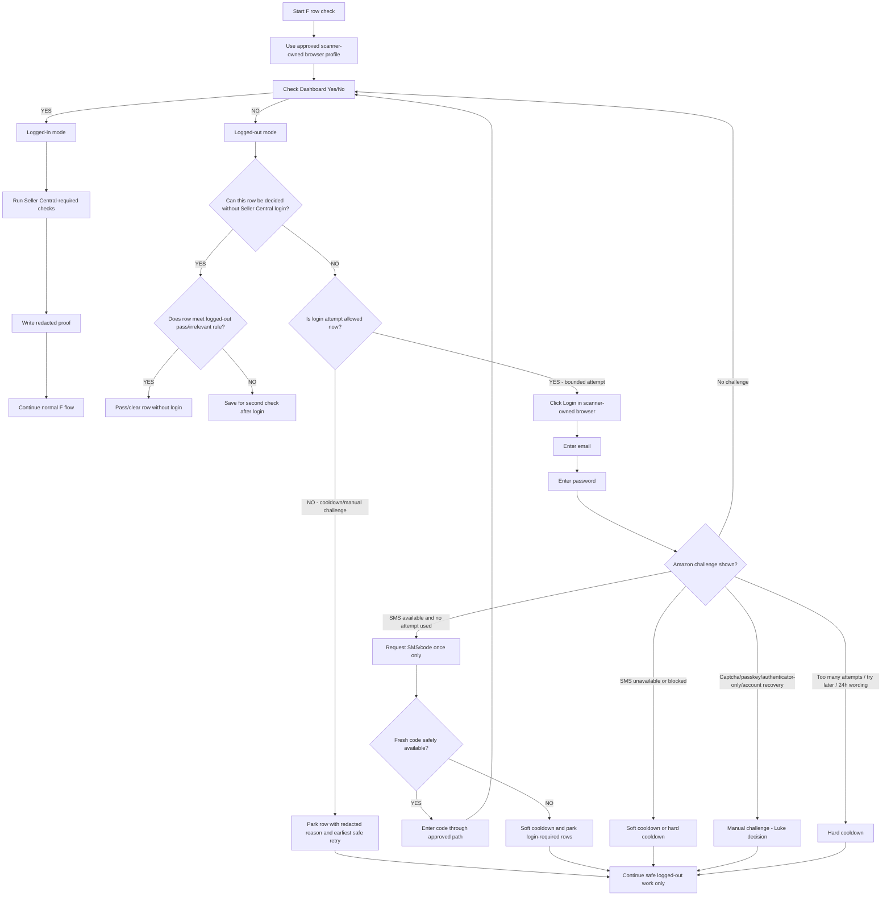

# F Seller Central Binary Login Flow

Created: 2026-06-09
Owner: Rep and Operations
Status: draft for Luke review
Purpose: make F login calm, binary, and editable before worker implementation

## Plain-English Summary

F should stop behaving like a jumping browser session and become a simple decision flow.

The first question is always:

- `Dashboard Yes/No = YES` means F is logged in enough to do logged-in Seller Central work.
- `Dashboard Yes/No = NO` means F is not logged in and must either use one controlled login route, continue safe logged-out checks, or park the row with a clear reason.

The flow must not keep clicking around, changing browser sessions, requesting SMS repeatedly, or opening separate Chrome windows.

## Key Research Rules

The research supports these rules:

- Repeated Seller Central SMS/OTP attempts can create or worsen cooldowns.
- Cookie clearing, browser changes, device changes, VPN/proxy changes, IP/location changes, and profile resets can make Amazon ask for verification again.
- SMS failure may be Amazon-side security friction or telecom delivery failure; the page alone may not prove which.
- Authenticator/trusted-device routes are safer if already set up, but automation must not create or bypass them.
- If Amazon shows a manual challenge, cooldown, blocked SMS, unavailable SMS, captcha, authenticator-only, passkey, or account recovery path, F must stop and report the exact redacted state.

## Flowchart

## Editable Conditions

These are the rules Luke can change before worker implementation.

| Condition | Draft Rule | Notes |
|---|---|---|
| Login proof | `Dashboard Yes/No = YES` | Credentials submitted is not enough. |
| Not logged in | `Dashboard Yes/No = NO` | No guessing from partial page state. |
| Logged-out pass | Row can pass or fail using supplier/Amazon page evidence already available without Seller Central. | Worker should define exact row fields before implementation. |
| Irrelevant threshold | If seller evidence is clearly over threshold, suggested draft threshold is `seller_count > 2`, row can pass through as irrelevant/no login-needed. | Luke to confirm exact threshold and wording. |
| Save for second check | If the row could be good but needs Seller Central proof, park it for retry after login. | This stops F blocking the whole cycle. |
| Login attempt allowed | Only if not in soft cooldown, hard cooldown, or manual challenge, and only inside bounded `login_attempt_mode`. | No background repeated login. |
| SMS request limit | One SMS/code request per approved incident. | No hammering phone login. |
| SMS unavailable | Enter cooldown and continue safe logged-out work. | Do not keep pressing. |
| Fresh code missing | Enter soft cooldown and park login-required rows. | Do not loop. |
| Too many attempts / try later / 24h | Enter hard cooldown. | Minimum 24 hours unless Luke approves official recovery. |
| Captcha/passkey/authenticator-only/account recovery | Manual challenge. | Luke decision required. |
| Browser/session changes | Not automatic. | No profile switching, cookie clearing, VPN/IP/device changes by automation. |

## Logged-In Mode

If `Dashboard Yes/No = YES`:

1. Run Seller Central-required checks.
2. Write redacted proof.
3. Clear rows that needed Seller Central.
4. Continue F flow.
5. If login drops, return to the Dashboard Yes/No check instead of guessing.

## Logged-Out Mode

If `Dashboard Yes/No = NO`:

1. Do not block the whole cycle immediately.
2. Process rows that can be decided without Seller Central.
3. Pass through clearly irrelevant rows if the threshold rule is met.
4. Save uncertain login-required rows for second check after login.
5. Do not request SMS/code unless login attempt is explicitly allowed.

## What This Should Stop

- F flashing in and out without a clear state.
- Browser profile jumping.
- Repeated login attempts.
- Repeated SMS/OTP requests.
- Treating partial login pages as success.
- Blocking every row just because Seller Central is unavailable.
- Letting vague "login failed" hide the actual reason.

## Worker Implementation Notes

This diagram is not implementation approval by itself.

The worker should turn it into a bounded F task only after Luke/Rep confirms the editable conditions, especially:

- exact irrelevant/pass threshold
- which row fields prove "can be decided without Seller Central"
- whether one SMS/code request is ever allowed automatically or must always require a human approval window

## Recommended Next Step

continue with `F-SELLER-CENTRAL-SAFE-LOGIN-TODAY` using this binary flow as the proposed decision map
