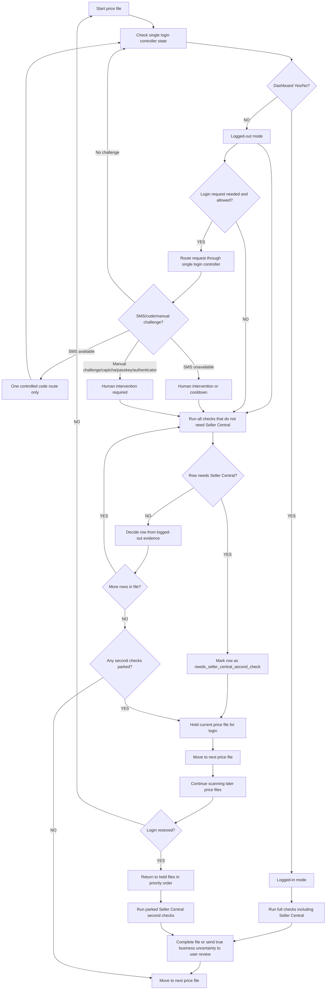

# F Single Login System Final Plan

Created: 2026-06-09
Owner: Rep and Operations
Priority: urgent
Status: final management plan for worker execution

## Plain-English Verdict

F is messy because it has become a split login system.

There appear to be three competing routes:

- old scanner/browser auto-login behavior
- UI login button behavior
- newer automatic login/controller behavior

That creates the exact problem Luke is seeing: Chrome flashing in and out, login windows appearing unpredictably, the UI login taking too long, and sessions becoming useless before a human can complete login.

The fix is not another patch. The fix is to make one login controller own every login decision.

## Target Outcome

F should become a calm binary system:

- `Dashboard Yes/No = YES`: logged-in mode.
- `Dashboard Yes/No = NO`: logged-out mode.

When logged out, the price-file scan must not stop. It should continue with what can be done without Seller Central, park only login-required checks, move to the next price file, and return automatically when login is restored.

## Non-Negotiable Rules

- One login owner only.
- The UI login button must not be a separate login system.
- The old scanner Chrome login must not be a separate login system.
- Auto-login must not be a separate login system.
- All three entry points must route through the same controller and state file.
- No repeated SMS/phone attempts.
- No Amazon security bypass.
- No hidden browser/profile jumping.
- No separate Chrome workaround.
- No row should be sent to user review only because Seller Central login is unavailable.
- Price-file scanning must continue in logged-out mode where possible.

## New Role Of The UI Login Button

The UI login button should become a request button, not its own login engine.

It should:

- ask the single login controller to enter a human-assisted login state
- show the current login state
- show whether SMS is available, unavailable, cooldown, or manual challenge
- show what Luke needs to do if human help is required
- use the scanner-owned browser/session route

It should not:

- open its own unrelated login browser
- race the auto-login system
- reset cookies or profiles
- create a second session owner
- sit for half an hour before the real controller knows what is happening

## User Intervention Route

User intervention is allowed as a controlled official route, not as a workaround.

Use it when:

- SMS is unavailable
- Amazon requires a human choice
- Amazon shows manual challenge
- a code is needed and automation cannot safely continue

The intervention screen should say:

- current state
- what Amazon is asking for
- what not to click repeatedly
- earliest safe retry if cooldown exists
- whether the scanner is continuing logged-out work in the background

If Luke helps successfully, the controller returns to Dashboard Yes/No proof.

If Luke cannot help, the controller parks login-required work and continues safe logged-out scanning.

## Price File Must Never Stall On Login

If F cannot log in during a price file scan:

1. Finish every check that does not require Seller Central.
2. Mark login-required rows as `second_check_after_login`.
3. Put the current price file into `held_for_login`, not user review.
4. Move to the next price file.
5. Keep repeating this for later price files.
6. As soon as login returns, immediately go back to held files in priority order.
7. Finish the parked second checks.
8. Only send rows to user review for real business uncertainty, not login unavailability.

Example:

- If TD Synnex reaches a Seller Central login-required point and F is not logged in, TD Synnex should be held for login second-checks.
- F should move on to the next price file.
- When login is back, TD Synnex should be pulled back automatically and finished.

## Required File States

The worker should design or use states like these.

### Login State

- `logged_in`
- `logged_out`
- `login_attempt_mode`
- `human_intervention_needed`
- `soft_cooldown`
- `hard_cooldown`
- `manual_challenge`

### Price File State

- `active`
- `completed_without_login_needed`
- `held_for_login`
- `second_check_after_login`
- `ready_for_user_review`
- `blocked_for_real_business_reason`

### Row State

- `checked_logged_out`
- `passed_without_seller_central`
- `failed_without_seller_central`
- `needs_seller_central_second_check`
- `checked_after_login`
- `ready_for_user_review`

## Flowchart

## Containment First

Before rebuilding, the worker should contain the chaos.

Containment means:

- identify every F login entry point
- identify which entry point opens Chrome
- identify whether the UI button bypasses the controller
- identify whether auto-login is still active
- identify whether the old scanner route is still trying to log in
- disable or route duplicate login paths only through an approved F maintenance packet

This plan does not itself stop runtime. If F runtime must be paused to prevent damage, that must be done through the approved maintenance process with a named F target, restart route, and proof check.

## Implementation Phases

### Phase 1 - Map And Contain

Goal:

- prove where the three login systems are
- stop duplicate login entry points from racing each other
- keep any containment inside approved F maintenance rules

Expected result:

- one named login controller is the only allowed owner
- UI button and scanner route become callers, not owners

### Phase 2 - Binary Login State

Goal:

- make Dashboard Yes/No the first decision every time
- remove vague partial login states
- record one redacted current state

Expected result:

- F can say clearly: logged in, logged out, cooldown, or human needed

### Phase 3 - Non-Stop Price File Flow

Goal:

- price-file scanning continues when login is unavailable
- login-required rows are parked for second checks
- files like TD Synnex are held, not sent to user review
- next price file starts automatically

Expected result:

- login problems no longer freeze the whole F cycle

### Phase 4 - Human Intervention UI

Goal:

- UI button becomes a controlled help request
- it uses the single controller
- it shows exact state and next action

Expected result:

- Luke can help when needed without fighting three systems

### Phase 5 - Safe Proof

Goal:

- focused tests prove no repeated SMS/phone attempts
- focused tests prove no duplicate login owners
- focused tests prove logged-out scan continues
- F MOT reports the state truthfully

Expected result:

- F is either safely logged in or safely moving through price files while parking second checks

## What Must Not Happen

- Do not keep the old scanner login, UI login button, and auto-login running independently.
- Do not open Chrome separately from the scanner-owned path.
- Do not restart F repeatedly to force login.
- Do not send login-blocked rows to user review.
- Do not lose TD Synnex or any other file because login was unavailable.
- Do not treat "credentials submitted" as logged in.
- Do not request SMS repeatedly.
- Do not change cookies, profiles, VPN, device, IP, or network automatically.

## Acceptance Proof

The final build is acceptable only when:

- one login controller owns every login attempt
- UI login button routes through the controller
- old scanner login route routes through the controller or is retired
- auto-login routes through the controller or is retired
- Dashboard Yes/No is the first login decision
- logged-out mode continues price-file scanning
- login-required rows are parked for second check
- held files resume automatically when login returns
- no repeated SMS/phone attempts occur
- no Amazon security bypass occurs
- F MOT and control notes show the exact current state

## Recommended Worker Job

Use this plan to drive:

- `F-SINGLE-LOGIN-SYSTEM-REBUILD`

This should replace scattered login repair as the main F execution lane.
